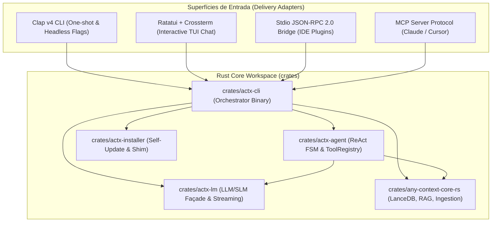

# 📐 Architectural Blueprint: Prioridade 4 — Interface CLI & TUI 100% Nativa em Rust (`actx-cli` / `actx-tui`)

> **Projeto**: AnyContext (`actx`)  
> **Versão Alvo**: `v0.31.0`  
> **Status**: `APPROVED / IN_PROGRESS`  
> **Autor**: Antigravity Assistant & LeviGuilherme  
> **Data**: 2026-09-25  
> **Sessão**: `9f488dbf-db54-4ecb-8ed2-b7a6ac1b2372`  
> **Decisão Fundamental**: A TUI nativa em Ratatui passa a ser a interface padrão absoluta do comando `actx`. O modo linha de comando puro (headless) fica restrito a flags operacionais (`--update`, `--version`, `--help`), daemons (`serve`, `mcp`, `rpc`) e queries diretas / piped stdin.  
> **Meta Central**: Consolidar a transição definitiva para **100% Rust** e **zero linhas de Python**, eliminando o runtime Python e Bun/TypeScript da distribuição final através de um único binário executável autônomo (`actx.exe` / `actx`).

---

## 1. 🏛️ Visão Geral & Motivação Arquitetural

Com a conclusão bem-sucedida das Prioridades 1, 2A, 2B e 3:
1. `any-context-core-rs`: Motor de Ingestão de Documentos (PDF, DOCX, TXT, CSV, Código), Chunkers AST Tree-Sitter (13 linguagens), Banco Vetorial LanceDB nativo, Busca Léxica BM25 Okapi, Pipeline RAG Híbrido com RRF ($k=60$) e Recuperação Concorrente em Lote (`retrieve_hybrid_batch`).
2. `actx-lm`: Façade universal de Modelos de Linguagem em Rust com streaming SSE para OpenAI, Anthropic, Gemini, Mock e SLMs locais via LM Studio e Ollama.
3. `actx-agent`: Orquestrador ReAct assíncrono com Máquina de Estados Finitos (FSM), registro unificado de ferramentas (`ToolRegistry`), sessões relacionais SQLite e emissão reativa de eventos (`AgentEvent`).

A camada Python e a interface TUI em TypeScript/Bun funcionam atualmente apenas como um "casulo temporário" para receber inputs de linha de comando e renderizar a tela.

A **Prioridade 4** implementa a crate nativa [`crates/actx-cli`](file:///C:/Users/guilh/source/repos/any-context/crates/actx-cli) que une todo o ecossistema Rust sob um único ponto de entrada executável:
- **CLI Parsing com `clap v4`**: Flags instantâneas, subcomandos e modo one-shot (`actx "minha pergunta"` ou `cat doc.txt | actx`).
- **Terminal TUI com `ratatui` + `crossterm`**: Interface de terminal moderna, com viewport de chat assíncrono, streaming de tokens em tempo real, renderização de blocos ReAct / Thinking colapsáveis, barra de status dinâmica e modal de slash commands com autocomplete.
- **Distribuição em Binário Único**: Elimina dependências externas (Python, pip, PyInstaller, Bun, node_modules), reduzindo o tempo de boot para **< 10ms**, memória RAM para **< 40MB** e gerando binários estáticos independentes para Windows, Linux e macOS.

---

## 2. 🧱 Arquitetura Hexagonal & Estrutura de Módulos



### 2.1. Estrutura de Pastas de `crates/actx-cli`

```
crates/actx-cli/
├── Cargo.toml
└── src/
    ├── main.rs                   # Entrypoint principal, inicialização de tracing e runtime Tokio
    ├── cli/
    │   ├── mod.rs                # Módulo CLI
    │   ├── args.rs               # Definição das structs de argumentos Clap v4 (Cli, Commands, Flags)
    │   └── oneshot.rs            # Execução direta de query com streaming stdout (sem TUI)
    ├── tui/
    │   ├── mod.rs                # Módulo TUI
    │   ├── app.rs                # Estado reativo da aplicação (mensagens, input, foco, modal)
    │   ├── ui.rs                 # Renderização dos widgets Ratatui (Header, Chat, ReAct, Input)
    │   ├── events.rs             # Loop de eventos Crossterm + canais assíncronos MPSC Tokio
    │   ├── theme.rs              # Paleta visual, estilos e renderização de sintaxe
    │   └── markdown.rs           # Renderizador minimalista de Markdown no terminal
    ├── commands/
    │   ├── mod.rs                # Universal Command Dispatcher
    │   ├── registry.rs           # Catálogo nativo dos 34 slash commands
    │   └── handlers.rs           # Executores dos comandos (/workspace, /sync, /model, /clear, etc.)
    └── config/
        ├── mod.rs                # Resolução de diretórios (AppData / .config)
        └── settings.rs           # Leitura e escrita de configurações no SQLite nativo
```

---

## 3. ⚙️ Detalhamento Técnico dos Componentes

### 3.1. Parsing de Argumentos via `clap v4` (`src/cli/args.rs`)
Substitui o `argparse` do Python e as heurísticas manuais de `sys.argv`:
```rust
#[derive(Parser, Debug)]
#[command(name = "actx", version, about = "AnyContext - Universal Agentic Context Engine")]
pub struct Cli {
    /// Workspace de contexto ativo
    #[arg(short = 'w', long = "workspace", default_value = "Default")]
    pub workspace: String,

    /// Executa uma consulta direta sem abrir a TUI (One-shot)
    #[arg(short = 'p', long = "prompt")]
    pub prompt: Option<String>,

    /// Subcomandos operacionais
    #[command(subcommand)]
    pub command: Option<Commands>,

    /// Prompt livre direto posicional (ex: actx "como funciona o auth?")
    #[arg(trailing_var_arg = true)]
    pub query: Vec<String>,
}

#[derive(Subcommand, Debug)]
pub enum Commands {
    /// Inicia o servidor REST API nativo
    Serve {
        #[arg(long, default_value = "127.0.0.1")]
        host: String,
        #[arg(long, default_value_t = 8000)]
        port: u16,
    },
    /// Inicia o servidor Model Context Protocol (MCP) via stdio
    Mcp,
    /// Inicia a ponte Stdio JSON-RPC 2.0 para plugins de IDE
    Rpc,
    /// Sincroniza pastas e documentos do workspace ativo
    Sync {
        #[arg(short, long)]
        force: bool,
    },
    /// Verifica e instala atualizações do binário
    Update {
        #[arg(long)]
        check: bool,
    },
    /// Exibe relatório de diagnóstico do sistema
    Diagnostics,
}
```

### 3.2. Interface TUI Interativa com `ratatui` + `crossterm` (`src/tui/`)
- **Arquitetura Orientada a Eventos (`Event-Driven Architecture`)**:
  - Thread dedicada a ler eventos do teclado com `crossterm::event::EventStream` e enviar mensagens `AppEvent::Key(KeyEvent)` para um canal `tokio::sync::mpsc`.
  - Canal assíncrono conectado aos eventos emitidos pelo `actx-agent` (`AgentEvent::Thinking`, `AgentEvent::Delta`, `AgentEvent::ToolStart`, `AgentEvent::ToolEnd`, `AgentEvent::Done`).
- **Widgets de Apresentação**:
  1. `HeaderBar`: Exibe nome do workspace ativo, modelo selecionado, badge do tier (ex: `Local / Edge`, `Frontier`) e contador de tokens.
  2. `ChatViewport`: Lista de mensagens com histórico rolável, formatação visual de Markdown (títulos, negrito, listas, blocos de código com destaque).
  3. `ReActAccordion`: Bloco recolhível exibindo o raciocínio do modelo e status das ferramentas em execução (ex: `⚙️ [NativeLanceStore] Searching top 8 chunks...`).
  4. `InputArea`: Editor de linha com navegação por cursor, histórico de comandos (Up/Down) e detecção de digitação de `/` para abertura de popup de autocomplete.

---

## 4. 📋 Paridade Universal de Comandos (Os 34 Slash Commands)

Todos os comandos atualmente existentes no registro do AnyContext são mapeados para o dispatcher central em Rust puro:
- `/help`, `/workspace`, `/sync`, `/model`, `/clear`, `/history`, `/info`, `/status`, `/exit`, `/quit`
- `/keys`, `/config`, `/logs`, `/diagnostics`, `/update`, `/rollback`, `/releases`
- `/fast`, `/deep`, `/search` (preparados para a RFC-042)
- `/ingest`, `/inspect`, `/chunks`, `/privacy`, `/purge`

---

## 5. 🎯 Marcos de Entrega (Milestones)

| Marco | Descrição | Status |
|---|---|---|
| **M1: Crate `actx-cli` & Clap v4** | Criação da crate, manifesto Cargo, modelo de argumentos e fast-path `-v`/`-h` | ⚪ Pendente |
| **M2: Modo One-Shot & Pipeline Streaming** | Execução de consultas únicas via linha de comando e piped stdin conectadas a `actx-agent` | ⚪ Pendente |
| **M3: Framework TUI Ratatui & Layout** | Estruturação da TUI com HeaderBar, ChatViewport e InputArea responsivos | ⚪ Pendente |
| **M4: Event Loop & Streaming Reativo** | Integração do stream SSE do `actx-lm` e eventos do `actx-agent` na tela | ⚪ Pendente |
| **M5: Dispatcher de Comandos & Autocomplete** | Paridade dos slash commands e popup interativo de sugestões | ⚪ Pendente |
| **M6: Suíte de Testes Nativos & NFRs** | Testes unitários e de integração de CLI/TUI com 100% de sucesso | ⚪ Pendente |
| **M7: Dual-Doc & Testes Manuais** | Atualização de README.md, TECDOC.md e MANUAL_TESTS.md sem truncamento | ⚪ Pendente |
