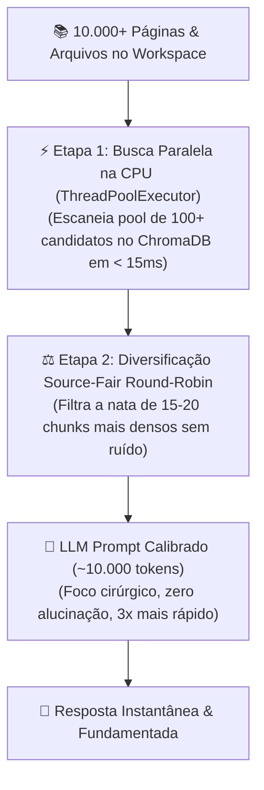

# 🧠 AnyContext (`actx`)

> **Transform any file, folder, website, or drive into a living, real-time AI context.**

```text
  ___               ____ ___  _   _ _____ _____ _  _______ 
 / _ \ _ __  _   _ / ___/ _ \| \ | |_   _| ____\ \/ /_   _|
| |_| | '_ \| | | | |  | | | |  \| | | | |  _|  \  /  | |  
|  _  | | | | |_| | |__| |_| | |\  | | | | |___ /  \  | |  
|_| |_|_| |_|\__, |\____\___/|_| \_| |_| |_____/_/\_\ |_|  
             |___/                                         
  🚀 AnyContext (actx)  |  Levix Digital
  ⚡ Agnostic AI Agent with Isolated Workspaces & Long-Term Memory
  🔒 100% Local & Offline-First Privacy
```

[](https://github.com/Levix-Digital/any-context/releases)
[](https://github.com/Levix-Digital/any-context)
[](https://www.python.org/)
[](https://lmstudio.ai/)
[-blueviolet.svg)](TECDOC.md)

**AnyContext** is the universal intelligence layer for your personal and professional data. Built with an uncompromising focus on **privacy, speed, and versatility**, AnyContext connects your local folders, scanned documents, and web portals directly to the world's most capable Artificial Intelligence models.

> 📖 **Looking for Deep Engineering & Architecture Details?**  
> Check our exhaustive technical manual: 👉 **[`TECDOC.md`](TECDOC.md)** (covers 2-Phase RAG, ChromaDB parallel scanning, 5-tier date resolution, SQLite memory, REST API schemas, and MCP specs).

Whether you are a **lawyer reviewing hundreds of contract pages**, a **consultant managing immigration dossiers**, a **researcher navigating scientific publications**, or an **enterprise deploying a secure in-VPC context server**, AnyContext operates **100% on your terms and infrastructure**.

---

## 🌟 Why AnyContext? (In Plain English)

Traditional AI tools require you to manually copy and paste files into web chats, exposing your confidential documents to external clouds and forgetting past conversations the moment you close the tab.

**AnyContext changes everything:**

1. **You Point to Your Folders**: Point AnyContext to any folder on your computer (PDFs, Word docs, Excel spreadsheets, images, text files, or source code).
2. **Instant Local Memory**: AnyContext reads and organizes your documents locally into an ultra-fast vector database (ChromaDB).
3. **Ask Anything Naturally**: Open the terminal and ask questions in plain English or Portuguese (*"What is the renewal deadline in contract 42?"*, *"Compare the tax policies across our 2025 financial reports"*).
4. **Cites Real Sources**: The AI answers accurately, quoting the exact file name, page, and chunk where the information was found.
5. **Zero Cloud Lock-In**: Choose from **9 leading AI providers** (OpenAI, Claude, Gemini, DeepSeek, Groq, Mistral, xAI Grok, OpenRouter) or run **100% offline and free** using local models (LM Studio / Ollama).

---

## 🚀 Key Features & Superpowers

- **🕒 Temporal RAG & Metadata Freshness Engine**:
  - **5-Tier Web Date Resolution**: Automatically extracts publication and update dates via OpenGraph/Schema.org, visible in-page text/footers (`Page details YYYY-MM-DD`, `Date modified:`), URL date patterns (`/2023/06/...`), HTTP `Last-Modified` headers, and crawl timestamps.
  - **Content Classification**: Distinguishes between `Canonical Service / Documentation` (authoritative current rules), `Historical News / Press Release` (past announcements), and `Local Document`.
  - **Filesystem Timestamps**: Automatically tags all local files with `last_modified_date` and `creation_date`.
  - **Time-Aware Chunk Headers**: Injects `Source: ... | Workspace: ... | Last Modified: YYYY-MM-DD | Type: ...` into every chunk.
  - **Recency Primacy & Conflict Resolution**: The AI agent evaluates timestamps and status notices, ensuring that current rules (`Status: Paused`) always supersede older historical announcements.
- **🔬 2-Phase High-Precision RAG & Context Calibration Engine**:
  - **🌐 Contextual Retrieval & Semantic Enrichment (`ContextualEnricher`)**: Automatically generates a rich 3-4 sentence summary and Top-N domain keywords for each document and web page, anchoring all chunks to their true parent topic and eliminating cross-domain false positives.
  - **Phase 1 (Deep Candidate Pool Scanning)**: The ChromaDB vector database evaluates a broad initial pool of **100+ candidate chunks** across thousands of indexed pages and files, guaranteeing 100% recall coverage.
  - **Phase 2 (Source-Fair Round-Robin Diversification)**: The `_diversify_nodes` algorithm balances chunk selection across all distinct documents and portals (up to 3 chunks per source). A single 500-page document is prevented from monopolizing the context window.
  - **⚡ Parallel Multi-Source Retrieval (`ThreadPoolExecutor`)**: Concurrently searches across the active workspace, linked Shared Sources, and Global knowledge bases on all CPU cores, fusing results in sub-10ms.
  - **"Lost in the Middle" Prevention & Context Calibration**: By injecting **15-20 high-density chunks (~10,000-15,000 tokens)** rather than 40+ noisy chunks, AnyContext prevents attention degradation, eliminates hallucinations, reduces latency by 3x, and stays well within provider rate limits.
  - **🧹 Runtime Tool Message Pruning (`PruningChatModelWrapper`)**: Intercepts and compacts raw chunk outputs from prior conversation turns in runtime, preventing token accumulation and keeping conversation prompt size permanently under ~12,000 tokens across 100+ turns.
  - **🔄 Resilient Auto-Retry with Exponential Backoff (`max_retries=5`)**: Automatic transparent recovery from LLM provider rate limits (TPM/RPM 429 errors) across all 9 supported providers with millisecond backoff loops, ensuring zero disruption during heavy research sessions.
  - **🎛️ Dynamic Retrieval Presets Matrix**:
    | Preset | Pool no ChromaDB | Chunks Injetados | Tokens de Contexto | Melhor uso |
    | :--- | :---: | :---: | :---: | :--- |
    | **⚡ Turbo** | 50 candidatos | 10 chunks | ~5.000 tokens | **Velocidade máxima:** perguntas rápidas, fatos pontuais, dúvidas do dia a dia. |
    | **⚖️ Balanced** *(Padrão)* | 100 candidatos | 20 chunks | ~10.000 a 15.000 tokens | **Equilíbrio perfeito:** alta precisão factual sem ruído (o padrão ideal). |
    | **🔬 Deep Research** | 150 candidatos | 40 chunks | ~30.000 a 40.000 tokens | **Auditoria pesada:** comparar cláusulas de 10 contratos ou analisar dossiês complexos. |
- **🛡️ Strict Context Grounding & Zero Pre-Training Hallucination**:
  - Answers are strictly anchored to the retrieved workspace chunks.
  - The AI is forbidden from using outdated 2023 pre-training weights to answer current factual, legal, or regulatory questions.
  - Cross-lingual domain translation: Automatically translates Portuguese prompts into targeted English domain keywords when searching English documentation.
- **🧠 3-Level Structured Long-Term Memory (5 Dimensions)**:
  - **Level 1 (Structured 5-Dimension Session Summary)**: Extracted upon `/exit` or `/q` across 5 clear dimensions:
    1. 👤 *User Directives & Preferences* (rules, workflow habits).
    2. 🏗️ *Technical Architecture & Key Decisions* (parameters, constants, schemas).
    3. 📁 *Files, Code Symbols & Databases* (files touched, functions, tables).
    4. 📌 *Critical Context & Problem Resolution* (root-cause diagnoses, bug fixes).
    5. 🚀 *Pending Tasks & Next Steps* (roadmap milestones, open tasks).
  - **Level 2 (Active Rolling Window)**: Retains recent active messages in SQLite graph state.
  - **Level 3 (Consolidated Meta-Summarization)**: Consolidates older memory vectors into high-level indices.
  - **1024-Token Memory Chunks**: Expanded chunking (`chunk_size=1024`, `chunk_overlap=200`) preserves deep technical reasoning.
- **📂 Decoupled Workspace Architecture & Empty Workspaces**:
  - Workspaces are isolated logical scopes for privacy and contextual boundaries.
  - Creating a workspace is completely separate from attaching folders: create empty workspaces anytime via `/switch <name>` or `/workspace add <name>` (ideal for web documentation portals, market research, or agent tasks).
  - Attach local folders or web URLs whenever you want via `/config` or `/web add`.
- **🏛️ 3-Tier AI Context Architecture (Company Global & Shared Sources)**:
  - **1. 🏢 Institutional Global (`Global`)**: Organization-wide knowledge base curatable by admins and automatically inherited in RAG search across authorized project workspaces.
  - **2. 📦 Reusable Shared Sources Library (`Shared Sources`)**: Dedicated central library workspace for reusable frameworks, codebases, and documentation portals linked across project workspaces on-demand in < 50ms with **$0.00 in embedding costs** via `/link` and `/shared`.
  - **3. 📁 Scoped Active Workspaces**: Dedicated project-specific boundaries guaranteeing zero cross-department data leakage.
- **🛒 Universal Schema.org & E-Commerce Rating Extraction**:
  - Automatic extraction of `Product` and `IndividualProduct` structured metadata (`<script type="application/ld+json">`) including star ratings, review counts, prices, and stock status across Walmart, Amazon, Mercado Livre, Shopify, VTEX, WooCommerce, etc.
  - Retains HTML semantic tags (`<form>`, `<header>`, `<aside>`, `<dl>`) so visible review badges (e.g. `4.844 out of 5 stars. 1199 reviews`) and buy box pricing are never discarded.
- **🔓 100% Unlocked Community Edition CLI**: Full local power for individual users at zero cost:
  - Unlimited local workspaces and folders.
  - Deep recursive subfolder scanning.
  - **Interactive 2-Phase Web Crawler & Sitemap Engine** (`/web add`): Fast discovery phase maps all internal URLs and XML sitemaps, presenting estimated page counts before concurrent multi-threaded crawling.
  - Image & Scanned PDF OCR parsing (`/ocr`).
  - ChromaDB local vector storage & SQLite long-term memory.
  - Access to all 9 supported AI model providers.
- **🤖 9 Leading AI Providers with Verified Low-Tier Models**:
  - **OpenAI**: `gpt-4o-mini`, `gpt-4o`, `gpt-4-turbo`, `gpt-3.5-turbo`.
  - **Anthropic Claude**: `claude-haiku-4-5-20251001`, `claude-sonnet-4-5-20250929`, `claude-sonnet-4-6`, `claude-opus-4-5-20251101`.
  - **Google Gemini**: `gemini-flash-latest`, `gemini-3.5-flash`, `gemini-3.5-flash-lite`, `gemini-pro-latest`.
  - **DeepSeek**: `deepseek-chat` (DeepSeek V3 - High Intelligence at $0.14/M tokens).
  - **Groq Cloud**: `llama-3.3-70b-versatile`, `llama-3.1-8b-instant`, `mixtral-8x7b-32768`, `gemma2-9b-it`.
  - **Mistral AI**: `mistral-small-latest`, `open-mistral-nemo`, `mistral-large-latest`.
  - **xAI Grok**: `grok-2-1212`, `grok-2`, `grok-beta`.
  - **OpenRouter**: `openrouter/auto`, `meta-llama/llama-3.3-70b-instruct:free`, `google/gemini-flash-1.5-8b`.
  - **Local Offline (Free & Private)**: `local-model` via LM Studio or Ollama (`http://localhost:1234/v1`).
- **📋 Multi-line & Long-Prompt Input Engine**:
  - **Direct Bracketed Paste (`Ctrl+V`)**: Seamlessly paste multi-line contract clauses, meeting transcripts, or large code snippets without premature command submission.
  - **Universal Line Break (`Ctrl + J` / `Esc` then `Enter`)**: Insert clean newlines with visual continuation prompts (`... `) anytime while typing.
  - **Shell-Style Line Continuation (`\` + `Enter`)**: End any line with a backslash `\` and press Enter to naturally continue your prompt on the next line.
  - **Triple Quotes (`""" ... """` or `''' ... '''`)**: Start a prompt with `"""` to enter multi-line block mode and submit by closing with `"""` or `/send`.
  - **Dedicated `/paste` Capture Mode**: Type `/paste` or `/multiline` to open an explicit capture buffer with abort (`/cancel`) protection.
- **🔄 Instant Zero-Cost Source Transfer (`/transfer` & `/config`)**:
  - Move folders and web portals between workspaces in sub-50ms with **$0.00 in embedding API costs**.
  - Dynamically updates vector metadata tags in ChromaDB and SQLite without re-indexing or re-crawling.
- **⚡ Sub-3ms Instant Startup & Clean Single-Line Synchronization**:
  - Signature ASCII banner renders in under 3 milliseconds.
  - Clean single-line background sync spinner (`✔ Workspace 'AnyContext' ready`).
  - Modern hierarchical tree view for verbose inspection (`/sync --verbose` or `/index -v`).
- **🎯 Typo-Resilient Slash Command Interception**:
  - Mistyped commands (e.g. `/check-updaete`, `/swich`, `/modeel`, `/sinc`) are caught by the intelligent fuzzy matcher and suggest the correct command without wasting AI tokens.
- **🔄 Interactive Multi-Instance Aware Self-Updater (`/update` & `/check-update`)**:
  - Detects GitHub releases with cache-busting and prompts: `? Would you like to download and install vX.Y.Z now? [Y/n]`.
  - **Multi-Instance Intelligence**: Detects other open AnyContext sessions (CLI terminals, REST API, MCP servers) and gives you the choice to update in background without losing work or close instances cleanly.
  - Performs atomic self-replacement with retry loops, even on locked Windows binaries.
- **🌐 REST API Server Mode (`actx --serve`)**:
  - High-performance FastAPI server with interactive Swagger UI at `http://127.0.0.1:8000/docs`.
- **🔌 Model Context Protocol (MCP) Server (`actx --mcp`)**:
  - Native JSON-RPC stdio implementation for **Claude Desktop**, **Cursor IDE**, and **Antigravity**.
- **📘 Permanent Self-Help System**:
  - The AI agent has full access to this documentation. You can ask in chat: *"Como eu adiciono um site ao meu workspace?"* or *"Quais comandos estão disponíveis?"*.

---

## ⚡ Quick Start & Installation

### Option 1: 1-Click Terminal Installer (No Python Required!)

Download the installer from the **[Latest GitHub Release](https://github.com/Levix-Digital/any-context/releases/latest)**:

- **Windows (PowerShell)**:
  ```powershell
  irm https://raw.githubusercontent.com/Levix-Digital/any-context/main/install.ps1 | iex
  ```
- **Linux / macOS (Bash)**:
  ```bash
  curl -fsSL https://raw.githubusercontent.com/Levix-Digital/any-context/main/install.sh | bash
  ```

### Option 2: Install via Python / `uv` / `pip`

```bash
git clone https://github.com/Levix-Digital/any-context.git
cd any-context
pip install -e .
```
*(Available terminal aliases: `actx`, `anycontext`, `any-context`, `ac`)*

---

## 💬 In-Chat Slash Commands Reference

Inside the interactive chat (`actx`), use these powerful slash commands:

| Command | Standard Options / Flags | Description |
| :--- | :--- | :--- |
| **`Ctrl+V` (Paste)** | — | Paste multi-line text with line breaks without premature submission. |
| **`[Ctrl + J]`** | `[Esc] + Enter` | Universal terminal newline shortcut (Linefeed). |
| **`\` + `[Enter]`** | — | Trailing backslash shell-style line continuation. |
| **`""" ... """`** | `''' ... '''` | Multi-line block delimiter (close with `"""` or `/send`). |
| **`/paste`** | `/multiline` | Open dedicated multi-line paste capture mode. |
| **`/switch`** | `<name>`, `--create`, `--delete`, `--list` | Switch active workspace or create, delete, and list workspaces. |
| **`/sync`** | `--status`, `--verbose`, `--bg`, `--full` | Ultra-fast hybrid synchronization using sub-30ms SQLite stat cache bypass. |
| **`/mode`** | `--hybrid`, `--strict`, `--proactive`, `--global` | Switch AI grounding mode per workspace or globally: **`Hybrid`** (dual-layer), **`Strict`** (100% verified facts), or **`Proactive`** (research & synthesis). |
| **`/web-search`** | `--on`, `--off`, `--status`, `--global`, `/ws` | Toggle real-time live web search per workspace with domain portal prioritization and source discrimination. |
| **`/web`** | `--add <url>`, `--list`, `--sync` | Manage, crawl, and synchronize web documentation portals. |
| **`/link`** | `<src> [dst]`, `--list`, `--unlink <src>` | Link or unlink reusable indexed sources across workspaces with zero API cost ($0.00). |
| **`/transfer`** | `<src_ws> <tgt_ws> <path_or_url>` | Instant zero-cost transfer of folders or web portals between workspaces. |
| **`/rename`** | `<old_ws> <new_ws>` | Atomic zero-cost workspace renaming ($0.00). |
| **`/model`** | `<name>`, `--list`, `-l` | Open key-aware AI model selector across 9 providers or list available models. |
| **`@model <msg>`** | — | One-shot prompt to a specific model without changing session defaults. |
| **`/api-keys`** | `/keys` | Step-by-step guide with portal links to obtain API keys. |
| **`/ocr`** | `image`, `scan` | View Image & Scanned PDF OCR parsing status. |
| **`/config`** | `-c` | Open interactive settings menu (Workspaces, AI Models, API Keys). |
| **`/billing`** | `--plans`, `-p` | View subscription tiers, capabilities, and license status. |
| **`[↑] / [↓]`** | — | Navigate through past prompts & commands in the active workspace. |
| **`/history`** | `--clear`, `--limit <n>` | Display or clear input history for the active workspace. |
| **`/update`** | `--check`, `-c`, `--force` | Check for updates and download/install the latest release. |
| **`/reset-memory`**| `--force`, `--all` | Purge conversation session memory for active or all workspaces. |
| **`/clear`** | `/cls` | Clear terminal screen and redraw the clean signature banner. |
| **`/factory-reset`**| `--force` | Reset all settings, workspaces, API keys, and databases to clean factory state. |
| **`/version`** | `/v` | Display current AnyContext version. |
| **`/help [cmd]`** | `/h`, `[cmd] --help`, `[cmd] -h` | Open the interactive manual index or get help for a specific command. |
| **`/exit`** | `/q`, `exit`, `quit` | Save structured 5-dimension long-term memory and exit gracefully. |
| **`Ctrl+C`** | — | Interrupt AI generation immediately or prompt graceful exit. |

---

## 🔬 Deep-Dive: A Ciência do Motor RAG do AnyContext

O AnyContext foi projetado com uma arquitetura de RAG em **duas fases distintas**, resolvendo os dois maiores desafios da inteligência artificial moderna: **alcance amplo em grandes volumes de dados** e **precisão cirúrgica sem dispersão de atenção**.



### 1. Profundidade de Busca vs. Injeção no Modelo
- **Busca Vetorial Ampla (ChromaDB):** A busca nunca é rasa. O ChromaDB avalia **100% dos documentos indexados**, avaliando similaridade semântica em um pool inicial amplo de **100 candidatos**.
- **Injeção Calibrada na LLM:** Apenas a "nata" dos trechos de maior relevância entra no prompt do modelo.

### 2. O Fenômeno *"Lost in the Middle"* (Por que mais chunks podem prejudicar a precisão)
- **A Escala Real de 10.000 Tokens:** 10.000 tokens equivalem a **~7.500 palavras** ou cerca de **15 a 20 páginas de livro densamente digitadas**. Para responder a uma pergunta pontual (ex: *"Quem deve assinar o waiver?"*), a resposta exata ocupa de 300 a 600 tokens (1 a 2 páginas).
- **O Perigo de Injetar 50.000+ Tokens:** Prompts gigantescos contendo 40 a 50 chunks brutos introduzem dezenas de páginas irrelevantes (horários, cardápios, avisos gerais). Pesquisas científicas de ponta (incluindo Stanford) comprovam que LLMs sofrem de **degradação de atenção no meio do contexto**, perdendo trechos cruciais e gerando alucinações.
- **Precisão por Calibração:** Ao entregar **15 a 20 chunks mais densos**, a IA foca 100% no que importa, reduz o tempo de resposta em 3x e economiza até 90% em créditos de API.

### 3. Algoritmo *Source-Fair Round-Robin* (Diversificação Multi-Fonte)
Para garantir que um documento gigante de 500 páginas não monopolize todas as vagas de resposta:
- O algoritmo balanceia a seleção pegando no máximo 2 a 3 trechos de cada arquivo ou página web diferente.
- Em workspaces com 50 PDFs ou 20 portais web, **todas as fontes relevantes têm representação garantida** no contexto final.

### 4. Resiliência a Rate Limits (TPM / RPM) com Backoff Exponencial
- Todos os 9 provedores de IA (OpenAI, Anthropic Claude, Gemini, Groq, DeepSeek, Mistral, xAI) impõem limites de **Tokens por Minuto (TPM)** e **Requisições por Minuto (RPM)**.
- O AnyContext conta com **`max_retries=5` e Backoff Exponencial automático**: caso um provedor retorne **HTTP 429 (Rate Limit)** em rajadas de perguntas, o sistema aguarda silenciosamente as frações de segundo necessárias e conclui a resposta sem que você veja erro na tela.

### 5. Pruning de Histórico em Runtime (`PruningChatModelWrapper`)
- O histórico da conversa preserva 100% das perguntas do usuário e conclusões da IA (`User` ➔ `AI`), mas intercepta e poda os blocos de texto bruto de buscas passadas (`ToolMessage`) em runtime para `"[Prior workspace context retrieved and synthesized in conversation history]"`.
- O prompt enviado à LLM se mantém permanentemente entre ~5.000 e 12.000 tokens, eliminando o erro de estouro de 128.000 tokens em conversas de 100+ turnos.

### 🎛️ Matriz Dinâmica de Presets de RAG

| Preset | Pool no ChromaDB | Chunks Injetados | Tokens de Contexto | Melhor uso |
| :--- | :---: | :---: | :---: | :--- |
| **⚡ Turbo** | 50 candidatos | 10 chunks | ~5.000 tokens | **Velocidade máxima:** perguntas rápidas, fatos pontuais, dúvidas do dia a dia. |
| **⚖️ Balanced** *(Padrão)* | 100 candidatos | 20 chunks | ~10.000 a 15.000 tokens | **Equilíbrio perfeito:** alta precisão factual sem ruído (o padrão ideal). |
| **🔬 Deep Research** | 150 candidatos | 40 chunks | ~30.000 a 40.000 tokens | **Auditoria pesada:** comparar cláusulas de 10 contratos ou analisar dossiês complexos. |

---

## 💡 Real-World Usage Examples (For Technical & Non-Technical Users)

### ⚖️ 1. Legal / Contract Risk Analysis (Non-Technical)
```text
You [LegalDocs | gpt-4o-mini]: Qual é o prazo de vigência e as penalidades por quebra de confidencialidade no Contrato Acme?

🤖 AI [gpt-4o-mini]:
🔍 [Search] Searching strictly within Workspace: 'LegalDocs' (top 8 chunks)...
📚 Reading retrieved documents...

De acordo com o arquivo 'Contrato_Acme_2025.docx' (Modificado em: 2026-08-12):
- **Prazo de Vigência**: 24 meses contados a partir da data de assinatura (Cláusula 8.1).
- **Penalidade por Quebra**: Multa não compensatória de R$ 100.000,00 (cem mil reais), sem prejuízo de perdas e danos apurados judicialmente (Cláusula 12.4).
- **Aviso Prévio**: A rescisão imotivada exige notificação prévia de 30 dias (Cláusula 8.3).
```

### 🛂 2. Temporal Immigration / Government Portal Verification (Non-Technical)
```text
You [Immigration | gpt-4o-mini]: Qual o status atual do Start-up Visa Program do Canadá?

🤖 AI [gpt-4o-mini]:
🔍 [Search] Searching strictly within Workspace: 'Immigration' (top 8 chunks)...
📚 Reading retrieved documents...

De acordo com a página oficial 'Start-up Visa Program - Canada.ca' (Última modificação: 2026-07-21 | Tipo: Canonical Service):
- **Status Operacional**: O programa está atualmente **PAUSADO (Paused)** para novas aplicações.
- **Regra em Vigor**: Apenas candidatos com certificado de compromisso válido emitido em 2025 podem submeter suas aplicações (prazo limite: 30 de junho de 2026).
- **Permissão de Trabalho**: Solicitantes com visto de trabalho ativo vinculado ao programa podem solicitar extensão durante o processamento da residência permanente.

*(Nota: Comunicados de imprensa anteriores de junho de 2023 sobre expansão de vagas representavam iniciativas históricas da época, sendo atualmente sobrepostos pela regra de pausa em vigor).*
```

### 🧠 3. Cross-Session Long-Term Memory Recall (Business & Management)
```text
# Session 1:
You [FinTech | gpt-4o-mini]: Vamos adotar a arquitetura SQLite WAL com migrações gerenciadas via Alembic para a release v2.0.
🤖 AI [gpt-4o-mini]: Excelente decisão! Registrado: SQLite WAL mode com Alembic para a v2.0.
You [FinTech | gpt-4o-mini]: /exit
🧠 [Hierarchical Memory - Level 1] Generating structured 5-dimension session summary block...
✔ Session memory persisted!

# Session 2 (Days later):
You [FinTech | gpt-4o-mini]: O que decidimos na última conversa sobre o banco de dados da release v2.0?
🤖 AI [gpt-4o-mini]:
🔍 [Search] Searching session memory records for workspace 'FinTech'...

Na sessão anterior, decidimos as seguintes diretrizes técnicas para a **release v2.0**:
1. **Engine**: SQLite configurado em modo **WAL (Write-Ahead Logging)** para suporte a leitura/escrita concorrente.
2. **Migrações**: Gerenciamento de esquema estruturado via **Alembic**.
```

### 💻 4. Developer / Software Engineering Codebase Analysis (Technical)
```text
You [BackendAPI | deepseek-chat]: Como funciona o fluxo de autenticação por tokens na rota /v1/auth/login?

🤖 AI [deepseek-chat]:
🔍 [Search] Searching strictly within Workspace: 'BackendAPI' (top 8 chunks)...

Conforme implementado no arquivo `src/any_context/server/routes.py` (Modificado em: 2026-08-18):
1. A rota recebe `POST /v1/auth/login` com payload `{"username": "...", "password": "..."}`.
2. O método `ConfigDBStore.verify_user_password()` valida o hash PBKDF2 com salt de 100.000 iterações.
3. Se válido, gera um Bearer Token com prefixo `actx_sec_` e expiração de 30 dias, retornando o papel do usuário (`Admin`, `Analyst` ou `Viewer`).
```

### 🛒 5. E-Commerce & Product Comparison (Structured Ratings & Reviews)
```text
You [Mercado | gpt-4o-mini]: Desses produtos de limpeza de vidros, qual tem a melhor avaliação e o melhor custo-benefício?

🤖 AI [gpt-4o-mini]:
🔍 [Search] Searching strictly within Workspace: 'Mercado' (top 8 chunks)...
📚 Reading retrieved documents...

Com base nas páginas de produtos indexadas:

1. **Windex Original Glass Cleaner Spray (23 fl oz)**:
   - **Avaliação**: **4.844 de 5 estrelas** (baseado em **1.199 avaliações**).
   - **Preço**: **USD $3.98** ($0.17 / fl oz).
   - **Status**: Em estoque.

2. **Great Value Glass Cleaner Spray Bottle (32 fl oz)**:
   - **Avaliação**: **4.200 de 5 estrelas** (baseado em **450 avaliações**).
   - **Preço**: **USD $2.48** ($0.08 / fl oz).
   - **Status**: Em estoque.

**Conclusão e Custo-Benefício:**
- **Melhor Avaliação Absoluta**: O **Windex** possui a maior nota de satisfação (**4.844 estrelas** com alto volume de 1.199 avaliações).
- **Melhor Custo-Benefício por Volume**: O **Great Value** custa menos da metade por fl oz ($0.08 vs $0.17), mantendo uma nota sólida de 4.2 estrelas.
```

### 6. Viewing Workspace Tree Structure (`/sync --verbose`)
```text
You [AnyContextProject | gpt-4o-mini]: /sync --verbose

📂 Workspace: AnyContextProject
├── 📁 Storage Locations (1 configured)
│   └── G:\My Drive\Documentos\AnyContext
├── 🔍 Subfolder Deep Scan
│   └── Discovered 12 files across 4 subdirectories
├── 📖 Document Chunks (12 total loaded)
│   ├── contract_template.docx (2 chunks)
│   ├── financial_report.xlsx (3 chunks)
│   └── architecture_notes.pdf (7 chunks)
├── 📘 Permanent System Context: Embedded README.md
└── ⚡ ChromaDB Collection: 'context_docs' synchronized and ready!
```

---

## 🌐 Intelligent Web Ingestion & Deep Recursive Crawler Engine

AnyContext includes a built-in, zero-dependency, concurrent web ingestion engine designed to transform documentation portals, government archives, legal bases, and technical wikis into living AI context.

Unlike basic web scrapers that blindly download noisy HTML or crawl randomly, AnyContext is engineered specifically for **high-precision Retrieval-Augmented Generation (RAG)**:

```
┌────────────────────────────────────────────────────────────────────────────────────────┐
│                        ANYCONTEXT WEB INGESTION LIFECYCLE                              │
├─────────────────┬─────────────────┬──────────────────┬─────────────────┬───────────────┤
│  1. Discovery   │  2. Resolution  │   3. Proximity   │  4. Concurrent  │ 5. Ingestion  │
│  & Normalization│  & Sitemaps     │     Ranking      │    Extraction   │   Pipeline    │
├─────────────────┼─────────────────┼──────────────────┼─────────────────┼───────────────┤
│ • Strip .html   │ • sitemapindex  │ • Landing (10k)  │ • Multi-threaded│ • Chunk 500/50│
│ • Infer Prefix  │ • Keyword Match │ • Section (2k)   │ • Strip Boiler  │ • OpenAI Embed│
│ • Extract Links │ • Filter .xml   │ • Keywords (300) │ • Markdown AST  │ • ChromaDB    │
└─────────────────┴─────────────────┴──────────────────┴─────────────────┴───────────────┘
```

### 🧠 How It Works Under the Hood:

1. **Semantic Path Normalization**:
   - When given a URL like `https://www.canada.ca/en/immigration-refugees-citizenship.html` or `https://docs.python.org/3/library/os.html`, the crawler automatically strips file extensions (`.html`, `.htm`, `.php`, `.asp`, `.aspx`) to derive the true semantic directory path (e.g. `/en/immigration-refugees-citizenship/`).
   - All sub-pages and child forms under that section are accurately recognized and grouped under **Section Pages**.

2. **Recursive Sitemap & `sitemapindex` Resolution**:
   - Locates `sitemap.xml` and traverses nested sitemap catalogs (`<sitemapindex>`).
   - Tokenizes path keywords (e.g. `immigration`, `refugees`, `citizenship`, `docs`, `api`) to prioritize sub-sitemaps matching your target subject, while discarding raw `.xml` URLs in favor of clean `.html` content pages.

3. **Semantic Proximity & Relevance Ranking (`_rank_url`)**:
   - Web portals often contain tens of thousands of unrelated pages. AnyContext ranks all discovered URLs by semantic distance before ingestion:
     - 🥇 **Landing / Start URL** (Priority 10,000)
     - 🥈 **Direct Section Children** (Priority 2,000)
     - 🥉 **Direct In-Page Links** (Priority 500)
     - 🏅 **Keyword & Component Matches** (Priority 300 per matching slug)
     - ⚪ **Generic Domain URLs** (Placed at the bottom of the batch)
   - When you pick **Top 50** or **Top 250**, you always receive the most relevant guides, articles, and documentation pages first.

4. **Clean Semantic HTML Extraction**:
   - Strips boilerplate noise: navigation bars, footers, cookie notices, JavaScript, styles, and advertising banners.
   - Preserves semantic structure: Markdown headings (`#`, `##`), tables, bullet points, and code blocks.

5. **SentenceSplitter & Batch Vector Embedding**:
   - Splits content into 500-token semantic chunks with 50-token overlap (`SentenceSplitter`).
   - Generates embeddings in rate-limited micro-batches (`embed_batch_size=32`) to prevent OpenAI TPM / HTTP 429 throttling.
   - Commits vectors atomically directly into isolated ChromaDB collections.

6. **Strict Workspace Privacy & Scope Isolation**:
   - Web vectors are tagged with strict workspace metadata. Queries in workspace `Legal` cannot bleed into workspace `Marketing`.

---

## ⚙️ Configuration & Environment Settings

AnyContext uses an intelligent **3-tier configuration resolution hierarchy**:

```
1. Operating System Environment Variables  (export OPENAI_API_KEY=...)
2. Local .env File                         (Loaded automatically via .env.example)
3. Local SQLite Secure Database            (Managed interactively via /config)
```

### Using the `.env` File (For Developers & Power Users)

Copy the official [`.env.example`](file:///C:/Users/guilh/source/repos/any-context/.env.example) to `.env` in your project root:

```bash
# AI Model Provider Keys
OPENAI_API_KEY=sk-proj-...
ANTHROPIC_API_KEY=sk-ant-...
GEMINI_API_KEY=AIzaSy...
DEEPSEEK_API_KEY=sk-...
GROQ_API_KEY=gsk_...
MISTRAL_API_KEY=mistral_...
XAI_API_KEY=xai-...
OPENROUTER_API_KEY=sk-or-v1-...

# Web Research & Search
TAVILY_API_KEY=tvly-...

# Observability & Agent Tracing (LangSmith)
LANGSMITH_TRACING=true
LANGSMITH_ENDPOINT=https://api.smith.langchain.com
LANGSMITH_API_KEY=lsv2_pt_...
LANGSMITH_PROJECT="AnyContext"

# Server Mode & Enterprise License Key
ANYCONTEXT_LICENSE_KEY=ACTX.eyJjbGllbnQiOiJBY21lIn0...
```

---

## 🏢 Server Mode & Enterprise VPC Deployment (`actx --serve`)

AnyContext includes a production-ready **REST API Server** for corporate intranets, VPCs, and external applications.

### 1. Launching the Server
```bash
# Local development server:
actx --serve --port 8000 --host 127.0.0.1

# Enterprise In-VPC Listener (All network interfaces):
actx --serve --host 0.0.0.0 --port 8000
```
Access the interactive OpenAPI / Swagger UI at: **`http://127.0.0.1:8000/docs`**.

Key API Endpoints include:
- `POST /v1/chat` — Streaming & non-streaming AI Agent queries with RAG, session memory, and optional `grounding_mode` (`"hybrid"`, `"strict"`, `"proactive"`).
- `GET /v1/context/mode` & `POST /v1/context/mode` — Inspect and configure active AI Grounding & Answer Mode.
- `GET /v1/workspaces` — Lists all workspaces with immutable `id`, `name`, `total_sources`, and unified typed `sources` array (`folder`, `web`, `cloud_drive`).
- `GET /v1/workspaces/{name}` & `GET /v1/workspaces/{name}/sources` — Detailed workspace sources inspection.
- `POST /v1/workspaces` — Create workspace (with or without initial folders).
- `POST /v1/workspaces/transfer` — Instant zero-cost transfer of local folders and web portals between workspaces with vector metadata migration in < 50ms.
- `POST /v1/workspaces/{name}/cloud-drives` — Connect cloud drive sources (Google Drive, OneDrive, S3, Dropbox).
- `POST /v1/index` — Background folder re-indexing.
- `GET /v1/models` — Active & available model inspection.

### 2. Linux Background Service (`systemd`)

Create `/etc/systemd/system/anycontext.service`:
```ini
[Unit]
Description=AnyContext Universal AI Server
After=network.target

[Service]
User=ubuntu
WorkingDirectory=/home/ubuntu
ExecStart=/home/ubuntu/.local/bin/actx --serve --host 0.0.0.0 --port 8000
Restart=always

[Install]
WantedBy=multi-user.target
```
```bash
sudo systemctl daemon-reload
sudo systemctl enable anycontext
sudo systemctl start anycontext
```

---

## 🔌 Model Context Protocol (MCP) Setup

To connect AnyContext to **Claude Desktop**, **Cursor IDE**, or **Antigravity**:

```bash
actx --mcp
```

### Registered MCP Tools:
- `search_workspace_docs` — Vector semantic search across indexed files.
- `query_anycontext_agent` — Direct RAG query with 3-level session memory and optional `grounding_mode`.
- `get_grounding_mode` & `set_grounding_mode` — Inspect and switch active AI Grounding Mode (`hybrid`, `strict`, `proactive`).
- `list_workspaces` — Lists all configured workspaces along with all their associated sources (local folders, web portals, cloud drives).
- `get_workspace_sources` — Retrieves detailed sources breakdown for a specific workspace.
- `transfer_workspace_source` — Zero-cost instant data source transfer (folders/websites) between workspaces.
- `rename_workspace` — Instant zero-cost atomic workspace rename across SQLite and ChromaDB.
- `get_context_retrieval_settings` — Inspect current RAG retrieval density parameters and active preset.
- `set_context_retrieval_preset` — Configure RAG presets (`balanced`, `turbo`, `deep_research`) or custom quotas.
- `create_workspace` — Create a new workspace.
- `list_available_models` — Model verification.

### Claude Desktop Configuration (`claude_desktop_config.json`):
```json
{
  "mcpServers": {
    "any-context": {
      "command": "actx",
      "args": ["--mcp"]
    }
  }
}
```

---

## 💳 Subscription Plans & Licensing Matrix

| Capability / Feature | Community (CLI) | Pro Plan | Team Plan | Enterprise Plan |
| :--- | :---: | :---: | :---: | :---: |
| **Local Folder Ingestion** | ✅ Unlimited | ✅ Unlimited | ✅ Unlimited | ✅ Unlimited |
| **Subfolder Recursive Scan**| ✅ Included | ✅ Included | ✅ Included | ✅ Included |
| **Web Scraping & Polling** | ✅ Unlimited | ✅ Unlimited | ✅ Unlimited | ✅ Unlimited |
| **Image & Scanned PDF OCR**| ✅ Included | ✅ Included | ✅ Included | ✅ Included |
| **9 AI Model Providers** | ✅ Full Access | ✅ Full Access | ✅ Full Access | ✅ Full Access |
| **ChromaDB + SQLite Memory**| ✅ Included | ✅ Included | ✅ Included | ✅ Included |
| **REST API Server (`actx --serve`)** | 🔒 Server Mode License | ✅ 1 Seat | ✅ 5+ Seats | ✅ Dedicated VPC |
| **Team Collaboration & RBAC** | 🔒 Team Feature | 🔒 Team Feature | ✅ Included | ✅ SSO / SAML |
| **Offline Ed25519 License** | Not Required | `.env` Key | `.env` Key | `.env` Key |
| **Price** | **$0 (Free Forever)**| **$29 / mo** | **$79 / mo** | **$499 / mo** |

> *To activate a Server Mode license, add `ANYCONTEXT_LICENSE_KEY=...` to your `.env` or type `/billing` in chat.*

---

## 🛡️ Privacy, Security & Data Sovereignty

- **Offline-First Guarantee**: When using LM Studio or Ollama, zero bytes of your documents or questions ever leave your physical device.
- **Safe Secrets Storage**: API keys and passwords in SQLite are protected with cryptographic PBKDF2 hashing and terminal masking.
- **Zero Third-Party Training**: Your documents are stored locally in `./context_db` and are never used to train public AI models.

---

## 🧹 Uninstallation

To cleanly remove AnyContext and remove PATH variables:

- **Windows (PowerShell)**:
  ```powershell
  irm https://raw.githubusercontent.com/Levix-Digital/any-context/main/uninstall.ps1 | iex
  ```
- **Linux / macOS (Bash)**:
  ```bash
  curl -fsSL https://raw.githubusercontent.com/Levix-Digital/any-context/main/uninstall.sh | bash
  ```

---

<div align="center">
  <sub>Built with ☕ and ❤️ by <b>Levix Digital</b> to transform document chaos into your personal AI assistant.</sub>
</div>
