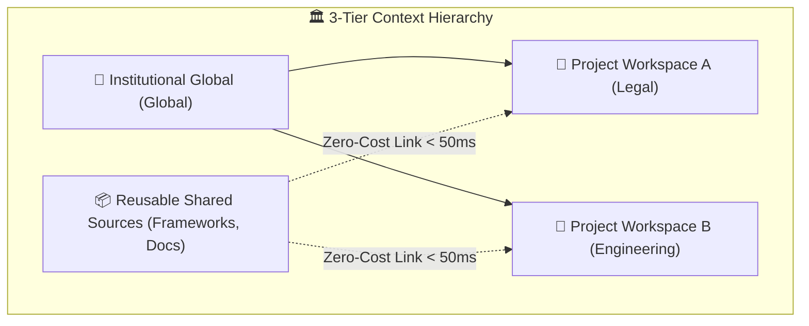
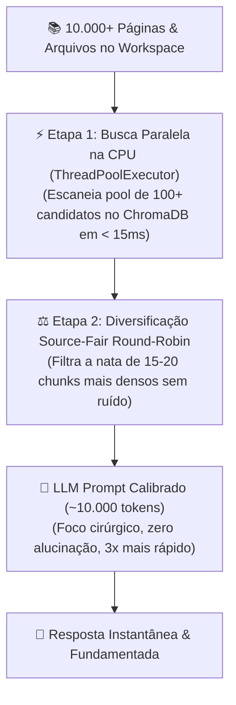

# 🔬 AnyContext Technical Documentation (`TecDoc`)

> **Comprehensive Engineering, Architecture, and Deep-Dive Technical Manual for AnyContext (`actx`).**

---

## 📑 Table of Contents
1. [System Architecture & 3-Tier Context Model](#1-system-architecture--3-tier-context-model)
2. [2-Phase High-Precision RAG & Context Calibration Engine](#2-2-phase-high-precision-rag--context-calibration-engine)
3. [Temporal RAG & Metadata Freshness Engine](#3-temporal-rag--metadata-freshness-engine)
4. [Intelligent Web Ingestion & Recursive Crawler Engine](#4-intelligent-web-ingestion--recursive-crawler-engine)
5. [3-Level Structured Long-Term Memory Architecture](#5-3-level-structured-long-term-memory-architecture)
6. [REST API Server Architecture & Security (`actx --serve`)](#6-rest-api-server-architecture--security-actx---serve)
7. [Model Context Protocol (MCP) Implementation (`actx --mcp`)](#7-model-context-protocol-mcp-implementation-actx---mcp)
8. [Observability & Telemetry Pipeline (LangSmith)](#8-observability--telemetry-pipeline-langsmith)
9. [Multi-Interface Surface Parity & Governance Protocol](#9-multi-interface-surface-parity--governance-protocol)

---

## 1. System Architecture & 3-Tier Context Model

AnyContext implements a fully modular, decoupled architecture designed for local-first execution, enterprise privacy, and zero data leakage.

### 🏛️ The 3-Tier AI Context Hierarchy
To eliminate redundant re-indexing and guarantee multi-department data isolation, AnyContext organizes context into three distinct tiers:

1. **🏢 Institutional Global Knowledge Base (`Global`)**:
   - Organization-wide knowledge base curatable by system administrators.
   - Automatically inherited and queried across all authorized project workspaces during RAG retrieval.
2. **📦 Reusable Shared Sources Library (`Shared Sources`)**:
   - Dedicated central library workspace for reusable frameworks, technical codebases, and web documentation portals.
   - **Zero-Cost Source Linking**: Any project workspace can link an existing indexed source in `< 50ms` with **$0.00 in embedding API costs** via `/link` or the REST API.
   - ChromaDB vectors and SQLite metadata are referenced dynamically without duplication.
3. **📁 Scoped Project Workspaces**:
   - Isolated contextual boundaries guaranteeing zero cross-project data leakage.
   - Workspaces can exist as empty logical scopes (ideal for documentation portals, market research, or agent tasks) before attaching local folders or web URLs.



### ⚙️ 3-Tier Configuration Resolution Hierarchy
AnyContext resolves settings, API credentials, and environment overrides through a strict three-tier precedence model:

```
1. Operating System Environment Variables  (Highest Precedence - export OPENAI_API_KEY=...)
2. Local .env File                         (Loaded cumulatively from AppData/Local/actx & project root)
3. Local SQLite Secure Database            (Lowest Precedence - Managed interactively via /config)
```

---

## 2. 2-Phase High-Precision RAG & Context Calibration Engine

AnyContext implements an advanced **2-Phase Retrieval-Augmented Generation (RAG)** pipeline designed for maximum factual precision, cross-source fairness, and elimination of context window attention degradation.



### 🔍 Phase 1: Deep Candidate Pool Scanning
- The ChromaDB vector database evaluates a broad initial pool of **100+ candidate chunks** across all indexed documents, guarantee 100% recall coverage.
- **Parallel Multi-Source Retrieval (`ThreadPoolExecutor`)**: Concurrently searches across the active workspace, linked Shared Sources, and Global knowledge bases on all CPU cores, fusing results in sub-10ms.

### ⚖️ Phase 2: Source-Fair Round-Robin Diversification (`_diversify_nodes`)
- To prevent a monolithic 500-page document from monopolizing all context slots, the `_diversify_nodes` algorithm allocates chunks using a balanced round-robin strategy:
  - **Pass 1:** Selects up to `max_chunks_per_source` (default: 3) from each distinct document or web URL.
  - **Pass 2:** If the target quota remains unfilled, populates remaining slots with the highest-scoring candidate chunks.

### 🌐 Contextual Retrieval & Semantic Enrichment (`ContextualEnricher`)
- **The Problem of Out-of-Domain False Positives**: In dense vector search, generic terms like "authorizations" or "deadlines" in unrelated documents (e.g. IT access forms or financial agreements) can falsely match queries about child immigration laws.
- **The Contextual Enrichment Solution (`src/any_context/vector_engine/enricher.py`)**:
  - Before chunking and embedding, every local document or crawled web URL passes through the `ContextualEnricher`.
  - Generates a **Rich Semantic Envelope**:
    1. **Rich Summary (3-4 dense sentences)**: Scope, governing policies, target subjects, and legal context.
    2. **Top-N Domain Keywords (5-8 terms)**: Canonical domain tags extracted and boosted by title/heading heuristics.
  - **Chunk Enveloping**: Every chunk is anchored with the document header:
    ```text
    [Context: Document 'Manual_Canada_2026.pdf': Guidelines on Child Travel Consent and Custody | Keywords: travel, consent, custody, ircc, minors]
    ---
    <original chunk text...>
    ```
  - **SHA-256 Persistent SQLite Caching**: The semantic envelope is generated once per file/URL and cached in SQLite (`contextual_enrichment_cache.db`), guaranteeing **sub-millisecond bypass (0.00ms)** for unmodified files on subsequent syncs.

### ⚡ Modular Parallel Vector Engine & LanceDB Columnar Storage (`vector_engine/`)
- **Encapsulated LanceDB Driver (`src/any_context/vector_engine/store.py`)**:
  - Direct persistence into Apache Arrow columnar datasets (`.lance`) in Rust.
  - Zero SQLite write locks, zero-copy retrieval, sub-5ms vector queries across 100,000+ chunks.
- **Dependency Injection Contracts (`src/any_context/vector_engine/models.py`)**:
  - `RetrievalConfig`: Immutable dataclass parameter object encapsulating candidate pool size (`candidate_pool_k`), target chunks (`target_top_k`), score threshold (`min_similarity_score`), and max chunks per source (`max_chunks_per_source`).
  - `IngestionConfig`: Immutable dataclass parameter object defining chunk size, token overlap, and batch embedding concurrency.
- **High-Throughput Parallel Ingestor (`src/any_context/vector_engine/indexer.py`)**:
  - `ParallelIndexer`: Coordinates concurrent file parsing, contextual enrichment, batch vector embeddings (50-100 chunks/batch), and zero-copy columnar ingestion into LanceDB.
- **Multi-Source Parallel Retriever (`src/any_context/vector_engine/retriever.py`)**:
  - `ParallelRetriever`: Concurrently executes vector search across the active workspace, Global knowledge base, and linked Shared Sources using thread pools calling LanceDB's native Rust HNSW index.
- **Decoupled Relevance & Diversification Filter (`src/any_context/vector_engine/filters.py`)**:
  - `RelevanceFilter`: Pure-function ranking module applying mathematical score thresholding, source-fair round-robin balancing, and strict density budgeting (~10,000 tokens) with zero I/O side effects.

### 🧹 Multi-Query Turn Consolidation & Runtime Pruning (`PruningChatModelWrapper`)
- In multi-turn chat sessions (`actx`), LangGraph retains the compiled state graph in RAM across consecutive turns within the same terminal session.
- To prevent past searches from accumulating across turns (e.g. 3 turns × 42k chars = 138,992 tokens) while **fully preserving multi-subtopic searches within the same question**:
  - **Historical Tool Messages**: All `ToolMessage` payloads prior to the latest `HumanMessage` are compacted to `"[Prior workspace context retrieved and synthesized in conversation history]"`.
  - **Current Turn Multi-Tool Consolidation**: When the agent searches multiple sub-topics in the active turn (e.g. Subtopic A + Subtopic B), the system partitions the 40,000-character density budget proportionally across all active tool calls. Every researched topic is preserved with high-density snippets without dropping facts.
  - **Conversation Dialogue**: `HumanMessage` and `AIMessage` history is **100% preserved**.
  - **Prompt Size**: Stays safely at ~5,000 to 12,000 tokens indefinitely, completely eliminating 128,000 token context overflow errors across 100+ turns and multi-topic tool loops.

### 🔄 Resilient Auto-Retry with Exponential Backoff (`max_retries=5`)
- All 9 supported AI providers (OpenAI, Anthropic, Gemini, Groq, DeepSeek, Mistral, xAI) enforce Tokens Per Minute (TPM) and Requests Per Minute (RPM) rate limits.
- AnyContext configures `max_retries=5` with exponential backoff on all chat model initializations. If a provider returns **HTTP 429 (Rate Limit)**, AnyContext waits the required milliseconds and completes the response seamlessly without user-facing errors.

### 🎛️ Dynamic Retrieval Presets Matrix

| Preset | Pool no ChromaDB | Chunks Injetados | Tokens de Contexto | Melhor uso |
| :--- | :---: | :---: | :---: | :--- |
| **⚡ Turbo** | 50 candidatos | 10 chunks | ~5.000 tokens | **Velocidade máxima:** perguntas rápidas, fatos pontuais, dúvidas do dia a dia. |
| **⚖️ Balanced** *(Padrão)* | 100 candidatos | 20 chunks | ~10.000 a 15.000 tokens | **Equilíbrio perfeito:** alta precisão factual sem ruído (o padrão ideal). |
| **🔬 Deep Research** | 150 candidatos | 40 chunks | ~30.000 a 40.000 tokens | **Auditoria pesada:** comparar cláusulas de 10 contratos ou analisar dossiês complexos. |

### 🛡️ AI Grounding & Answer Modes
- **🛡️ Strict Mode**: 100% anchored to workspace chunks. Zero parametric speculation; explicitly declares absence of facts if not found. Web search requires explicit user confirmation.
- **⚖️ Hybrid Mode (Default)**: Dual-layer response. Answers factual questions using workspace documents, followed by clearly labeled general knowledge insights (*"De acordo com meus conhecimentos gerais..."*).
- **🚀 Proactive Mode**: Open research and strategic ideation. Broad cross-synthesis and proactive recommendations.

---

## 3. Temporal RAG & Metadata Freshness Engine

AnyContext features a deterministic time-aware retrieval engine that resolves document recency, supersedes outdated news, and maintains temporal integrity.

### 🕒 5-Tier Web Date Resolution Pipeline
Extracts canonical publication and update timestamps through a cascading priority hierarchy:
1. **OpenGraph / Schema.org JSON-LD**: `article:published_time`, `dateModified`, `datePublished`.
2. **In-Page Semantic Text & Footers**: Regex parsing of visible patterns (`Page details YYYY-MM-DD`, `Date modified: YYYY-MM-DD`, `Last updated: ...`).
3. **URL Date Patterns**: Extraction from structured URL slugs (e.g. `/2023/06/15/...`).
4. **HTTP `Last-Modified` Headers**: Server-reported timestamps.
5. **Crawl & Ingestion Timestamp**: Fallback to real-time ingestion date.

### 🏷️ Content Classification & Chunk Headers
- Categorizes sources into `Canonical Service / Documentation` (authoritative active rules), `Historical News / Press Release` (past announcements), or `Local Document`.
- Every chunk injected into the LLM context carries a standardized time-aware header:
  ```text
  --- [Document Chunk N | Source: filename.ext | Workspace: Legal | Last Modified: YYYY-MM-DD | Type: Canonical Service] ---
  ```
- **Recency Primacy Protocol**: The AI agent evaluates timestamps and operational notices, guaranteeing that active rules (`Status: Paused`) supersede older historical press releases.

---

## 4. Intelligent Web Ingestion & Recursive Crawler Engine

AnyContext includes a built-in, concurrent web ingestion engine designed for high-precision RAG extraction.

```
┌────────────────────────────────────────────────────────────────────────────────────────┐
│                        ANYCONTEXT WEB INGESTION LIFECYCLE                              │
├─────────────────┬─────────────────┬──────────────────┬─────────────────┬───────────────┤
│  1. Discovery   │  2. Resolution  │   3. Proximity   │  4. Concurrent  │ 5. Ingestion  │
│  & Normalization│  & Sitemaps     │     Ranking      │    Extraction   │   Pipeline    │
├─────────────────┼─────────────────┼──────────────────┼─────────────────┼───────────────┤
│ • Strip .html   │ • sitemapindex  │ • Landing (10k)  │ • Multi-threaded│ • Chunk 500/50│
│ • Infer Prefix  │ • Keyword Match │ • Section (2k)   │ • Strip Boiler  │ • OpenAI Embed│
│ • Extract Links │ • Filter .xml   │ • Keywords (300) │ • Markdown AST  │ • ChromaDB    │
└─────────────────┴─────────────────┴──────────────────┴─────────────────┴───────────────┘
```

### 🧠 Under the Hood Details:
1. **Semantic Path Normalization**: Strips file extensions (`.html`, `.php`, `.aspx`) to derive true directory paths (e.g. `/en/services/`).
2. **Recursive Sitemap Traversal**: Locates `sitemap.xml` and traverses nested `<sitemapindex>` catalogs, filtering matching topics.
3. **Semantic Proximity Ranking (`_rank_url`)**:
   - 🥇 **Landing URL** (Priority 10,000)
   - 🥈 **Direct Section Children** (Priority 2,000)
   - 🥉 **Direct In-Page Links** (Priority 500)
   - 🏅 **Keyword & Slug Matches** (Priority 300 per keyword)
   - ⚪ **Generic Domain URLs** (Priority 0)
4. **Clean Semantic HTML Extraction**: Strips navigation bars, footers, cookies, scripts, and ads while preserving headings, markdown tables, and code blocks.
5. **SentenceSplitter & Rate-Limited Batching**: Splits content into 500-token chunks (50 overlap) and generates embeddings in micro-batches (`embed_batch_size=32`) to prevent rate limits.
6. **E-Commerce & Schema.org Rating Extraction**: Parses `<script type="application/ld+json">` for `Product` and `IndividualProduct` schema (star ratings, review counts, prices, stock status) and preserves HTML review badges (`4.844 out of 5 stars. 1199 reviews`).

---

## 5. 3-Level Structured Long-Term Memory Architecture

AnyContext implements a hierarchical 3-level memory system:

### 🧠 Level 1: Structured 5-Dimension Session Summary
Extracted automatically upon `/exit` or `/q` across 5 clear dimensions:
1. 👤 **User Directives & Preferences**: Explicit rules, workflows, coding conventions.
2. 🏗️ **Technical Architecture & Key Decisions**: Architecture choices, parameters, schemas.
3. 📁 **Files, Code Symbols & Databases**: Files modified, functions created, database tables.
4. 📌 **Critical Context & Problem Resolution**: Root-cause diagnoses, bug fixes, operational insights.
5. 🚀 **Pending Tasks & Next Steps**: Roadmap milestones and open action items.

### 🧠 Level 2: Active Rolling Window
Retains recent conversation messages in SQLite state for immediate context continuity.

### 🧠 Level 3: Consolidated Meta-Summarization
Consolidates older memory vectors into high-level indices using 1024-token expanded chunks (`chunk_size=1024`, `chunk_overlap=200`).

---

## 6. REST API Server Architecture & Security (`actx --serve`)

AnyContext includes a production-grade FastAPI REST server for enterprise VPC deployments.

### 🌐 Key REST Endpoints:
- `POST /v1/chat` — Streaming & non-streaming RAG queries with session memory and `grounding_mode`.
- `GET /v1/context/mode` & `POST /v1/context/mode` — Grounding mode inspection and management.
- `GET /v1/workspaces` — Lists all workspaces with unified typed `sources` array.
- `GET /v1/workspaces/{name}/sources` — Detailed source breakdown.
- `POST /v1/workspaces` — Create workspace.
- `POST /v1/workspaces/transfer` — Instant zero-cost transfer of local folders and websites between workspaces.
- `POST /v1/workspaces/{name}/cloud-drives` — Connect cloud drive sources.
- `POST /v1/index` — Background folder re-indexing.
- `GET /v1/models` — Active & available model inspection.

### 🔒 Cryptographic Security & RBAC:
- **PBKDF2 Password Hashing**: Passwords stored in SQLite are hashed with PBKDF2 using 100,000 iterations and cryptographic salts.
- **Bearer Authentication**: Session tokens prefixed with `actx_sec_` with role-based access control (`Admin`, `Analyst`, `Viewer`).

---

## 7. Model Context Protocol (MCP) Implementation (`actx --mcp`)

Native JSON-RPC 2.0 stdio implementation connecting AnyContext to Claude Desktop, Cursor IDE, and Antigravity.

### 🔌 11 Registered MCP Tools:
1. `search_workspace_docs` — Vector semantic search across indexed files.
2. `query_anycontext_agent` — Direct RAG query with 3-level session memory.
3. `get_grounding_mode` — Inspect active AI Grounding Mode (`hybrid`, `strict`, `proactive`).
4. `set_grounding_mode` — Switch active AI Grounding Mode.
5. `list_workspaces` — Lists all configured workspaces and associated sources.
6. `get_workspace_sources` — Retrieves detailed sources breakdown for a workspace.
7. `transfer_workspace_source` — Zero-cost instant data source transfer.
8. `rename_workspace` — Instant zero-cost atomic workspace rename.
9. `get_context_retrieval_settings` — Inspect current RAG retrieval density parameters and preset.
10. `set_context_retrieval_preset` — Configure RAG presets (`balanced`, `turbo`, `deep_research`).
11. `list_available_models` — Inspect available and configured models.

---

## 8. Observability & Telemetry Pipeline (LangSmith)

When `LANGSMITH_TRACING=true` is present in the environment (via `.env` or system variables):
- Every user query, LangGraph agent step, tool call (`search_db`, `live_web_search`), and LLM synthesis is traced in real-time.
- Traces are streamed to `https://api.smith.langchain.com` under the project `AnyContext`.
- Captures precise token counts (input/output), millisecond latencies, and execution trees.

---

## 9. Multi-Interface Surface Parity & Governance Protocol

AnyContext strictly follows the **`dev-cycle-protocol`** universal software engineering lifecycle:
- **Modular Architecture**: Complete decoupling of core business logic from consumer interfaces.
- **Multi-Interface Surface Parity**: Every feature is delivered across all 3 active interfaces (`CLI`, `REST API`, `MCP Server`).
- **Dual-Doc Standard**: Synchronous maintenance of `UserDoc` (`README.md` / `/help`) and `TecDoc` (`TECDOC.md`).
- **Explicit Approval Gate**: Implementation strictly begins only after explicit user confirmation of the Final Blueprint.
