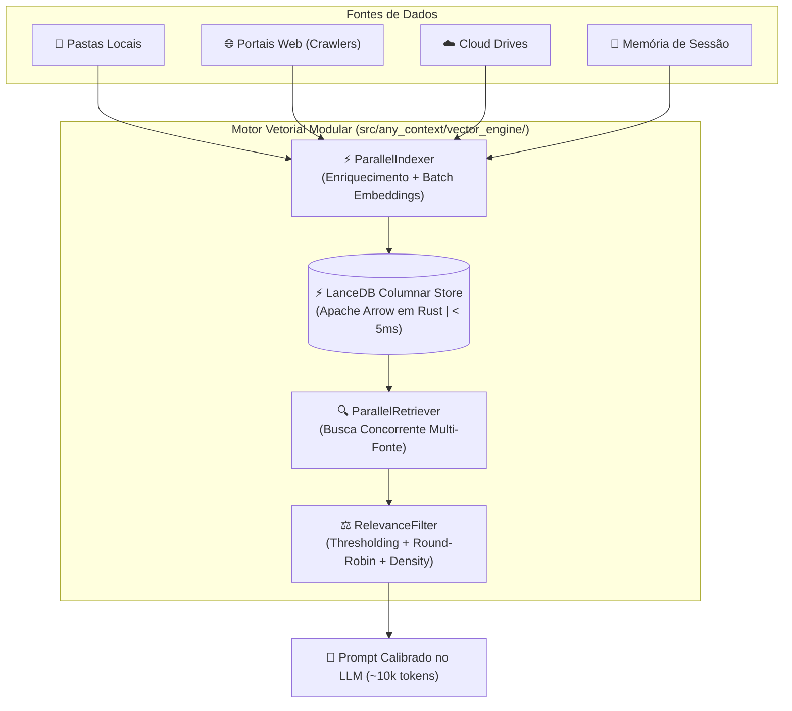
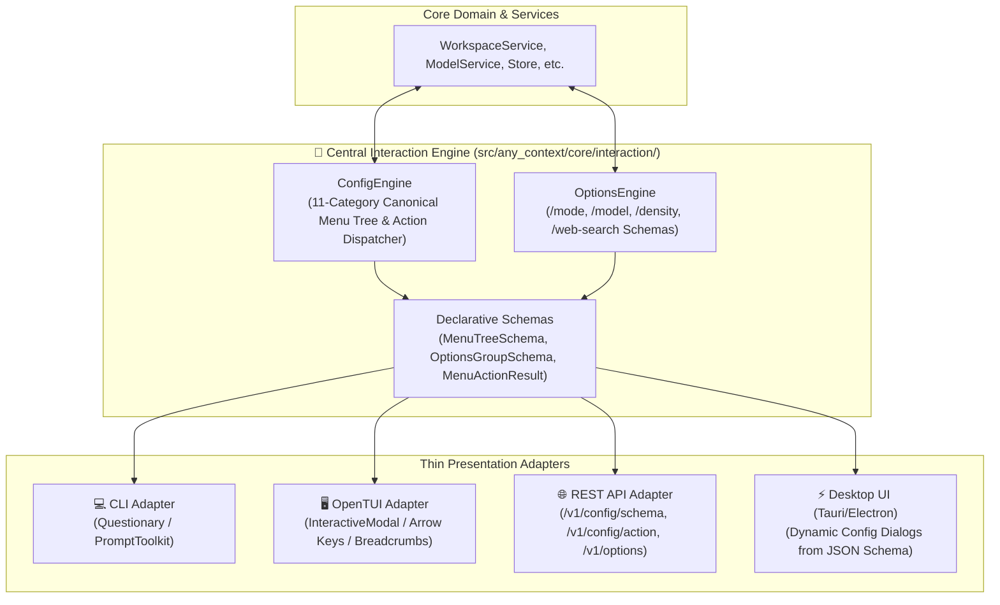
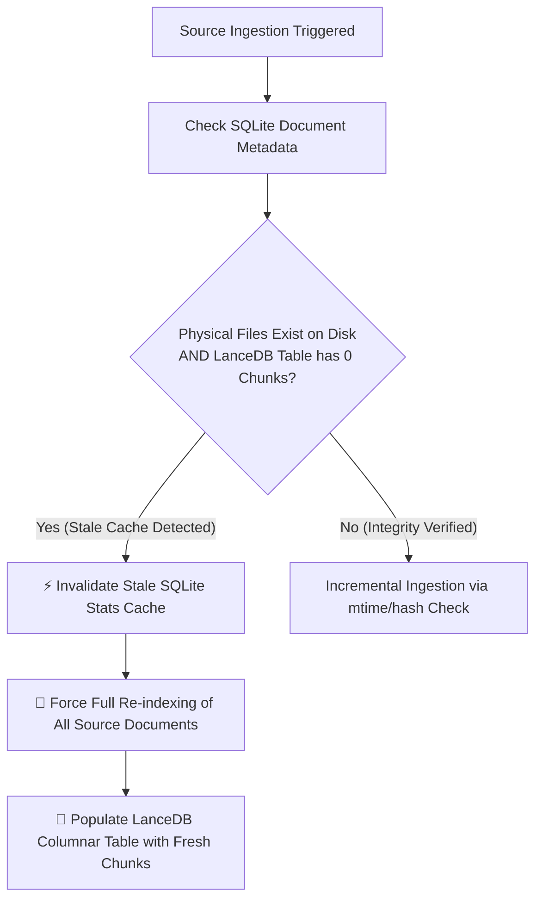

# 🔬 AnyContext Technical Documentation (`TecDoc`)

> **Comprehensive Engineering, Architecture, and Deep-Dive Technical Manual for AnyContext (`actx`).**

---

## 📑 Table of Contents
1. [System Architecture & 3-Tier Context Model](#1-system-architecture--3-tier-context-model)
2. [100% LanceDB Columnar Vector Engine & Modular RAG Architecture](#2-100-lancedb-columnar-vector-engine--modular-rag-architecture)
3. [Temporal RAG & Metadata Freshness Engine](#3-temporal-rag--metadata-freshness-engine)
4. [Intelligent Web Ingestion & Recursive Crawler Engine](#4-intelligent-web-ingestion--recursive-crawler-engine)
5. [3-Level Structured Long-Term Memory Architecture](#5-3-level-structured-long-term-memory-architecture)
6. [Unified Synchronization & Multi-Source Parity Engine](#6-unified-synchronization--multi-source-parity-engine)
7. [REST API Server Architecture & Security (`actx --serve`)](#7-rest-api-server-architecture--security-actx---serve)
8. [Model Context Protocol (MCP) Implementation (`actx --mcp`)](#8-model-context-protocol-mcp-implementation-actx---mcp)
9. [Cross-Version Python Compatibility (3.10 - 3.13) & AST Engineering](#9-cross-version-python-compatibility-310---313--ast-engineering)
10. [Observability & Telemetry Pipeline (LangSmith)](#10-observability--telemetry-pipeline-langsmith)
11. [AI Grounding Modes & Strict Web Search Permission Gate (`v0.24.3`)](#11-ai-grounding-modes--strict-web-search-permission-gate-v0243)
12. [Multi-Interface Surface Parity & Governance Protocol](#12-multi-interface-surface-parity--governance-protocol)
13. [Hexagonal Decoupling & Universal Command Adapter Architecture (`v0.27.0`)](#13-hexagonal-decoupling--universal-command-adapter-architecture-v0270)
14. [Central Interaction Engine & Decoupled Presentation Architecture (`v0.28.0`)](#14-central-interaction-engine--decoupled-presentation-architecture-v0280)
15. [Hardware-Bound Data Encryption & OS-Native Storage Isolation (`v0.28.16`)](#15-hardware-bound-data-encryption--os-native-storage-isolation-v02816)
16. [Full-Screen OpenTUI Layout, Mouse Wheel & Keyboard Scroll Engine (`v0.28.28`)](#16-full-screen-opentui-layout-mouse-wheel--keyboard-scroll-engine-v02828)
17. [RAG Self-Healing Ingestion & Stale Cache Invalidation Engine (`v0.28.29`)](#17-rag-self-healing-ingestion--stale-cache-invalidation-engine-v02829)
18. [Interactive Workspace Deletion with Mandatory Confirmation Protocol (`v0.28.32`)](#18-interactive-workspace-deletion-with-mandatory-confirmation-protocol-v02832)
19. [Canonical Model ID Normalization & Settings Persistence Engine (`v0.28.33`)](#19-canonical-model-id-normalization--settings-persistence-engine-v02833)
20. [Sub-Process DLL Isolation & Fast-Path Routing in PyInstaller Binaries (`v0.28.37`)](#20-sub-process-dll-isolation--fast-path-routing-in-pyinstaller-binaries-v02837)

---

## 1. System Architecture & 3-Tier Context Model

AnyContext implements a fully modular, decoupled architecture designed for local-first execution, enterprise privacy, and zero data leakage.

### 🏛️ The 3-Tier AI Context Hierarchy
To eliminate redundant re-indexing and guarantee multi-department data isolation, AnyContext organizes context into three distinct tiers:

1. **🏢 Institutional Global Knowledge Base (`Global`)**:
   - Organization-wide knowledge base curatable by system administrators.
   - Automatically inherited and queried across all authorized project workspaces during RAG retrieval.
2. **📦 Reusable Shared Sources Library (`Shared Sources`)**:
   - Dedicated central library workspace for reusable frameworks, technical codebases, and web documentation portals.
   - **Zero-Cost Source Linking**: Any project workspace can link an existing indexed source in `< 50ms` with **$0.00 in embedding API costs** via `/link` or the REST API.
   - LanceDB columnar vector datasets and SQLite metadata are referenced dynamically without physical duplication.
3. **📁 Scoped Project Workspaces**:
   - Isolated contextual boundaries guaranteeing zero cross-project data leakage.
   - Workspaces can exist as empty logical scopes (ideal for documentation portals, market research, or agent tasks) before attaching local folders or web URLs.

```mermaid
graph TD
    subgraph "🏛️ 3-Tier Context Hierarchy"
        A["🏢 Institutional Global (Global)"] --> D["📁 Project Workspace A (Legal)"]
        A --> E["📁 Project Workspace B (Engineering)"]
        B["📦 Reusable Shared Sources (Frameworks, Docs)"] -.->|Zero-Cost Link < 50ms ($0.00)| D
        B -.->|Zero-Cost Link < 50ms ($0.00)| E
    end
```

### ⚙️ 3-Tier Configuration Resolution Hierarchy
AnyContext resolves settings, API credentials, and environment overrides through a strict three-tier precedence model:

```
1. Operating System Environment Variables  (Highest Precedence - export OPENAI_API_KEY=...)
2. Local .env File                         (Loaded cumulatively from AppData/Local/actx & project root)
3. Local SQLite Secure Database            (Lowest Precedence - Managed interactively via /config)
```

---

## 2. 100% LanceDB Columnar Vector Engine & Modular RAG Architecture

Starting in version `v0.21.0`, AnyContext has **fully unified all vector operations into LanceDB (Apache Arrow / Rust)**, completely eliminating ChromaDB, SQLite write-lock contentions, and `docstore.json` serialization bottlenecks.



### 🧩 Modular Subsystem Breakdown (`src/any_context/vector_engine/`)

#### 1. `LanceDBStore` (`src/any_context/vector_engine/store.py`):
- **Native Columnar Engine**: Encapsulates raw LanceDB driver operations using PyArrow schemas. All vector data is stored in Apache Arrow format on disk (`workspace_chunks.lance` and `session_memory.lance`).
- **Zero-Copy & Sub-Millisecond Speed**: Vector queries execute in `< 5ms` on 100k+ chunks through Rust-based AVX2/AVX-512 SIMD vector distance routines.
- **PyArrow Record Schema**:
  ```python
  pa.schema([
      pa.field("id", pa.string()),
      pa.field("vector", pa.list_(pa.float32(), dim)),
      pa.field("text", pa.string()),
      pa.field("file_name", pa.string()),
      pa.field("file_path", pa.string()),
      pa.field("workspace", pa.string()),
      pa.field("last_modified", pa.string()),
      pa.field("content_type", pa.string()),
      pa.field("document_summary", pa.string()),
      pa.field("keywords", pa.string()),
      pa.field("content_hash", pa.string()),
  ])
  ```
- **Cross-Platform Path Normalization (`_norm_path`)**: Standardizes Windows (`\`) and POSIX (`/`) paths to forward slashes before SQL/Arrow filtering, guaranteeing 100% search compatibility across operating systems.
- **Atomic Zero-Cost Metadata Operations ($0.00)**:
  - `update_workspace_name(old_ws, new_ws, table_name)`: Reads matching records, updates the workspace metadata attribute, and commits changes atomically in `< 50ms` without recomputing vector embeddings.
  - `transfer_file(source_ws, target_ws, file_path, table_name)`: Migrates all records belonging to a folder, file, or URL domain from one workspace to another in `< 50ms` with zero token expenditure.

#### 2. `ParallelIndexer` (`src/any_context/vector_engine/indexer.py`):
- **Concurrent Ingestion Pipeline**: Coordinates file parsing, semantic enrichment, batch embedding, and columnar writes.
- **Micro-Batch Vectorization**: Calls `get_text_embeddings_batch` in batches of 32 to 100 chunks, maximizing OpenAI/local embedding throughput while avoiding HTTP 429 rate limits.
- **Dynamic Dimension Resolution**: Inspects the length of the first computed embedding vector (e.g. 1536 for OpenAI `text-embedding-3-small` or 3072 for `text-embedding-3-large`) and provisions the PyArrow schema dynamically.

#### 3. `ParallelRetriever` (`src/any_context/vector_engine/retriever.py`):
- **Multi-Source Thread Pool Execution**: Uses `ThreadPoolExecutor` to simultaneously query the active workspace partition, the `Global` knowledge base, and linked `Shared Sources`.
- **Distance to Similarity Normalization**: Converts LanceDB L2 / Cosine distances to a normalized `[0.0, 1.0]` score:
  $$\text{score} = \frac{1.0}{1.0 + \max(0.0, \text{distance})}$$
- **Zero-Lock Concurrency**: Multiple read threads query the Apache Arrow dataset concurrently without database lock contention.

#### 4. `RelevanceFilter` (`src/any_context/vector_engine/filters.py`):
- **Pure-Function Decoupled Filter**: Applies mathematical score thresholding (`apply_threshold`), source-fair round-robin balancing (`apply_source_diversification`), and strict prompt density budgeting (`apply_density_budget`).
- **Density Budgeting**: Enforces a strict ceiling of **45,000 characters (~10,000-11,000 tokens)**, ensuring that injected context fits safely within LLM attention windows without causing attention degradation ("Lost in the Middle").

#### 5. `RetrievalConfig` & `IngestionConfig` (`src/any_context/vector_engine/models.py`):
- **Decoupled Parameter Objects**: Immutable dataclasses injected via Dependency Injection into the retriever and indexer.
- **Retrieval Presets**:
  - `turbo`: `candidate_pool_k=50`, `target_top_k=10`, `max_chunks_per_source=2` (~5,000 tokens).
  - `balanced` (Default): `candidate_pool_k=100`, `target_top_k=20`, `max_chunks_per_source=3` (~10,000-15,000 tokens).
  - `deep_research`: `candidate_pool_k=150`, `target_top_k=40`, `max_chunks_per_source=5` (~30,000-40,000 tokens).

---

### 🌐 Contextual Retrieval & Semantic Enrichment (`ContextualEnricher`)

- **The Problem of Out-of-Domain False Positives**: In dense vector search, generic terms like "authorizations" or "deadlines" in unrelated documents (e.g. IT access forms or financial agreements) can falsely match queries about child immigration laws.
- **The Contextual Enrichment Solution (`src/any_context/vector_engine/enricher.py`)**:
  - Before chunking and embedding, every local document or crawled web URL passes through the `ContextualEnricher`.
  - Generates a **Rich Semantic Envelope**:
    1. **Rich Summary (3-4 dense sentences)**: Scope, governing policies, target subjects, and legal context.
    2. **Top-N Domain Keywords (5-8 terms)**: Canonical domain tags extracted and boosted by title/heading heuristics.
  - **Chunk Enveloping**: Every chunk is anchored with the document header:
    ```text
    [Context: Document 'Manual_Canada_2026.pdf': Guidelines on Child Travel Consent and Custody | Keywords: travel, consent, custody, ircc, minors]
    ---
    <original chunk text...>
    ```
  - **SHA-256 Persistent SQLite Caching**: The semantic envelope is generated once per file/URL and cached in SQLite (`contextual_enrichment_cache.db`), guaranteeing **sub-millisecond bypass (0.00ms)** for unmodified files on subsequent syncs.

---

### 🔍 Live Database Inspection Command (`/inspect` ou `/chunks`)

Users and administrators can verify vector database state directly from the chat interface without leaving the terminal:
- Command: `/inspect` (aliases: `/chunks`, `/lance`)
- Options: `/inspect -n 10` (custom sample limit)
- Output Data:
  - Active storage engine: `⚡ LanceDB Columnar (Apache Arrow / Rust)`
  - Physical disk path of the `.lance` dataset
  - Total chunks in active workspace vs. total across all workspaces in `workspace_chunks.lance`
  - Total long-term memories in `session_memory.lance`
  - Formatted text snippets, content types (`Local Document`, `Web Documentation`), and source paths

---

## 3. Temporal RAG & Metadata Freshness Engine

AnyContext features a deterministic time-aware retrieval engine that resolves document recency, supersedes outdated news, and maintains temporal integrity.

### 🕒 5-Tier Web Date Resolution Pipeline
Extracts canonical publication and update timestamps through a cascading priority hierarchy:
1. **OpenGraph / Schema.org JSON-LD**: `article:published_time`, `dateModified`, `datePublished`.
2. **In-Page Semantic Text & Footers**: Regex parsing of visible patterns (`Page details YYYY-MM-DD`, `Date modified: YYYY-MM-DD`, `Last updated: ...`).
3. **URL Date Patterns**: Extraction from structured URL slugs (e.g. `/2023/06/15/...`).
4. **HTTP `Last-Modified` Headers**: Server-reported timestamps.
5. **Crawl & Ingestion Timestamp**: Fallback to real-time ingestion date.

### 🏷️ Content Classification & Chunk Headers
- Categorizes sources into `Canonical Service / Documentation` (authoritative active rules), `Historical News / Press Release` (past announcements), or `Local Document`.
- Every chunk injected into the LLM context carries a standardized time-aware header:
  ```text
  --- [Document Chunk N | Source: filename.ext | Workspace: Legal | Last Modified: YYYY-MM-DD | Type: Canonical Service] ---
  ```
- **Recency Primacy Protocol**: The AI agent evaluates timestamps and operational notices, guaranteeing that active rules (`Status: Paused`) supersede older historical press releases.

---

## 4. Intelligent Web Ingestion & Recursive Crawler Engine

AnyContext includes a built-in, concurrent web ingestion engine designed for high-precision RAG extraction.

```
┌────────────────────────────────────────────────────────────────────────────────────────┐
│                        ANYCONTEXT WEB INGESTION LIFECYCLE                              │
├─────────────────┬─────────────────┬──────────────────┬─────────────────┬───────────────┤
│  1. Discovery   │  2. Resolution  │   3. Proximity   │  4. Concurrent  │ 5. Columnar   │
│  & Normalization│  & Sitemaps     │     Ranking      │    Extraction   │   LanceDB     │
├─────────────────┼─────────────────┼──────────────────┼─────────────────┼───────────────┤
│ • Strip .html   │ • sitemapindex  │ • Landing (10k)  │ • Multi-threaded│ • Chunk 500/50│
│ • Infer Prefix  │ • Keyword Match │ • Section (2k)   │ • Strip Boiler  │ • Batch Embed │
│ • Extract Links │ • Filter .xml   │ • Keywords (300) │ • Markdown AST  │ • Arrow Batch │
└─────────────────┴─────────────────┴──────────────────┴─────────────────┴───────────────┘
```

### 🧠 Under the Hood Details:
1. **Semantic Path Normalization**: Strips file extensions (`.html`, `.php`, `.aspx`) to derive true directory paths (e.g. `/en/services/`).
2. **Recursive Sitemap Traversal**: Locates `sitemap.xml` and traverses nested `<sitemapindex>` catalogs, filtering matching topics.
3. **Semantic Proximity Ranking (`_rank_url`)**:
   - 🥇 **Landing URL** (Priority 10,000)
   - 🥈 **Direct Section Children** (Priority 2,000)
   - 🥉 **Direct In-Page Links** (Priority 500)
   - 🏅 **Keyword & Slug Matches** (Priority 300 per keyword)
   - ⚪ **Generic Domain URLs** (Priority 0)
4. **Clean Semantic HTML Extraction**: Strips navigation bars, footers, cookies, scripts, and ads while preserving headings, markdown tables, and code blocks.
5. **High-Speed Dual-Stage Parallel Pipeline (`v0.23.0`)**:
   - **Stage 1: Multi-Threaded Network & Conditional GET (20 Workers)**:
     - **Sitemap `<lastmod>` Diff**: In-memory timestamp comparison against SQLite skips network requests entirely for unmodified sitemap entries.
     - **HTTP Conditional GET (`If-None-Match` & `If-Modified-Since`)**: Returns `304 Not Modified` with 0 bytes body download in ~15ms, maintaining vector integrity without consuming bandwidth.
     - **Anti-429 Exponential Backoff**: Automatically catches HTTP 429 rate limit responses, applies jittered backoff based on `Retry-After` headers, and retries gracefully without thread deadlock.
   - **Stage 2: Parallel Batch Vectorization via `ParallelIndexer` (4-6 Workers)**:
     - Modified documents are enriched concurrently and dispatched in parallel batches to the embedding provider (OpenAI / Local LLM) with transient rate limit retries.
     - Embeddings are streamed directly into LanceDB via Apache Arrow columnar zero-copy buffers.
6. **Multi-Page Portal Re-Crawling on `/web --sync`**:
   - `sync_workspace_web_urls` inspects whether a web source has multiple indexed pages (`page_count > 1` or crawler root).
   - For multi-page portals, it executes the full crawler pipeline (`crawl_website`) across all sub-pages with support for `force_rescrape`, guaranteeing that all portal chunks are populated in LanceDB.

---

## 5. 3-Level Structured Long-Term Memory Architecture

AnyContext implements a hierarchical 3-level memory system powered exclusively by LanceDB table `session_memory.lance`:

### 🧠 Level 1: Structured 5-Dimension Session Summary
Extracted automatically upon `/exit` or `/q` across 5 clear dimensions:
1. 👤 **User Directives & Preferences**: Explicit rules, workflows, coding conventions.
2. 🏗️ **Technical Architecture & Key Decisions**: Architecture choices, parameters, schemas.
3. 📁 **Files, Code Symbols & Databases**: Files modified, functions created, database tables.
4. 📌 **Critical Context & Problem Resolution**: Root-cause diagnoses, bug fixes, operational insights.
5. 🚀 **Pending Tasks & Next Steps**: Roadmap milestones and open action items.

### 🧠 Level 2: Active Rolling Window
Retains recent conversation messages in SQLite state for immediate context continuity.

### 🧠 Level 3: Consolidated Meta-Summarization
Consolidates older memory vectors into high-level indices using 1024-token expanded chunks (`chunk_size=1024`, `chunk_overlap=200`) stored in LanceDB.

---

## 6. Unified Synchronization & Multi-Source Parity Engine

### 🏛️ Hexagonal Architecture & CLI Presentation Adapter (`src/any_context/cli/formatters.py` - `v0.24.1`)
In accordance with strict **Hexagonal Architecture (Ports & Adapters)** principles:
- **Core Domain & Use Cases (`core/`, `vector_engine/`, `ingestion/`, `billing/`, `help/`)**:
  - **100% UI-Agnostic**: Absolutely zero ANSI escape codes (`\033[...]`), zero hardcoded ASCII box drawings (`┌ │ └`), zero direct interactive prompts (`questionary`), and zero unbuffered `print()` calls.
  - Returns pure data structures (dictionaries, dataclasses, pydantic models) and emits progress via callback functions (`progress_callback(current, total, stage, item)`).
### 📊 Universal Two-Stage Progress Telemetry (`src/any_context/cli/progress.py` - `v0.24.2`)
To eliminate duplicate progress bar and spinner implementations across data sources:
- **`TwoStageProgressRenderer`**: A universal, thread-safe presentation context manager providing live terminal progress rendering for any ingestion pipeline (Folders, Web, Drives):
  - **Stage 1 (Discovery & Collection)**: Displays `[1/2 <Stage>] [████░░░░] N/Total (Pct%) • new, cached • item` for file scanning, web scraping, and cloud downloads.
  - **Stage 2 (Vectorization & IA)**: Connected directly to `ParallelIndexer`, rendering real-time enrichment and batch vector embeddings `[2/2 Embedding] [██████░░░░] N/Total (chunks) • Vector Knowledge Base`.
  - Encapsulates automatic terminal cursor management (`\033[?25l` / `\033[?25h`) and safe stdout flushing on Windows CP1252 consoles.

### 🖥️ OpenTUI Reactive TUI & Stdio RPC Architecture (`src/any_context/tui/` & `src/any_context/server/rpc_bridge.py` - `v0.26.8`)
- **Full Reactive TUI Framework with CLI Visual Parity & Standalone Bootloader Isolation**:
  - Built on `@opentui/core` and `@opentui/react` running on Zig/React/Bun.
  - **Natural Scroll Flow & ASCII Art Banner (`src/any_context/tui/components/chat-message-list.tsx`)**: Eliminates rigid header boxes; mounts the signature ASCII Art banner, edition badge (`🌿 Community Edition`), and welcome frame directly into the virtualized scroll view.
  - **Active Input Buffer Synchronization (`src/any_context/tui/components/input-bar.tsx`)**: Utilizes `useRef<TextareaRenderable>` with real-time `plainText` extraction during `onContentChange` and `onSubmit`, ensuring bi-directional state synchronization with Slash Command Palette completions.
  - **Unified 1-Line Footer Dock with Elastic Flex Layout (`src/any_context/tui/components/status-bar.tsx`)**: Implements `flexShrink={0}` and `minHeight={2}` (1 border line + 1 text row), preventing vertical box collapse in tight terminal viewports.
  - **PyInstaller Bootloader Environment Isolation (`src/any_context/cli/chat_loop.py` & `src/any_context/tui/bridge-client.ts`)**: Case-insensitively scrubs all `_mei*` and `pyi_*` variables (`_MEIPASS2`, `PYI_PARENT_PID`), preventing security validation aborts when spawning `actx --rpc` from `bun.exe`.
  - **Slash Command Palette Overlay (`src/any_context/tui/components/autocomplete-dropdown.tsx`)**: Floating popover dialog triggered automatically upon typing `/`, featuring real-time fuzzy filtering, keyboard navigation (`↑`/`↓`), and tab completion across all 23 internal slash commands.
  - **Zero-Network-Port Stdio RPC Bridge (`src/any_context/server/rpc_bridge.py`)**: Sub-millisecond (<1ms) communication over OS pipes using Newline-Delimited JSON (NDJSON), eliminating port conflicts, firewall popups, and zombie processes.
  - **Dual Architecture Parity**: Headless developer CLI (`actx "..."`, pipes `cat | actx`) and interactive shell in `src/any_context/cli/` remain fully preserved and available.


### 🎛️ Shared Multi-Source Orchestration Layer (`src/any_context/ingestion/orchestrator.py` - `v0.24.0`)
To enforce strict Single Responsibility Principles (SRP), all cross-source orchestration, background thread management, and multi-source workspace inspection are isolated into `orchestrator.py`:
- `BackgroundSyncManager`: Thread-safe worker thread daemon management and atomic telemetry.
- `check_workspace_changes`: Holistic multi-source scanner (<30ms) inspecting Local Folders, Web Portals, Cloud Drives, and Shared Links.
- `clear_context_vector_db`: LanceDB table and cache maintenance routines.

### 🔄 Unified Master Orchestrator (`src/any_context/ingestion/unified_sync.py`)
- `/sync` orchestrates synchronization across all registered source categories in the active workspace:
  1. 📁 **Local Folders**: Scanned, diffed (SHA-256), contextualized and ingested via `run_index_folder`.
  2. 🌐 **Web Portals**: Tracked, scraped, hashed and updated via `sync_workspace_web_urls`.
  3. ☁️ **Cloud Drives**: Synced via cloud drive managers.
- **Granular Target Flags**:
  - `/sync --folder` / `/sync -f`: Synchronizes local folders only.
  - `/sync --web` / `/sync -w`: Synchronizes web sources only.
  - `/sync --drive` / `/sync -d`: Synchronizes cloud drives only.
  - `/sync --all` / `/sync -a`: Synchronizes across all configured workspaces.
  - `/sync --force`: Forces re-hashing and re-indexing of all sources.
  - `/sync --status`: Displays real-time sync metrics without performing writes.
  - `/sync --bg`: Triggers synchronization in an asynchronous background thread.

### ⚡ Non-Blocking Background Synchronization & Telemetry (`BackgroundSyncManager`)
- **Decoupled Worker Architecture**: `BackgroundSyncManager` encapsulates thread-safe daemon worker threads (`SyncWorker-<workspace>`) for non-blocking execution of unified synchronization jobs across folders, web sources, and cloud drives.
- **Real-Time Progress Telemetry**:
  - `BackgroundSyncManager.update_progress(workspace_name, current, total, stage, item_name)` records atomic updates per workspace.
  - `BackgroundSyncManager.format_progress_bar(workspace_name, width=8)` produces proportional Unicode block micro-bars (e.g. `[████░░░░] 50% (15/30 files)`).
  - Progress callbacks are propagated through `run_unified_sync`, `run_index_folder` and `sync_workspace_web_urls`.
- **Dynamic Status Toolbar Integration**:
  - `BackgroundSyncManager.is_syncing(workspace_name)` provides sub-millisecond atomic state queries.
  - The CLI `bottom_toolbar` renderer evaluates `is_syncing` and `format_progress_bar` dynamically on each render frame, flashing `⚡ Syncing [████░░░░] 50% (15/30 files)` in bold orange while background workers operate.
  - The interactive prompt (`prompt_toolkit`) remains **100% unlocked and responsive**, allowing uninterrupted user interaction while document ingestion and vectorization run in parallel.
- **REST & MCP Parity**:
  - REST endpoint `GET /v1/workspaces/{name}/sync/status` returns structured `is_syncing`, `progress` (`pct`, `current`, `total`, `stage`), and `progress_bar`.
  - MCP tool `check_workspace_sync_status` and `sync_workspace_folders` seamlessly query and report live progress metrics.

### 📁 Source Family CLI Parity Matrix
Standardized symmetric CLI verbs across `/folder`, `/web`, and `/drive`:

| Verb | `/folder` | `/web` | `/drive` |
| :--- | :--- | :--- | :--- |
| **List** | `/folder` or `/folder --list` | `/web` or `/web --list` | `/drive` or `/drive --list` |
| **Add** | `/folder --add <path>` | `/web --add <url>` | `/drive --add <provider>` |
| **Remove** | `/folder --remove <path>` | `/web --remove <url>` | `/drive --remove <id>` |
| **Sync** | `/folder --sync` | `/web --sync` | `/drive --sync` |

---

## 7. REST API Server Architecture & Security (`actx --serve`)

AnyContext includes a production-grade FastAPI REST server for enterprise VPC deployments.

### 🌐 Key REST Endpoints:
- `POST /v1/chat` — Streaming & non-streaming RAG queries with session memory and `grounding_mode`.
- `GET /v1/context/mode` & `POST /v1/context/mode` — Grounding mode inspection and management.
- `GET /v1/workspaces` — Lists all workspaces with unified typed `sources` array.
- `GET /v1/workspaces/{name}/sources` — Detailed source breakdown.
- `POST /v1/workspaces` — Create workspace.
- `POST /v1/workspaces/transfer` — Instant zero-cost transfer of local folders and websites between workspaces.
- `POST /v1/workspaces/{name}/cloud-drives` — Connect cloud drive sources.
- `POST /v1/index` — Background folder re-indexing.
- `GET /v1/models` — Active & available model inspection.

### 🔒 Cryptographic Security & RBAC:
- **PBKDF2 Password Hashing**: Passwords stored in SQLite are hashed with PBKDF2 using 100,000 iterations and cryptographic salts.
- **Bearer Authentication**: Session tokens prefixed with `actx_sec_` with role-based access control (`Admin`, `Analyst`, `Viewer`).

---

## 8. Model Context Protocol (MCP) Implementation (`actx --mcp`)

Native JSON-RPC 2.0 stdio implementation connecting AnyContext to Claude Desktop, Cursor IDE, and Antigravity.

### 🔌 11 Registered MCP Tools:
1. `search_workspace_docs` — Vector semantic search across indexed files via LanceDB.
2. `query_anycontext_agent` — Direct RAG query with 3-level session memory.
3. `get_grounding_mode` — Inspect active AI Grounding Mode (`hybrid`, `strict`, `proactive`).
4. `set_grounding_mode` — Switch active AI Grounding Mode.
5. `list_workspaces` — Lists all configured workspaces and associated sources.
6. `get_workspace_sources` — Retrieves detailed sources breakdown for a workspace.
7. `transfer_workspace_source` — Zero-cost instant data source transfer.
8. `rename_workspace` — Instant zero-cost atomic workspace rename.
9. `get_context_retrieval_settings` — Inspect current RAG retrieval density parameters and preset.
10. `set_context_retrieval_preset` — Configure RAG presets (`balanced`, `turbo`, `deep_research`).
11. `list_available_models` — Inspect available and configured models.

---

## 9. Cross-Version Python Compatibility (3.10 - 3.13) & AST Engineering

### 🐍 The PEP 701 f-string Syntax Constraint:
In Python 3.12+, backslashes are permitted inside `{...}` expressions within f-strings. In Python 3.10 and 3.11, any backslash inside `{...}` generates an immediate `SyntaxError: f-string expression part cannot include a backslash`.

### 🛡️ Pre-Sanitization Protocol:
All code throughout AnyContext pre-sanitizes variables outside f-string interpolation:
```python
# Guaranteed 100% compatible across Python 3.10, 3.11, 3.12, 3.13:
clean_workspaces = [w.replace("'", "''") for w in workspaces]
ws_in = ", ".join("'" + w + "'" for w in clean_workspaces)
where_clauses.append(f"workspace IN ({ws_in})")
```
Automated AST static verification checks are executed across all codebase files (`src/` and `tests/`) as part of the continuous integration test suite.

---

## 10. Observability & Telemetry Pipeline (LangSmith)

When `LANGSMITH_TRACING=true` is present in the environment (via `.env` or system variables):
- Every user query, LangGraph agent step, tool call (`search_db`, `live_web_search`), and LLM synthesis is traced in real-time.
- Traces are streamed to `https://api.smith.langchain.com` under the project `AnyContext`.
- Captures precise token counts (input/output), millisecond latencies, and execution trees.

## 11. AI Grounding Modes & Strict Web Search Permission Gate (`v0.24.3`)

### 🛡️ Grounding Mode Architecture & Source Discrimination
AnyContext implements 3 distinct Grounding Modes configured per-workspace or globally (`/mode`):
1. **⚖️ Hybrid (Default)**: Combines indexed workspace facts with autonomous external web knowledge, segregating responses into `📂 Informações do Workspace` and `🌐 Informações Complementares da Web`.
2. **🛡️ Strict (Audit & Legal)**: 100% grounded in indexed workspace documents with zero parametric hallucination. Autonomous web search is **strictly forbidden**. If documents lack information, the agent halts and asks for explicit user confirmation.
3. **🚀 Proactive (Research & Ideation)**: Autonomous dual-layer synthesis combining local files and web search with multi-source strategic insights.

### 🔒 Multi-Source Citation Templates (`AGENT.md` - `v0.24.3`)
Every factual statement retrieved from workspace data or external search MUST append the standardized citation block corresponding to its source category:
1. 📂 **Local Folders (`Folder`)**:
   ```markdown
   ---
   📄 **Fontes Consultadas (Arquivos Locais):**
   - `[Nome_do_Arquivo.ext]` (Última Modificação: YYYY-MM-DD | Seção / Página)
   ```
2. 🌐 **Web Portals & Search (`Web`):**
   ```markdown
   ---
   🌐 **Fontes Consultadas (Portais Web do Workspace / Busca em Tempo Real):**
   - [Título da Página Web / Loja](https://url-completa...) (Última Modificação: YYYY-MM-DD)
   ```
3. ☁️ **Cloud Drives (`Driver` - Google Drive, OneDrive, Dropbox):**
   ```markdown
   ---
   ☁️ **Fontes Consultadas (Cloud Drive):**
   - `[Nome_do_Arquivo.ext]` (Provedor: Google Drive / OneDrive | Caminho: `drive://pasta/arquivo.ext`)
   ```

### ⚡ Deterministic Dynamic Tool Gating & Global Intent Isolation (`v0.24.4`)
- **Dynamic Tool Gating at Model Wrapper Layer (`PruningBoundModel`)**:
  - In `Strict Mode`, `live_web_search` is physically withheld from the model's bound toolset on initial unconfirmed prompts.
  - Smaller LLMs (`gpt-4o-mini`, `claude-3-5-haiku`) cannot bypass textual instructions because the function schema is absent.
  - When the user explicitly confirms (e.g. `sim`, `yes`, `pode pesquisar`) or uses an explicit web command, `live_web_search` is dynamically bound for that turn, executing the search with full citations.
- **Intent-Based Global System Help Isolation (`search_db`)**:
  - The `Global` workspace (containing `README.md` and `HELP_REGISTRY`) is excluded from domain searches (e.g. products, legal, medical) and queried only when slash commands or system help keywords are detected, preventing false-positive matches from system manuals.

### 🎯 Dynamic Strategy Pattern for Turn-Level Grounding Injection & Token Economy (`v0.24.5`)
- **The Prompt Dilution & Attention Degradation Problem**:
  - In long multi-turn conversations, lighter models (`gpt-4o-mini`, `deepseek-chat`, `claude-3-haiku`) experience context fatigue and attention loss when relying exclusively on static directives placed in the initial `SystemMessage`.
- **Strategy Pattern Architecture (`src/any_context/core/grounding_strategies.py`)**:
  - Abstract `GroundingStrategy` interface declaring `format_turn_header(workspace_name, web_search_enabled) -> str`.
  - Concrete strategies: `StrictGroundingStrategy`, `HybridGroundingStrategy`, and `ProactiveGroundingStrategy`.
  - Factory function `get_grounding_strategy(mode)` resolves strategies in O(1) runtime.
- **Priority Hierarchy & Universal Temporal Recency Matrix (`v0.24.7`)**:
  - **`Strict`**: VectorDB (Priority 0) & Registered Workspace Portals (Priority 0 live unindexed data, permission-gated) | Parametric Memory (❌ Forbidden) | Open Web Search (Priority 1 fallback). Universal Recency: If data appears in multiple sources, most recent source always prevails.
  - **`Hybrid`**: VectorDB (Priority 0) & Registered Workspace Portals (Priority 0 live targeted search) | Parametric Memory & Open Web Search (Priority 1). Universal Recency: Most recent source always prevails.
  - **`Proactive`**: VectorDB (Priority 0), Registered Workspace Portals (Priority 0), Parametric Memory (Priority 0), Web Search (Priority 0). Universal Recency: Total real-time fusion where the most recent source across all channels always wins.
- **Runtime Injection Lifecycle in `_prune_messages_for_llm`**:
  - Dynamically attaches the ultra-compact (~35-45 tokens) header exclusively to the active turn's `HumanMessage` (`latest_human_idx`) at LLM call-time.
  - Inspects active workspace registered web portals (`WebSchedulerStore`) and targets `live_web_search(target_domain='...')` to workspace domains first.
  - Historical messages in SQLite checkpoints, terminal display, and memory summarizers remain 100% clean and unpolluted.
  - Generates massive token savings across long sessions while ensuring 100% adherence to active grounding modes.

---

## 12. Multi-Interface Surface Parity & Governance Protocol

AnyContext strictly follows the **`dev-cycle-protocol`** universal software engineering lifecycle:
- **Modular Architecture**: Complete decoupling of core business logic from consumer interfaces.
- **Multi-Interface Surface Parity**: Every feature is delivered across all active interfaces (`CLI`, `OpenTUI`, `REST API`, `MCP Server`, `Desktop`).
- **Dual-Doc Standard**: Synchronous maintenance of `UserDoc` (`README.md` / `/help`) and `TecDoc` (`TECDOC.md`).
- **Explicit Approval Gate**: Implementation strictly begins only after explicit user confirmation of the Final Blueprint.

---

## 13. Hexagonal Decoupling & Universal Command Adapter Architecture (`v0.27.0`)

Starting in `v0.27.0`, AnyContext has finalized its complete **Hexagonal Architecture (Ports & Adapters)** decoupling:

```mermaid
graph TD
    subgraph "Core Domain & Application Services (src/any_context/core/services/)"
        WS["WorkspaceService"]
        SS["SourceService"]
        MS["ModelService"]
        GS["GroundingService"]
        SyncS["SyncService"]
        MemS["MemoryService"]
        BS["BillingService"]
    end

    subgraph "Adapters & Consumer Interfaces"
        CLI["💻 CLI Terminal<br/>(prompt-toolkit)"] -->|"Commands Adapter<br/>(src/any_context/commands/)"| WS & SS & MS & GS & SyncS & MemS & BS
        TUI["🖥️ OpenTUI Desktop TUI<br/>(actx --tui / React / Zig)"] -->|"Stdio RPC Bridge<br/>(execute_command)"| WS & SS & MS & GS & SyncS & MemS & BS
        REST["🌐 REST API Server<br/>(FastAPI / Swagger)"] -->|"HTTP Controllers"| WS & SS & MS & GS & SyncS & MemS & BS
        MCP["🔌 MCP Protocol Server<br/>(JSON-RPC Tools)" ] -->|"MCP Tool Handlers"| WS & SS & MS & GS & SyncS & MemS & BS
        DESK["⚡ Desktop App (Electron / Tauri)<br/>(WebUI React Components)"] -->|"Stdio RPC Bridge / IPC"| WS & SS & MS & GS & SyncS & MemS & BS
    end
```



### 🧩 1. Core Application Services (`src/any_context/core/services/`)
- Pure Python domain services with zero dependencies on terminal formatting, ANSI colors, prompt-toolkit, HTTP request objects, or RPC transports:
  - `WorkspaceService`: Create, list, delete (with system protections for `Default` and `Global`), rename with instant vector remapping.
  - `SourceService`: List sources, add/remove local folders and web URLs, transfer sources between workspaces ($0.00 vector metadata remapping), link/unlink reusable shared sources.
  - `ModelService`: Get/set active inference model, inspect 9-provider model catalog with API key availability validation, configure provider credentials.
  - `GroundingService`: Get/set workspace grounding mode (`strict`, `hybrid`, `proactive`), get/set web search status.
  - `SyncService`: Trigger asynchronous background synchronization (`BackgroundSyncManager`), check sync status, inspect pending file diffs.
  - `MemoryService`: Atomic purging of workspace session memory and hierarchical summaries.
  - `BillingService`: Subscription status, tier limits, and capabilities matrix.

### ⚡ 2. Universal Command Adapter (`src/any_context/commands/`)
- `registry.py`: Canonical registry of all 23 slash commands with aliases, parameter schemas, category metadata, and direct execution flags.
- `result.py`: Standardized `CommandResult(success: bool, message: str, state_updates: Dict, action: Optional[str], error: Optional[str])`.
- `dispatcher.py`: Pure `CommandDispatcher` and `dispatch_command(command_line, active_workspace)` delivering structured execution and markdown formatting.

### 🔌 3. Multi-Interface Consumer Parity & Desktop Strategy (Electron -> Tauri)
- **Stdio RPC Bridge (`src/any_context/server/rpc_bridge.py`)**:
  - Bi-directional NDJSON over stdin/stdout with sub-millisecond local latency, zero network port conflicts, and PyInstaller bootloader variable sanitization.
  - Exposes `execute_command` to execute any slash command directly through the core dispatcher.
- **Desktop Strategy**:
  - Fast Time-to-Market via **Electron** utilizing existing WebUI React components and local Stdio RPC Bridge pipe.
  - Seamless future migration to **Tauri** with zero backend modifications due to Hexagonal decoupling.

---

## 14. Central Interaction Engine & Decoupled Presentation Architecture (`v0.28.0`)

In version `v0.28.0`, AnyContext introduces the **Central Interaction Engine (`src/any_context/core/interaction/`)**, making consumer interfaces (CLI, OpenTUI, REST API, Desktop UI) presentation-only adapters ("thin, dumb frontends").



### 🧩 1. Canonical Declarative Schemas (`src/any_context/core/interaction/schemas.py`)
- `OptionItemSchema`: Represents individual selectable items with badges (e.g. `[Active]`), icons, titles, and descriptions.
- `OptionsGroupSchema`: Structured collection of options (e.g. `grounding_mode`, `inference_model`, `retrieval_density`).
- `MenuItemSchema`: Represents menu nodes with types (`submenu`, `action`, `toggle`, `select`, `input`), command shortcuts, and metadata.
- `MenuTreeSchema`: Full hierarchical tree with breadcrumb path tracking (`⚙️ Configuration ➔ 📂 Workspaces`).
- `MenuActionResult`: Standardized response returning status, messages, error details, and atomic `state_updates`.

### 🎛️ 2. Quick Options & Hierarchical Configuration (`options_engine.py` & `config_engine.py`)
- **Quick Selectors (`OptionsEngine`)**:
  - `/mode`: Modal with `Strict (Audit & Legal)`, `Hybrid (Balanced)`, and `Proactive (Research)`.
  - `/model`: Catalog of all configured and key-available AI inference models.
  - `/density`: Presets for `Balanced`, `Turbo`, and `Deep Research`.
- **Complete 11-Category System Tree (`ConfigEngine`)**:
  - `📂 Workspaces & Folders Management`
  - `🤝 Workspace Sharing & Collaboration`
  - `🎛️ AI Grounding & Answer Modes`
  - `🌐 Live Web Search & External Intelligence`
  - `🔍 Context Retrieval Density & RAG Presets`
  - `🤖 AI Models, Base URL & API Keys`
  - `🔑 Manage Saved API Keys`
  - `🧠 Memory Compression & Reset Settings`
  - `💳 Subscription & Payment Plans`
  - `🛡️ User Accounts & Security Access Control`
  - `💥 Factory Reset AnyContext`

### 🪟 3. OpenTUI Unified `<InteractiveModal>` Component
- Generic modal component in `src/any_context/tui/components/interactive-modal.tsx`:
  - Renders both quick option selectors and multi-level configuration trees.
  - Keyboard navigation with `[↑/↓]`, selection/execution with `[Enter/Tab]`, and hierarchical back/close with `[Esc]`.
  - Proper internal padding and margin containment preventing legends (`💡 [↑/↓] Navigate ...`) from clipping bottom borders.

### 📜 4. Stable Viewport Flexbox & Keyboard Chat Scroll
- `<ChatMessageList>` constrained with `flexGrow={1}`, `flexShrink={1}`, and `minHeight={0}` to prevent empty lower-half dead zones.
- Keyboard bindings for chat history navigation:
  - `PageUp` / `Shift+Up` / `Ctrl+Up`: Scroll up through previous messages.
  - `PageDown` / `Shift+Down` / `Ctrl+Down`: Scroll down to latest response.
  - `Home`: Jump to chat beginning.
  - `End`: Jump to latest response.
- Reactive auto-scroll pins output to bottom on incoming streaming chunks.

---

## 15. Hardware-Bound Data Encryption & OS-Native Storage Isolation (`v0.28.16`)

AnyContext introduces a zero-trust local storage security architecture to protect document contents, contextual summaries, and vector stores against unauthorized extraction, database dumping, or cross-system piracy.

### 🏛️ 1. OS-Native Canonical Data Architecture (`paths.py`)
Application data and vector stores are isolated into the official application directories of the operating system:

- **Windows**: `%LOCALAPPDATA%\AnyContext\` (`C:\Users\<user>\AppData\Local\AnyContext\`)
- **macOS**: `~/Library/Application Support/AnyContext/`
- **Linux**: `~/.local/share/any-context/` (or `~/.any-context/`)

```
📁 AnyContext/
├── 📁 config/
│   └── 🗄️ settings.db      (SQLite Config, Workspaces, RBAC)
├── 📁 data/
│   ├── 📁 context_db/      (LanceDB Vector Store & Chunks)
│   └── 📁 memory/          (Session Long-Term Memory)
└── 📁 security/
```

### 🔒 2. Hardware-Bound Machine Key Derivation (`SecurityEngine`)
The `SecurityEngine` extracts unique host hardware signatures:
- **Windows**: MachineGuid from `HKLM\SOFTWARE\Microsoft\Cryptography` and CSPProduct UUID.
- **macOS**: `IOPlatformUUID` via `IOPlatformExpertDevice`.
- **Linux**: `/etc/machine-id` and `/var/lib/dbus/machine-id`.
- **Derivation**: 256-bit symmetric key derived via **PBKDF2-HMAC-SHA256** with 100,000 rounds and domain separation salt.

### 🛡️ 3. Field-Level AES-GCM-256 Vector Encryption
- **Encrypted Fields in LanceDB**: `text`, `document_summary`, `keywords` are encrypted on disk with 96-bit random nonce and 128-bit authentication tag (`enc::<base64>`).
- **Indexed Metadata Fields**: `id`, `vector` (float array), `workspace`, `file_path`, `content_type` remain queryable for high-speed sub-millisecond Rust vector filtering.
- **Top-K On-The-Fly Decryption**: Only top-K scored chunks retrieved during vector search are decrypted in memory for LLM synthesis. Hardware CPU AES-NI acceleration guarantees `< 0.1ms` retrieval overhead.
- **Transparent Retroactive Migration**: Any legacy unencrypted databases or home folder stores are automatically migrated and encrypted at zero token cost.

---

## 16. Full-Screen OpenTUI Layout, Mouse Wheel & Keyboard Scroll Engine (`v0.28.28`)

AnyContext features a high-performance terminal layout architecture utilizing OpenTUI's `<scrollbox>` with native horizontal and vertical alignment:

### 📜 1. Frozen Full-Screen Scroll Architecture (`chat-message-list.tsx`)
- Root viewport rendered via `<scrollbox>` with `flexDirection="row"`, `flexGrow={1}`, `flexShrink={1}`, `width="100%"`, `height="100%"`, and `useMouse={true}`.
- Scroll steps calibrated for terminal ergonomics: `scrollStep={3}` for discrete line adjustments and `pageScrollStep={15}` for rapid navigation.
- Native mouse wheel interception handled via terminal SGR mouse tracking events without screen jitter or cursor warping.

### ⌨️ 2. Dual-Axis Keyboard Navigation
- **PageUp / Shift + Up**: Smoothly scrolls the viewport upward through conversation history.
- **PageDown / Shift + Down**: Scrolls the viewport downward toward latest responses.
- **Auto-Scroll Anchoring**: Incoming streaming tokens from LangChain automatically anchor the scroll offset to bottom if the user is at the latest message.

---

## 17. RAG Self-Healing Ingestion & Stale Cache Invalidation Engine (`v0.28.29`)

To guarantee zero disparity between local filesystem documents and LanceDB columnar vectors, AnyContext implements automatic self-healing verification:



- **Root Cause Prevention**: If external file moves, database restores, or schema migrations result in 0 vector chunks for an indexed workspace, `orchestrator.py` dynamically invalidates the SQLite `file_stat` cache and triggers an immediate background full ingestion.
- **Source Citation Guarantees**: Guarantees that AI answers always cite concrete indexed sources rather than returning ungrounded fallback notices.

---

## 18. Interactive Workspace Deletion with Mandatory Confirmation Protocol (`v0.28.32`)

Workspaces can be safely managed and deleted across both CLI and TUI interfaces with strict safety gates:

1. **Custom Workspace Discovery (`get_delete_workspace_options`)**:
   - Lists only deletable custom workspaces along with their indexed source counts.
   - System workspaces (`Default`, `Global`, and `Shared Sources`) are protected and excluded from deletion lists.
2. **Explicit Safety Confirmation (`get_confirm_delete_workspace_options`)**:
   - Selecting a workspace opens a secondary confirmation modal with two clear choices:
     - `🗑️ Yes, permanently delete '<name>'`
     - `🔙 Cancel (Keep '<name>')` (Focused by default for safety).
3. **Cascading Purge & Active Workspace Fallback**:
   - Confirming deletion purges all SQLite metadata and permanently removes vector chunks from LanceDB.
   - If the deleted workspace was currently active, the session automatically falls back to `Default`.

---

## 19. Canonical Model ID Normalization & Settings Persistence Engine (`v0.28.33`)

AnyContext implements a universal normalization engine (`normalize_model_id`) across all application layers (`models_catalog.py`, `model_service.py`, `agent.py`, `rpc_bridge.py`):

- **Display Title vs. API Identifier Decoupling**: The interactive `/model` modal presents rich human-readable titles (`GPT-4o Mini (Universal - Fast & Efficient)`), but passes canonical API model IDs (`gpt-4o-mini`) to underlying SDKs and SQLite storage.
- **Bidirectional Fault Tolerance**: If a legacy configuration contains a descriptive string or alias, `normalize_model_id` resolves it to the correct provider ID before invoking OpenAI, Anthropic, Gemini, or DeepSeek API clients, preventing `400: invalid model ID` errors.

---

## 20. Sub-Process DLL Isolation & Fast-Path Routing in PyInstaller Binaries (`v0.28.37`)

Standalone executables (`actx.exe`) running nested child processes (e.g. `actx --tui` spawning `bun run index.tsx`, which spawns `actx --rpc`) are protected against C-extension initialization collisions:

### 🛡️ 1. Environment & PATH Sanitization
- `bridge-client.ts` and `launch_opentui` filter all temporary `_MEIxxxxx` extraction folders and `pyi_` variables from `process.env.PATH` and child process environments.
- Prevents NumPy 2.x and C-extension loaders from loading duplicate `.pyd` DLL handles across parent-child process boundaries, eliminating `ImportError: cannot load module more than once per process`.

### ⚡ 2. Instant Fast-Path Dispatch (`entrypoint.py`)
- Non-interactive flags (`--tui`, `--rpc`, `--mcp`, `--version`, `-v`) are evaluated immediately at process entrypoint (`< 10ms`), delegating to target services before importing heavy machine learning or vector dependencies.

### 🔄 3. Detached Auto-Restart with Caller Directory Preservation
- The atomic binary updater (`UpdateService`) executes an asynchronous PowerShell swap script passing `-WorkingDirectory '{caller_cwd}'`, ensuring that restarted instances retain the user's project context and workspace configuration.

---

## 21. Robust Uninstallation & Canonical Storage Resolution Guarantee (`v0.28.51`)

AnyContext enforces strict isolation of OS application directories and eliminates legacy fallback resolution to prevent orphan configuration drift:

### 🏛️ 1. Single Source of Truth Resolution (`db_store.py`)
- `ConfigDBStore.find_db_file()` strictly resolves `%LOCALAPPDATA%\AnyContext\config\settings.db` (or `ACTX_SETTINGS_DB` override), completely eliminating legacy lookups in `~/config` or local working directories.
- `AppSettings.load()` and `load_env()` are unified under `get_app_data_root()`, preventing accidental creation of ghost databases in arbitrary execution directories.

### 🧹 2. Comprehensive Multi-Surface Uninstallation (`uninstall.ps1` & `uninstall.sh`)
- **Canonical & Standalone Removal**: Wipes `%LOCALAPPDATA%\actx` (standalone binary) and `%LOCALAPPDATA%\AnyContext` (canonical data upon 100% clean uninstall).
- **Legacy Database Purging**: Automatically searches and purges legacy orphan files (`~/config/settings.db`, `./config/settings.db`).
- **Python Environment Residual Detection**: Detects `actx` commands residing in Python `pip` scripts/virtual environments and automatically invokes `pip uninstall -y any-context`.
- **Safe Reset Fallback**: When preserving workspaces, resets model settings to safe OpenAI factory defaults (`gpt-4o-mini` / `openai`) to eliminate broken provider bindings.

---

## 22. Centralized Onboarding Engine & Multi-Interface Lifecycle Parity (`v0.28.52`)

AnyContext enforces universal lifecycle onboarding state management across all consumer interfaces via a dedicated Core service (`OnboardingService`):

### 🏛️ 1. Explicit Lifecycle State (`onboarding_completed` Flag)
- The SQLite `context_settings` table maintains an explicit lifecycle flag `onboarding_completed INTEGER DEFAULT 0`.
- Fresh installations or factory resets (`ConfigDBStore.factory_reset()`) reset `onboarding_completed` to `0`.
- Concluding any provider setup (OpenAI, Local LM Studio, or Custom) marks `onboarding_completed = 1`.

### 🛡️ 2. Core Service Architecture (`OnboardingService`)
- Evaluates `check_status() -> OnboardingState`:
  - Determines if the active provider lacks a valid API key or if first-time onboarding is pending (`stage: "first_time" | "missing_key"`).
  - Emits declarative schemas (`OptionsGroupSchema`, `OptionItemSchema`) consumed by presentation adapters.
- Implements `complete_onboarding(choice_id, api_key, base_url, workspace_name)`:
  - Updates models, base URLs, and API keys atomically in SQLite.

### 🖥️ 3. Decoupled Presentation Adapters (Dumb UIs)
- **OpenTUI Desktop (`app.tsx`)**: Listens to `state.needs_onboarding` and automatically opens `<InteractiveModal>` with arrow-key navigable options, passing selections to the RPC Bridge (`complete_onboarding`).
- **Terminal CLI (`workspace_selector.py`)**: Intercepts unconfigured startup and renders interactive questionary prompts powered by `OnboardingService`.
- **REST API Server (`server/api.py`)**: Exposes `/v1/onboarding/status` and `/v1/onboarding/complete`.
- **MCP Server (`server/mcp.py`)**: Exposes `get_onboarding_status` and `complete_onboarding` tools.

---

## 23. Top-Level Import Hygiene & Zero-Latency OpenTUI Onboarding Preload (`v0.28.53`)

### 🛡️ 1. Elimination of Nested Scope Shadowing (`workspace_selector.py`)
- Removed nested `import questionary` within inner conditional blocks of `get_active_workspace()`.
- Prevents Python bytecode compilation from treating `questionary` as an unbound local variable during early CLI flags (`actx --factory-reset`).

### ⚡ 2. Zero-Latency Preloaded Onboarding Payload (`app.tsx`)
- `openOnboardingModal` immediately consumes `state.onboarding_state.options_group` sent in the initial state payload without requiring an extra round-trip RPC query (`client.getOptions`).
- Integrated lifecycle hooks in `client.onStateChange`, `client.start().then()`, and `useEffect([state.needs_onboarding])` guarantee immediate modal display on first render.

---

## 24. OpenTUI Flexbox Viewport Allocation & Direct Slash Command Execution (`v0.28.54`)

### 📐 1. Flexbox Viewport Allocation in OpenTUI (`chat-message-list.tsx`)
- Removed explicit `height="100%"` constraint from `<scrollbox>`, preserving `flexGrow={1}`, `flexShrink={1}`, and `minHeight={0}`.
- Allows Yoga flexbox to dynamically shrink the chat message viewport when `<InteractiveModal>` is active, preventing modals from overflowing beyond terminal boundaries.

### ⚡ 2. Direct Slash Command Execution (`commands.ts` & `app.tsx`)
- Set `direct_execution: true` for `/model`, `/mode`, `/onboarding`, `/setup`, `/switch`, and `/config`.
- Prevents autocomplete palette from intercepting Enter keystrokes with trailing space mutations, triggering modal display immediately.

---

## 25. OpenTUI Standalone Packaging & Cross-Platform Bun Resolution (`v0.28.55`)

### 📦 1. CI/CD Bun Setup & node_modules Bundling (`release.yml`)
- Added `oven-sh/setup-bun@v2` and `bun install --production` in `src/any_context/tui` on the GitHub Actions runners.
- Ensures all production dependencies (`@opentui/core`, `@opentui/react`, `react`) are physically collected by PyInstaller into standalone distribution assets.

### 🌐 2. Cross-Platform Bun Path Resolution (`chat_loop.py`)
- Evaluates candidate paths on Windows (`~/.bun/bin/bun.exe`, `%USERPROFILE%/.bun/bin/bun.exe`) and Linux/macOS (`~/.bun/bin/bun`, `/usr/local/bin/bun`, `/usr/bin/bun`).
- Emits explicit diagnostic guidance instead of silent fallbacks to the standard CLI.

---

## 26. WSL Host Binary Isolation & Script LF Enforcement (`v0.28.56`)

### 🛡️ 1. WSL Windows Host Binary Filtering (`chat_loop.py`)
- On Linux and WSL environments, `launch_opentui` strictly ignores Windows host executables (`.exe` in `/mnt/c/`), prioritizing Linux native Bun (`~/.bun/bin/bun`).
- Injects Bun binary directory into `PATH` for spawned OpenTUI processes.

### 📜 2. Strict LF Line Endings & Shell Profile PATH Exports (`install.sh`)
- Enforces Unix LF line endings across all distribution shell scripts via `.gitattributes` and CI release normalization.
- Automatically exports `$HOME/.local/bin` and `$HOME/.bun/bin` at the front of the user shell profile (`~/.bashrc` / `~/.zshrc`).


