# 🔬 AnyContext Technical Documentation (`TecDoc`)

> **Comprehensive Engineering, Architecture, and Deep-Dive Technical Manual for AnyContext (`actx`).**

---

## 📑 Table of Contents
1. [System Architecture & 3-Tier Context Model](#1-system-architecture--3-tier-context-model)
2. [100% LanceDB Columnar Vector Engine & Modular RAG Architecture](#2-100-lancedb-columnar-vector-engine--modular-rag-architecture)
3. [Temporal RAG & Metadata Freshness Engine](#3-temporal-rag--metadata-freshness-engine)
4. [Intelligent Web Ingestion & Recursive Crawler Engine](#4-intelligent-web-ingestion--recursive-crawler-engine)
5. [3-Level Structured Long-Term Memory Architecture](#5-3-level-structured-long-term-memory-architecture)
6. [Unified Synchronization & Multi-Source Parity Engine](#6-unified-synchronization--multi-source-parity-engine)
7. [REST API Server Architecture & Security (`actx --serve`)](#7-rest-api-server-architecture--security-actx---serve)
8. [Model Context Protocol (MCP) Implementation (`actx --mcp`)](#8-model-context-protocol-mcp-implementation-actx---mcp)
9. [Cross-Version Python Compatibility (3.10 - 3.13) & AST Engineering](#9-cross-version-python-compatibility-310---313--ast-engineering)
10. [Observability & Telemetry Pipeline (LangSmith)](#10-observability--telemetry-pipeline-langsmith)
11. [AI Grounding Modes & Strict Web Search Permission Gate (`v0.24.3`)](#11-ai-grounding-modes--strict-web-search-permission-gate-v0243)
12. [Multi-Interface Surface Parity & Governance Protocol](#12-multi-interface-surface-parity--governance-protocol)
13. [Hexagonal Decoupling & Universal Command Adapter Architecture (`v0.27.0`)](#13-hexagonal-decoupling--universal-command-adapter-architecture-v0270)
14. [Central Interaction Engine & Decoupled Presentation Architecture (`v0.28.0`)](#14-central-interaction-engine--decoupled-presentation-architecture-v0280)
15. [Hardware-Bound Data Encryption & OS-Native Storage Isolation (`v0.28.16`)](#15-hardware-bound-data-encryption--os-native-storage-isolation-v02816)
16. [Full-Screen OpenTUI Layout, Mouse Wheel & Keyboard Scroll Engine (`v0.28.28`)](#16-full-screen-opentui-layout-mouse-wheel--keyboard-scroll-engine-v02828)
17. [RAG Self-Healing Ingestion & Stale Cache Invalidation Engine (`v0.28.29`)](#17-rag-self-healing-ingestion--stale-cache-invalidation-engine-v02829)
18. [Interactive Workspace Deletion with Mandatory Confirmation Protocol (`v0.28.32`)](#18-interactive-workspace-deletion-with-mandatory-confirmation-protocol-v02832)
19. [Canonical Model ID Normalization & Settings Persistence Engine (`v0.28.33`)](#19-canonical-model-id-normalization--settings-persistence-engine-v02833)
20. [Sub-Process DLL Isolation & Fast-Path Routing in PyInstaller Binaries (`v0.28.37`)](#20-sub-process-dll-isolation--fast-path-routing-in-pyinstaller-binaries-v02837)
21. [Unified Database Management, Streaming Mini-Batch Ingestion, and Dumb UI Architecture (`v0.28.77`)](#21-unified-database-management-streaming-mini-batch-ingestion-and-dumb-ui-architecture-v02877)
22. [Test Sandbox Architecture, Legacy Workspace Auto-Purge, and Hexagonal Model Authority (`v0.28.78`)](#22-test-sandbox-architecture-legacy-workspace-auto-purge-and-hexagonal-model-authority-v02878)
23. [Provenance-Based Workspace Immunity, Pre-Migration Snapshots, and Persistent Logging Architecture (`v0.28.79`)](#23-provenance-based-workspace-immunity-pre-migration-snapshots-and-persistent-logging-architecture-v02879)
24. [LanceDB Single Source of Truth Web Engine & Zero-Copy Columnar Cache (`v0.28.80`)](#lancedb-single-source-of-truth-web-engine--zero-copy-columnar-cache-v02880)
25. [Hermetic Vector Storage Sandboxing & Production Data Immunity (`v0.28.81`)](#hermetic-vector-storage-sandboxing--production-data-immunity-v02881)
26. [Canonical HTTP Redirect Trailing Slash Resolution & Relative Link RFC 3986 Integrity (`v0.28.82`)](#canonical-http-redirect-trailing-slash-resolution--relative-link-rfc-3986-integrity-v02882)
27. [Session Process Immunology & Clean Terminal Teardown (`v0.28.83`)](#session-process-immunology--clean-terminal-teardown-v02883)
28. [Grounding Strategies, Live Web Search Priority Matrix & Universal Temporal Recency (`v0.28.84`)](#grounding-strategies-live-web-search-priority-matrix--universal-temporal-recency-v02884)
29. [Hermetic Triple Sandboxing & Cascade Test Workspace Purge Architecture (`v0.28.85`)](#29-hermetic-triple-sandboxing--cascade-test-workspace-purge-architecture-v02885)

---


## 1. System Architecture & 2-Tier Clean Context Model

AnyContext implements a fully modular, decoupled architecture designed for local-first execution, enterprise privacy, and zero data leakage.

### 🏛️ The 2-Tier Clean AI Context Hierarchy (Zero Context Pollution)
To eliminate redundant re-indexing, prevent context pollution, and guarantee multi-project data isolation, AnyContext organizes context into two explicit, predictable tiers:

1. **📦 Reusable Shared Sources Library (`Shared Sources`)**:
   - Dedicated central library workspace for reusable frameworks, technical codebases, and web documentation portals.
   - **Zero-Cost Explicit Source Linking**: Any project workspace can link an existing indexed source in `< 50ms` with **$0.00 in embedding API costs** via `/link` or the REST API.
   - LanceDB columnar vector datasets and SQLite metadata are referenced dynamically without physical duplication or background context leakage.
2. **📁 Scoped Project Workspaces**:
   - Isolated contextual boundaries guaranteeing zero cross-project data leakage.
   - Workspaces can exist as empty logical scopes (ideal for documentation portals, market research, or agent tasks) before attaching local folders or web URLs.

```mermaid
graph TD
    subgraph "🏛️ 2-Tier Context Hierarchy"
        B["📦 Reusable Shared Sources (Frameworks, Docs)"] -.->|Explicit Zero-Cost Link < 50ms ($0.00)| D["📁 Project Workspace A (Legal)"]
        B -.->|Explicit Zero-Cost Link < 50ms ($0.00)| E["📁 Project Workspace B (Engineering)"]
    end
```

### ⚙️ 3-Tier Configuration Resolution Hierarchy
AnyContext resolves settings, API credentials, and environment overrides through a strict three-tier precedence model:

```
1. Operating System Environment Variables  (Highest Precedence - export OPENAI_API_KEY=...)
2. Local .env File                         (Loaded cumulatively from AppData/Local/actx & project root)
3. Local SQLite Secure Database            (Lowest Precedence - Managed interactively via /config)
```

---

## 2. 100% LanceDB Columnar Vector Engine & Modular RAG Architecture

Starting in version `v0.21.0`, AnyContext has **fully unified all vector operations into LanceDB (Apache Arrow / Rust)**, completely eliminating ChromaDB, SQLite write-lock contentions, and `docstore.json` serialization bottlenecks.

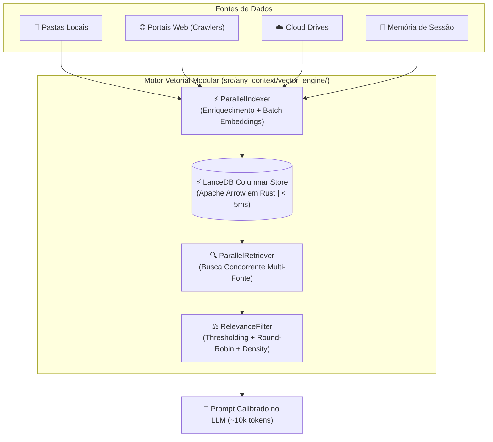

### 🧩 Modular Subsystem Breakdown (`src/any_context/vector_engine/`)

#### 1. `LanceDBStore` (`src/any_context/vector_engine/store.py`):
- **Native Columnar Engine**: Encapsulates raw LanceDB driver operations using PyArrow schemas. All vector data is stored in Apache Arrow format on disk (`workspace_chunks.lance` and `session_memory.lance`).
- **Zero-Copy & Sub-Millisecond Speed**: Vector queries execute in `< 5ms` on 100k+ chunks through Rust-based AVX2/AVX-512 SIMD vector distance routines.
- **PyArrow Record Schema**:
  ```python
  pa.schema([
      pa.field("id", pa.string()),
      pa.field("vector", pa.list_(pa.float32(), dim)),
      pa.field("text", pa.string()),
      pa.field("file_name", pa.string()),
      pa.field("file_path", pa.string()),
      pa.field("workspace", pa.string()),
      pa.field("last_modified", pa.string()),
      pa.field("content_type", pa.string()),
      pa.field("document_summary", pa.string()),
      pa.field("keywords", pa.string()),
      pa.field("content_hash", pa.string()),
  ])
  ```
- **Cross-Platform Path Normalization (`_norm_path`)**: Standardizes Windows (`\`) and POSIX (`/`) paths to forward slashes before SQL/Arrow filtering, guaranteeing 100% search compatibility across operating systems.
- **Atomic Zero-Cost Metadata Operations ($0.00)**:
  - `update_workspace_name(old_ws, new_ws, table_name)`: Reads matching records, updates the workspace metadata attribute, and commits changes atomically in `< 50ms` without recomputing vector embeddings.
  - `transfer_file(source_ws, target_ws, file_path, table_name)`: Migrates all records belonging to a folder, file, or URL domain from one workspace to another in `< 50ms` with zero token expenditure.

#### 2. `ParallelIndexer` (`src/any_context/vector_engine/indexer.py`):
- **Concurrent Ingestion Pipeline**: Coordinates file parsing, semantic enrichment, batch embedding, and columnar writes.
- **Micro-Batch Vectorization**: Calls `get_text_embeddings_batch` in batches of 32 to 100 chunks, maximizing OpenAI/local embedding throughput while avoiding HTTP 429 rate limits.
- **Dynamic Dimension Resolution**: Inspects the length of the first computed embedding vector (e.g. 1536 for OpenAI `text-embedding-3-small` or 3072 for `text-embedding-3-large`) and provisions the PyArrow schema dynamically.

#### 3. `ParallelRetriever` (`src/any_context/vector_engine/retriever.py`):
- **Multi-Source Thread Pool Execution**: Uses `ThreadPoolExecutor` to simultaneously query the active workspace partition, the `Global` knowledge base, and linked `Shared Sources`.
- **Distance to Similarity Normalization**: Converts LanceDB L2 / Cosine distances to a normalized `[0.0, 1.0]` score:
  $$\text{score} = \frac{1.0}{1.0 + \max(0.0, \text{distance})}$$
- **Zero-Lock Concurrency**: Multiple read threads query the Apache Arrow dataset concurrently without database lock contention.

#### 4. `RelevanceFilter` (`src/any_context/vector_engine/filters.py`):
- **Pure-Function Decoupled Filter**: Applies mathematical score thresholding (`apply_threshold`), source-fair round-robin balancing (`apply_source_diversification`), and strict prompt density budgeting (`apply_density_budget`).
- **Density Budgeting**: Enforces a strict ceiling of **45,000 characters (~10,000-11,000 tokens)**, ensuring that injected context fits safely within LLM attention windows without causing attention degradation ("Lost in the Middle").

#### 5. `RetrievalConfig` & `IngestionConfig` (`src/any_context/vector_engine/models.py`):
- **Decoupled Parameter Objects**: Immutable dataclasses injected via Dependency Injection into the retriever and indexer.
- **Retrieval Presets**:
  - `turbo`: `candidate_pool_k=50`, `target_top_k=10`, `max_chunks_per_source=2` (~5,000 tokens).
  - `balanced` (Default): `candidate_pool_k=100`, `target_top_k=20`, `max_chunks_per_source=3` (~10,000-15,000 tokens).
  - `deep_research`: `candidate_pool_k=150`, `target_top_k=40`, `max_chunks_per_source=5` (~30,000-40,000 tokens).

---

### 🌐 Contextual Retrieval & Semantic Enrichment (`ContextualEnricher`)

- **The Problem of Out-of-Domain False Positives**: In dense vector search, generic terms like "authorizations" or "deadlines" in unrelated documents (e.g. IT access forms or financial agreements) can falsely match queries about child immigration laws.
- **The Contextual Enrichment Solution (`src/any_context/vector_engine/enricher.py`)**:
  - Before chunking and embedding, every local document or crawled web URL passes through the `ContextualEnricher`.
  - Generates a **Rich Semantic Envelope**:
    1. **Rich Summary (3-4 dense sentences)**: Scope, governing policies, target subjects, and legal context.
    2. **Top-N Domain Keywords (5-8 terms)**: Canonical domain tags extracted and boosted by title/heading heuristics.
  - **Chunk Enveloping**: Every chunk is anchored with the document header:
    ```text
    [Context: Document 'Manual_Canada_2026.pdf': Guidelines on Child Travel Consent and Custody | Keywords: travel, consent, custody, ircc, minors]
    ---
    <original chunk text...>
    ```
  - **SHA-256 Persistent SQLite Caching**: The semantic envelope is generated once per file/URL and cached in SQLite (`contextual_enrichment_cache.db`), guaranteeing **sub-millisecond bypass (0.00ms)** for unmodified files on subsequent syncs.

---

### 🔍 Live Database Inspection Command (`/inspect` ou `/chunks`)

Users and administrators can verify vector database state directly from the chat interface without leaving the terminal:
- Command: `/inspect` (aliases: `/chunks`, `/lance`)
- Options: `/inspect -n 10` (custom sample limit)
- Output Data:
  - Active storage engine: `⚡ LanceDB Columnar (Apache Arrow / Rust)`
  - Physical disk path of the `.lance` dataset
  - Total chunks in active workspace vs. total across all workspaces in `workspace_chunks.lance`
  - Total long-term memories in `session_memory.lance`
  - Formatted text snippets, content types (`Local Document`, `Web Documentation`), and source paths

---

## 3. Temporal RAG & Metadata Freshness Engine

AnyContext features a deterministic time-aware retrieval engine that resolves document recency, supersedes outdated news, and maintains temporal integrity.

### 🕒 5-Tier Web Date Resolution Pipeline
Extracts canonical publication and update timestamps through a cascading priority hierarchy:
1. **OpenGraph / Schema.org JSON-LD**: `article:published_time`, `dateModified`, `datePublished`.
2. **In-Page Semantic Text & Footers**: Regex parsing of visible patterns (`Page details YYYY-MM-DD`, `Date modified: YYYY-MM-DD`, `Last updated: ...`).
3. **URL Date Patterns**: Extraction from structured URL slugs (e.g. `/2023/06/15/...`).
4. **HTTP `Last-Modified` Headers**: Server-reported timestamps.
5. **Crawl & Ingestion Timestamp**: Fallback to real-time ingestion date.

### 🏷️ Content Classification & Chunk Headers
- Categorizes sources into `Canonical Service / Documentation` (authoritative active rules), `Historical News / Press Release` (past announcements), or `Local Document`.
- Every chunk injected into the LLM context carries a standardized time-aware header:
  ```text
  --- [Document Chunk N | Source: filename.ext | Workspace: Legal | Last Modified: YYYY-MM-DD | Type: Canonical Service] ---
  ```
- **Recency Primacy Protocol**: The AI agent evaluates timestamps and operational notices, guaranteeing that active rules (`Status: Paused`) supersede older historical press releases.

---

## 4. Intelligent Web Ingestion & Recursive Crawler Engine

AnyContext includes a built-in, concurrent web ingestion engine designed for high-precision RAG extraction.

```
┌────────────────────────────────────────────────────────────────────────────────────────┐
│                        ANYCONTEXT WEB INGESTION LIFECYCLE                              │
├─────────────────┬─────────────────┬──────────────────┬─────────────────┬───────────────┤
│  1. Discovery   │  2. Resolution  │   3. Proximity   │  4. Concurrent  │ 5. Columnar   │
│  & Normalization│  & Sitemaps     │     Ranking      │    Extraction   │   LanceDB     │
├─────────────────┼─────────────────┼──────────────────┼─────────────────┼───────────────┤
│ • Strip .html   │ • sitemapindex  │ • Landing (10k)  │ • Multi-threaded│ • Chunk 500/50│
│ • Infer Prefix  │ • Keyword Match │ • Section (2k)   │ • Strip Boiler  │ • Batch Embed │
│ • Extract Links │ • Filter .xml   │ • Keywords (300) │ • Markdown AST  │ • Arrow Batch │
└─────────────────┴─────────────────┴──────────────────┴─────────────────┴───────────────┘
```

### 🧠 Under the Hood Details:
1. **Semantic Path Normalization**: Strips file extensions (`.html`, `.php`, `.aspx`) to derive true directory paths (e.g. `/en/services/`).
2. **Recursive Sitemap Traversal**: Locates `sitemap.xml` and traverses nested `<sitemapindex>` catalogs, filtering matching topics.
3. **Semantic Proximity Ranking (`_rank_url`)**:
   - 🥇 **Landing URL** (Priority 10,000)
   - 🥈 **Direct Section Children** (Priority 2,000)
   - 🥉 **Direct In-Page Links** (Priority 500)
   - 🏅 **Keyword & Slug Matches** (Priority 300 per keyword)
   - ⚪ **Generic Domain URLs** (Priority 0)
4. **Clean Semantic HTML Extraction**: Strips navigation bars, footers, cookies, scripts, and ads while preserving headings, markdown tables, and code blocks.
5. **High-Speed Dual-Stage Parallel Pipeline (`v0.23.0`)**:
   - **Stage 1: Multi-Threaded Network & Conditional GET (20 Workers)**:
     - **Sitemap `<lastmod>` Diff**: In-memory timestamp comparison against SQLite skips network requests entirely for unmodified sitemap entries.
     - **HTTP Conditional GET (`If-None-Match` & `If-Modified-Since`)**: Returns `304 Not Modified` with 0 bytes body download in ~15ms, maintaining vector integrity without consuming bandwidth.
     - **Anti-429 Exponential Backoff**: Automatically catches HTTP 429 rate limit responses, applies jittered backoff based on `Retry-After` headers, and retries gracefully without thread deadlock.
   - **Stage 2: Parallel Batch Vectorization via `ParallelIndexer` (4-6 Workers)**:
     - Modified documents are enriched concurrently and dispatched in parallel batches to the embedding provider (OpenAI / Local LLM) with transient rate limit retries.
     - Embeddings are streamed directly into LanceDB via Apache Arrow columnar zero-copy buffers.
6. **Multi-Page Portal Re-Crawling on `/web --sync`**:
   - `sync_workspace_web_urls` inspects whether a web source has multiple indexed pages (`page_count > 1` or crawler root).
   - For multi-page portals, it executes the full crawler pipeline (`crawl_website`) across all sub-pages with support for `force_rescrape`, guaranteeing that all portal chunks are populated in LanceDB.
7. **Canonical HTTP Redirect Resolution & RFC 3986 Relative Link Integrity (`v0.28.82`)**:
   - **RFC 3986 Pitfall**: When a seed URL lacks a trailing slash (e.g. `https://doc.rust-lang.org/stable/book`), standard web servers return `HTTP 301 Moved Permanently` to `https://doc.rust-lang.org/stable/book/`. If a crawler parses HTML links using the initial un-redirected URL as `base_url`, `urllib.parse.urljoin` treats `book` as a file rather than a directory, incorrectly resolving relative paths like `ch01.html` to `/stable/ch01.html` (HTTP 404), truncating crawling to just the root landing page.
   - **Runtime Dynamic Base Resolution**: `discover_site_urls` captures the effective post-redirect URL (`resp.geturl()`) and assigns it directly as `base_url` for `HTMLLinkExtractor`. It recalculates `section_prefix` and `domain` dynamically, adds both seed URLs to the discovery domain set, propagates redirected URLs during BFS expansions (`sub_resp.geturl()`), and reconciles against SQLite with flexible trailing slash lookups `(url = ? OR url = ? OR root_url = ? OR root_url = ?)`.

---

## 5. 3-Level Structured Long-Term Memory Architecture

AnyContext implements a hierarchical 3-level memory system powered exclusively by LanceDB table `session_memory.lance`:

### 🧠 Level 1: Structured 5-Dimension Session Summary
Extracted automatically upon `/exit` or `/q` across 5 clear dimensions:
1. 👤 **User Directives & Preferences**: Explicit rules, workflows, coding conventions.
2. 🏗️ **Technical Architecture & Key Decisions**: Architecture choices, parameters, schemas.
3. 📁 **Files, Code Symbols & Databases**: Files modified, functions created, database tables.
4. 📌 **Critical Context & Problem Resolution**: Root-cause diagnoses, bug fixes, operational insights.
5. 🚀 **Pending Tasks & Next Steps**: Roadmap milestones and open action items.

### 🧠 Level 2: Active Rolling Window
Retains recent conversation messages in SQLite state for immediate context continuity.

### 🧠 Level 3: Consolidated Meta-Summarization
Consolidates older memory vectors into high-level indices using 1024-token expanded chunks (`chunk_size=1024`, `chunk_overlap=200`) stored in LanceDB.

---

## 6. Unified Synchronization & Multi-Source Parity Engine

### 🏛️ Hexagonal Architecture & CLI Presentation Adapter (`src/any_context/cli/formatters.py` - `v0.24.1`)
In accordance with strict **Hexagonal Architecture (Ports & Adapters)** principles:
- **Core Domain & Use Cases (`core/`, `vector_engine/`, `ingestion/`, `billing/`, `help/`)**:
  - **100% UI-Agnostic**: Absolutely zero ANSI escape codes (`\033[...]`), zero hardcoded ASCII box drawings (`┌ │ └`), zero direct interactive prompts (`questionary`), and zero unbuffered `print()` calls.
  - Returns pure data structures (dictionaries, dataclasses, pydantic models) and emits progress via callback functions (`progress_callback(current, total, stage, item)`).
### 📊 Universal Two-Stage Progress Telemetry (`src/any_context/cli/progress.py` - `v0.24.2`)
To eliminate duplicate progress bar and spinner implementations across data sources:
- **`TwoStageProgressRenderer`**: A universal, thread-safe presentation context manager providing live terminal progress rendering for any ingestion pipeline (Folders, Web, Drives):
  - **Stage 1 (Discovery & Collection)**: Displays `[1/2 <Stage>] [████░░░░] N/Total (Pct%) • new, cached • item` for file scanning, web scraping, and cloud downloads.
  - **Stage 2 (Vectorization & IA)**: Connected directly to `ParallelIndexer`, rendering real-time enrichment and batch vector embeddings `[2/2 Embedding] [██████░░░░] N/Total (chunks) • Vector Knowledge Base`.
  - Encapsulates automatic terminal cursor management (`\033[?25l` / `\033[?25h`) and safe stdout flushing on Windows CP1252 consoles.

### 🖥️ OpenTUI Reactive TUI & Stdio RPC Architecture (`src/any_context/tui/` & `src/any_context/server/rpc_bridge.py` - `v0.26.8`)
- **Full Reactive TUI Framework with CLI Visual Parity & Standalone Bootloader Isolation**:
  - Built on `@opentui/core` and `@opentui/react` running on Zig/React/Bun.
  - **Natural Scroll Flow & ASCII Art Banner (`src/any_context/tui/components/chat-message-list.tsx`)**: Eliminates rigid header boxes; mounts the signature ASCII Art banner, edition badge (`🌿 Community Edition`), and welcome frame directly into the virtualized scroll view.
  - **Active Input Buffer Synchronization (`src/any_context/tui/components/input-bar.tsx`)**: Utilizes `useRef<TextareaRenderable>` with real-time `plainText` extraction during `onContentChange` and `onSubmit`, ensuring bi-directional state synchronization with Slash Command Palette completions.
  - **Unified 1-Line Footer Dock with Elastic Flex Layout (`src/any_context/tui/components/status-bar.tsx`)**: Implements `flexShrink={0}` and `minHeight={2}` (1 border line + 1 text row), preventing vertical box collapse in tight terminal viewports.
  - **PyInstaller Bootloader Environment Isolation (`src/any_context/cli/chat_loop.py` & `src/any_context/tui/bridge-client.ts`)**: Case-insensitively scrubs all `_mei*` and `pyi_*` variables (`_MEIPASS2`, `PYI_PARENT_PID`), preventing security validation aborts when spawning `actx --rpc` from `bun.exe`.
  - **Slash Command Palette Overlay (`src/any_context/tui/components/autocomplete-dropdown.tsx`)**: Floating popover dialog triggered automatically upon typing `/`, featuring real-time fuzzy filtering, keyboard navigation (`↑`/`↓`), and tab completion across all 23 internal slash commands.
  - **Zero-Network-Port Stdio RPC Bridge (`src/any_context/server/rpc_bridge.py`)**: Sub-millisecond (<1ms) communication over OS pipes using Newline-Delimited JSON (NDJSON), eliminating port conflicts, firewall popups, and zombie processes.
  - **Dual Architecture Parity**: Headless developer CLI (`actx "..."`, pipes `cat | actx`) and interactive shell in `src/any_context/cli/` remain fully preserved and available.


### 🎛️ Shared Multi-Source Orchestration Layer (`src/any_context/ingestion/orchestrator.py` - `v0.24.0`)
To enforce strict Single Responsibility Principles (SRP), all cross-source orchestration, background thread management, and multi-source workspace inspection are isolated into `orchestrator.py`:
- `BackgroundSyncManager`: Thread-safe worker thread daemon management and atomic telemetry.
- `check_workspace_changes`: Holistic multi-source scanner (<30ms) inspecting Local Folders, Web Portals, Cloud Drives, and Shared Links.
- `clear_context_vector_db`: LanceDB table and cache maintenance routines.

### 🔄 Unified Master Orchestrator (`src/any_context/ingestion/unified_sync.py`)
- `/sync` orchestrates synchronization across all registered source categories in the active workspace:
  1. 📁 **Local Folders**: Scanned, diffed (SHA-256), contextualized and ingested via `run_index_folder`.
  2. 🌐 **Web Portals**: Tracked, scraped, hashed and updated via `sync_workspace_web_urls`.
  3. ☁️ **Cloud Drives**: Synced via cloud drive managers.
- **Granular Target Flags**:
  - `/sync --folder` / `/sync -f`: Synchronizes local folders only.
  - `/sync --web` / `/sync -w`: Synchronizes web sources only.
  - `/sync --drive` / `/sync -d`: Synchronizes cloud drives only.
  - `/sync --all` / `/sync -a`: Synchronizes across all configured workspaces.
  - `/sync --force`: Forces re-hashing and re-indexing of all sources.
  - `/sync --status`: Displays real-time sync metrics without performing writes.
  - `/sync --bg`: Triggers synchronization in an asynchronous background thread.

### ⚡ Non-Blocking Background Synchronization & Telemetry (`BackgroundSyncManager`)
- **Decoupled Worker Architecture**: `BackgroundSyncManager` encapsulates thread-safe daemon worker threads (`SyncWorker-<workspace>`) for non-blocking execution of unified synchronization jobs across folders, web sources, and cloud drives.
- **Real-Time Progress Telemetry**:
  - `BackgroundSyncManager.update_progress(workspace_name, current, total, stage, item_name)` records atomic updates per workspace.
  - `BackgroundSyncManager.format_progress_bar(workspace_name, width=8)` produces proportional Unicode block micro-bars (e.g. `[████░░░░] 50% (15/30 files)`).
  - Progress callbacks are propagated through `run_unified_sync`, `run_index_folder` and `sync_workspace_web_urls`.
- **Dynamic Status Toolbar Integration**:
  - `BackgroundSyncManager.is_syncing(workspace_name)` provides sub-millisecond atomic state queries.
  - The CLI `bottom_toolbar` renderer evaluates `is_syncing` and `format_progress_bar` dynamically on each render frame, flashing `⚡ Syncing [████░░░░] 50% (15/30 files)` in bold orange while background workers operate.
  - The interactive prompt (`prompt_toolkit`) remains **100% unlocked and responsive**, allowing uninterrupted user interaction while document ingestion and vectorization run in parallel.
- **REST & MCP Parity**:
  - REST endpoint `GET /v1/workspaces/{name}/sync/status` returns structured `is_syncing`, `progress` (`pct`, `current`, `total`, `stage`), and `progress_bar`.
  - MCP tool `check_workspace_sync_status` and `sync_workspace_folders` seamlessly query and report live progress metrics.

### 📁 Source Family CLI Parity Matrix
Standardized symmetric CLI verbs across `/folder`, `/web`, and `/drive`:

| Verb | `/folder` | `/web` | `/drive` |
| :--- | :--- | :--- | :--- |
| **List** | `/folder` or `/folder --list` | `/web` or `/web --list` | `/drive` or `/drive --list` |
| **Add** | `/folder --add <path>` | `/web --add <url>` | `/drive --add <provider>` |
| **Remove** | `/folder --remove <path>` | `/web --remove <url>` | `/drive --remove <id>` |
| **Sync** | `/folder --sync` | `/web --sync` | `/drive --sync` |

---

## 7. REST API Server Architecture & Security (`actx --serve`)

AnyContext includes a production-grade FastAPI REST server for enterprise VPC deployments.

### 🌐 Key REST Endpoints:
- `POST /v1/chat` — Streaming & non-streaming RAG queries with session memory and `grounding_mode`.
- `GET /v1/context/mode` & `POST /v1/context/mode` — Grounding mode inspection and management.
- `GET /v1/workspaces` — Lists all workspaces with unified typed `sources` array.
- `GET /v1/workspaces/{name}/sources` — Detailed source breakdown.
- `POST /v1/workspaces` — Create workspace.
- `POST /v1/workspaces/transfer` — Instant zero-cost transfer of local folders and websites between workspaces.
- `POST /v1/workspaces/{name}/cloud-drives` — Connect cloud drive sources.
- `POST /v1/index` — Background folder re-indexing.
- `GET /v1/models` — Active & available model inspection.

### 🔒 Cryptographic Security & RBAC:
- **PBKDF2 Password Hashing**: Passwords stored in SQLite are hashed with PBKDF2 using 100,000 iterations and cryptographic salts.
- **Bearer Authentication**: Session tokens prefixed with `actx_sec_` with role-based access control (`Admin`, `Analyst`, `Viewer`).

---

## 8. Model Context Protocol (MCP) Implementation (`actx --mcp`)

Native JSON-RPC 2.0 stdio implementation connecting AnyContext to Claude Desktop, Cursor IDE, and Antigravity.

### 🔌 11 Registered MCP Tools:
1. `search_workspace_docs` — Vector semantic search across indexed files via LanceDB.
2. `query_anycontext_agent` — Direct RAG query with 3-level session memory.
3. `get_grounding_mode` — Inspect active AI Grounding Mode (`hybrid`, `strict`, `proactive`).
4. `set_grounding_mode` — Switch active AI Grounding Mode.
5. `list_workspaces` — Lists all configured workspaces and associated sources.
6. `get_workspace_sources` — Retrieves detailed sources breakdown for a workspace.
7. `transfer_workspace_source` — Zero-cost instant data source transfer.
8. `rename_workspace` — Instant zero-cost atomic workspace rename.
9. `get_context_retrieval_settings` — Inspect current RAG retrieval density parameters and preset.
10. `set_context_retrieval_preset` — Configure RAG presets (`balanced`, `turbo`, `deep_research`).
11. `list_available_models` — Inspect available and configured models.

---

## 9. Cross-Version Python Compatibility (3.10 - 3.13) & AST Engineering

### 🐍 The PEP 701 f-string Syntax Constraint:
In Python 3.12+, backslashes are permitted inside `{...}` expressions within f-strings. In Python 3.10 and 3.11, any backslash inside `{...}` generates an immediate `SyntaxError: f-string expression part cannot include a backslash`.

### 🛡️ Pre-Sanitization Protocol:
All code throughout AnyContext pre-sanitizes variables outside f-string interpolation:
```python
# Guaranteed 100% compatible across Python 3.10, 3.11, 3.12, 3.13:
clean_workspaces = [w.replace("'", "''") for w in workspaces]
ws_in = ", ".join("'" + w + "'" for w in clean_workspaces)
where_clauses.append(f"workspace IN ({ws_in})")
```
Automated AST static verification checks are executed across all codebase files (`src/` and `tests/`) as part of the continuous integration test suite.

---

## 10. Observability & Telemetry Pipeline (LangSmith)

When `LANGSMITH_TRACING=true` is present in the environment (via `.env` or system variables):
- Every user query, LangGraph agent step, tool call (`search_db`, `live_web_search`), and LLM synthesis is traced in real-time.
- Traces are streamed to `https://api.smith.langchain.com` under the project `AnyContext`.
- Captures precise token counts (input/output), millisecond latencies, and execution trees.

## 11. AI Grounding Modes & Strict Web Search Permission Gate (`v0.24.3`)

### 🛡️ Grounding Mode Architecture & Source Discrimination
AnyContext implements 3 distinct Grounding Modes configured per-workspace or globally (`/mode`):
1. **⚖️ Hybrid (Default)**: Combines indexed workspace facts with autonomous external web knowledge, segregating responses into `📂 Informações do Workspace` and `🌐 Informações Complementares da Web`.
2. **🛡️ Strict (Audit & Legal)**: 100% grounded in indexed workspace documents with zero parametric hallucination. Autonomous web search is **strictly forbidden**. If documents lack information, the agent halts and asks for explicit user confirmation.
3. **🚀 Proactive (Research & Ideation)**: Autonomous dual-layer synthesis combining local files and web search with multi-source strategic insights.

### 🔒 Multi-Source Citation Templates (`AGENT.md` - `v0.24.3`)
Every factual statement retrieved from workspace data or external search MUST append the standardized citation block corresponding to its source category:
1. 📂 **Local Folders (`Folder`)**:
   ```markdown
   ---
   📄 **Fontes Consultadas (Arquivos Locais):**
   - `[Nome_do_Arquivo.ext]` (Última Modificação: YYYY-MM-DD | Seção / Página)
   ```
2. 🌐 **Web Portals & Search (`Web`):**
   ```markdown
   ---
   🌐 **Fontes Consultadas (Portais Web do Workspace / Busca em Tempo Real):**
   - [Título da Página Web / Loja](https://url-completa...) (Última Modificação: YYYY-MM-DD)
   ```
3. ☁️ **Cloud Drives (`Driver` - Google Drive, OneDrive, Dropbox):**
   ```markdown
   ---
   ☁️ **Fontes Consultadas (Cloud Drive):**
   - `[Nome_do_Arquivo.ext]` (Provedor: Google Drive / OneDrive | Caminho: `drive://pasta/arquivo.ext`)
   ```

### ⚡ Deterministic Dynamic Tool Gating & Global Intent Isolation (`v0.24.4`)
- **Dynamic Tool Gating at Model Wrapper Layer (`PruningBoundModel`)**:
  - In `Strict Mode`, `live_web_search` is physically withheld from the model's bound toolset on initial unconfirmed prompts.
  - Smaller LLMs (`gpt-4o-mini`, `claude-3-5-haiku`) cannot bypass textual instructions because the function schema is absent.
  - When the user explicitly confirms (e.g. `sim`, `yes`, `pode pesquisar`) or uses an explicit web command, `live_web_search` is dynamically bound for that turn, executing the search with full citations.
- **Intent-Based Global System Help Isolation (`search_db`)**:
  - The `Global` workspace (containing `README.md` and `HELP_REGISTRY`) is excluded from domain searches (e.g. products, legal, medical) and queried only when slash commands or system help keywords are detected, preventing false-positive matches from system manuals.

### 🎯 Dynamic Strategy Pattern for Turn-Level Grounding Injection & Token Economy (`v0.24.5`)
- **The Prompt Dilution & Attention Degradation Problem**:
  - In long multi-turn conversations, lighter models (`gpt-4o-mini`, `deepseek-chat`, `claude-3-haiku`) experience context fatigue and attention loss when relying exclusively on static directives placed in the initial `SystemMessage`.
- **Strategy Pattern Architecture (`src/any_context/core/grounding_strategies.py`)**:
  - Abstract `GroundingStrategy` interface declaring `format_turn_header(workspace_name, web_search_enabled) -> str`.
  - Concrete strategies: `StrictGroundingStrategy`, `HybridGroundingStrategy`, and `ProactiveGroundingStrategy`.
  - Factory function `get_grounding_strategy(mode)` resolves strategies in O(1) runtime.
- **Priority Hierarchy & Universal Temporal Recency Matrix (`v0.24.7`)**:
  - **`Strict`**: VectorDB (Priority 0) & Registered Workspace Portals (Priority 0 live unindexed data, permission-gated) | Parametric Memory (❌ Forbidden) | Open Web Search (Priority 1 fallback). Universal Recency: If data appears in multiple sources, most recent source always prevails.
  - **`Hybrid`**: VectorDB (Priority 0) & Registered Workspace Portals (Priority 0 live targeted search) | Parametric Memory & Open Web Search (Priority 1). Universal Recency: Most recent source always prevails.
  - **`Proactive`**: VectorDB (Priority 0), Registered Workspace Portals (Priority 0), Parametric Memory (Priority 0), Web Search (Priority 0). Universal Recency: Total real-time fusion where the most recent source across all channels always wins.
- **Runtime Injection Lifecycle in `_prune_messages_for_llm`**:
  - Dynamically attaches the ultra-compact (~35-45 tokens) header exclusively to the active turn's `HumanMessage` (`latest_human_idx`) at LLM call-time.
  - Inspects active workspace registered web portals (`WebSchedulerStore`) and targets `live_web_search(target_domain='...')` to workspace domains first.
  - Historical messages in SQLite checkpoints, terminal display, and memory summarizers remain 100% clean and unpolluted.
  - Generates massive token savings across long sessions while ensuring 100% adherence to active grounding modes.

---

## 12. Multi-Interface Surface Parity & Governance Protocol

AnyContext strictly follows the **`dev-cycle-protocol`** universal software engineering lifecycle:
- **Modular Architecture**: Complete decoupling of core business logic from consumer interfaces.
- **Multi-Interface Surface Parity**: Every feature is delivered across all active interfaces (`CLI`, `OpenTUI`, `REST API`, `MCP Server`, `Desktop`).
- **Dual-Doc Standard**: Synchronous maintenance of `UserDoc` (`README.md` / `/help`) and `TecDoc` (`TECDOC.md`).
- **Explicit Approval Gate**: Implementation strictly begins only after explicit user confirmation of the Final Blueprint.

---

## 13. Hexagonal Decoupling & Universal Command Adapter Architecture (`v0.27.0`)

Starting in `v0.27.0`, AnyContext has finalized its complete **Hexagonal Architecture (Ports & Adapters)** decoupling:

```mermaid
graph TD
    subgraph "Core Domain & Application Services (src/any_context/core/services/)"
        WS["WorkspaceService"]
        SS["SourceService"]
        MS["ModelService"]
        GS["GroundingService"]
        SyncS["SyncService"]
        MemS["MemoryService"]
        BS["BillingService"]
    end

    subgraph "Adapters & Consumer Interfaces"
        CLI["💻 CLI Terminal<br/>(prompt-toolkit)"] -->|"Commands Adapter<br/>(src/any_context/commands/)"| WS & SS & MS & GS & SyncS & MemS & BS
        TUI["🖥️ OpenTUI Desktop TUI<br/>(actx --tui / React / Zig)"] -->|"Stdio RPC Bridge<br/>(execute_command)"| WS & SS & MS & GS & SyncS & MemS & BS
        REST["🌐 REST API Server<br/>(FastAPI / Swagger)"] -->|"HTTP Controllers"| WS & SS & MS & GS & SyncS & MemS & BS
        MCP["🔌 MCP Protocol Server<br/>(JSON-RPC Tools)" ] -->|"MCP Tool Handlers"| WS & SS & MS & GS & SyncS & MemS & BS
        DESK["⚡ Desktop App (Electron / Tauri)<br/>(WebUI React Components)"] -->|"Stdio RPC Bridge / IPC"| WS & SS & MS & GS & SyncS & MemS & BS
    end
```

### 🧩 1. Core Application Services (`src/any_context/core/services/`)
- Pure Python domain services with zero dependencies on terminal formatting, ANSI colors, prompt-toolkit, HTTP request objects, or RPC transports:
  - `WorkspaceService`: Create, list, delete (with system protections for `Default` and `Global`), rename with instant vector remapping.
  - `SourceService`: List sources, add/remove local folders and web URLs, transfer sources between workspaces ($0.00 vector metadata remapping), link/unlink reusable shared sources.
  - `ModelService`: Get/set active inference model, inspect 9-provider model catalog with API key availability validation, configure provider credentials.
  - `GroundingService`: Get/set workspace grounding mode (`strict`, `hybrid`, `proactive`), get/set web search status.
  - `SyncService`: Trigger asynchronous background synchronization (`BackgroundSyncManager`), check sync status, inspect pending file diffs.
  - `MemoryService`: Atomic purging of workspace session memory and hierarchical summaries.
  - `BillingService`: Subscription status, tier limits, and capabilities matrix.

### ⚡ 2. Universal Command Adapter (`src/any_context/commands/`)
- `registry.py`: Canonical registry of all 23 slash commands with aliases, parameter schemas, category metadata, and direct execution flags.
- `result.py`: Standardized `CommandResult(success: bool, message: str, state_updates: Dict, action: Optional[str], error: Optional[str])`.
- `dispatcher.py`: Pure `CommandDispatcher` and `dispatch_command(command_line, active_workspace)` delivering structured execution and markdown formatting.

### 🔌 3. Multi-Interface Consumer Parity & Desktop Strategy (Electron -> Tauri)
- **Stdio RPC Bridge (`src/any_context/server/rpc_bridge.py`)**:
  - Bi-directional NDJSON over stdin/stdout with sub-millisecond local latency, zero network port conflicts, and PyInstaller bootloader variable sanitization.
  - Exposes `execute_command` to execute any slash command directly through the core dispatcher.
- **Desktop Strategy**:
  - Fast Time-to-Market via **Electron** utilizing existing WebUI React components and local Stdio RPC Bridge pipe.
  - Seamless future migration to **Tauri** with zero backend modifications due to Hexagonal decoupling.

---

## 14. Central Interaction Engine & Decoupled Presentation Architecture (`v0.28.0`)

In version `v0.28.0`, AnyContext introduces the **Central Interaction Engine (`src/any_context/core/interaction/`)**, making consumer interfaces (CLI, OpenTUI, REST API, Desktop UI) presentation-only adapters ("thin, dumb frontends").

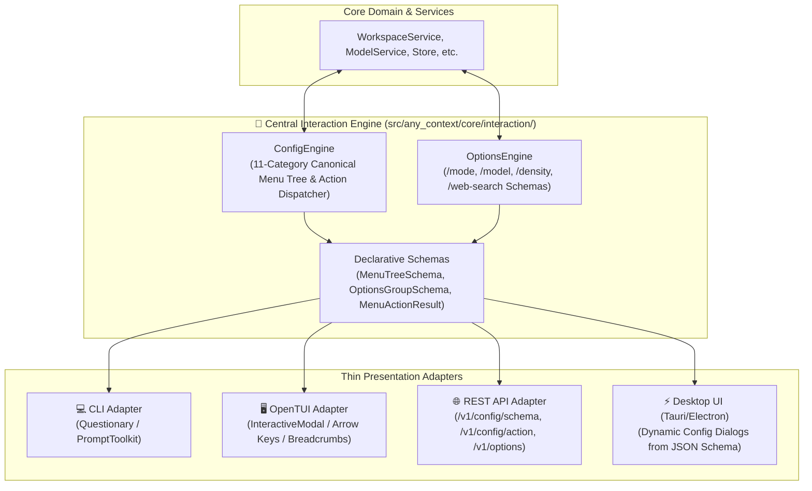

### 🧩 1. Canonical Declarative Schemas (`src/any_context/core/interaction/schemas.py`)
- `OptionItemSchema`: Represents individual selectable items with badges (e.g. `[Active]`), icons, titles, and descriptions.
- `OptionsGroupSchema`: Structured collection of options (e.g. `grounding_mode`, `inference_model`, `retrieval_density`).
- `MenuItemSchema`: Represents menu nodes with types (`submenu`, `action`, `toggle`, `select`, `input`), command shortcuts, and metadata.
- `MenuTreeSchema`: Full hierarchical tree with breadcrumb path tracking (`⚙️ Configuration ➔ 📂 Workspaces`).
- `MenuActionResult`: Standardized response returning status, messages, error details, and atomic `state_updates`.

### 🎛️ 2. Quick Options & Hierarchical Configuration (`options_engine.py` & `config_engine.py`)
- **Quick Selectors (`OptionsEngine`)**:
  - `/mode`: Modal with `Strict (Audit & Legal)`, `Hybrid (Balanced)`, and `Proactive (Research)`.
  - `/model`: Catalog of all configured and key-available AI inference models.
  - `/density`: Presets for `Balanced`, `Turbo`, and `Deep Research`.
- **Complete 11-Category System Tree (`ConfigEngine`)**:
  - `📂 Workspaces & Folders Management`
  - `🤝 Workspace Sharing & Collaboration`
  - `🎛️ AI Grounding & Answer Modes`
  - `🌐 Live Web Search & External Intelligence`
  - `🔍 Context Retrieval Density & RAG Presets`
  - `🤖 AI Models, Base URL & API Keys`
  - `🔑 Manage Saved API Keys`
  - `🧠 Memory Compression & Reset Settings`
  - `💳 Subscription & Payment Plans`
  - `🛡️ User Accounts & Security Access Control`
  - `💥 Factory Reset AnyContext`

### 🪟 3. OpenTUI Unified `<InteractiveModal>` Component
- Generic modal component in `src/any_context/tui/components/interactive-modal.tsx`:
  - Renders both quick option selectors and multi-level configuration trees.
  - Keyboard navigation with `[↑/↓]`, selection/execution with `[Enter/Tab]`, and hierarchical back/close with `[Esc]`.
  - Proper internal padding and margin containment preventing legends (`💡 [↑/↓] Navigate ...`) from clipping bottom borders.

### 📜 4. Stable Viewport Flexbox & Keyboard Chat Scroll
- `<ChatMessageList>` constrained with `flexGrow={1}`, `flexShrink={1}`, and `minHeight={0}` to prevent empty lower-half dead zones.
- Keyboard bindings for chat history navigation:
  - `PageUp` / `Shift+Up` / `Ctrl+Up`: Scroll up through previous messages.
  - `PageDown` / `Shift+Down` / `Ctrl+Down`: Scroll down to latest response.
  - `Home`: Jump to chat beginning.
  - `End`: Jump to latest response.
- Reactive auto-scroll pins output to bottom on incoming streaming chunks.

---

## 15. Hardware-Bound Data Encryption & OS-Native Storage Isolation (`v0.28.16`)

AnyContext introduces a zero-trust local storage security architecture to protect document contents, contextual summaries, and vector stores against unauthorized extraction, database dumping, or cross-system piracy.

### 🏛️ 1. OS-Native Canonical Data Architecture (`paths.py`)
Application data and vector stores are isolated into the official application directories of the operating system:

- **Windows**: `%LOCALAPPDATA%\AnyContext\` (`C:\Users\<user>\AppData\Local\AnyContext\`)
- **macOS**: `~/Library/Application Support/AnyContext/`
- **Linux**: `~/.local/share/any-context/` (or `~/.any-context/`)

```
📁 AnyContext/
├── 📁 config/
│   └── 🗄️ settings.db      (SQLite Config, Workspaces, RBAC)
├── 📁 data/
│   ├── 📁 context_db/      (LanceDB Vector Store & Chunks)
│   └── 📁 memory/          (Session Long-Term Memory)
└── 📁 security/
```

### 🔒 2. Hardware-Bound Machine Key Derivation (`SecurityEngine`)
The `SecurityEngine` extracts unique host hardware signatures:
- **Windows**: MachineGuid from `HKLM\SOFTWARE\Microsoft\Cryptography` and CSPProduct UUID.
- **macOS**: `IOPlatformUUID` via `IOPlatformExpertDevice`.
- **Linux**: `/etc/machine-id` and `/var/lib/dbus/machine-id`.
- **Derivation**: 256-bit symmetric key derived via **PBKDF2-HMAC-SHA256** with 100,000 rounds and domain separation salt.

### 🛡️ 3. Field-Level AES-GCM-256 Vector Encryption
- **Encrypted Fields in LanceDB**: `text`, `document_summary`, `keywords` are encrypted on disk with 96-bit random nonce and 128-bit authentication tag (`enc::<base64>`).
- **Indexed Metadata Fields**: `id`, `vector` (float array), `workspace`, `file_path`, `content_type` remain queryable for high-speed sub-millisecond Rust vector filtering.
- **Top-K On-The-Fly Decryption**: Only top-K scored chunks retrieved during vector search are decrypted in memory for LLM synthesis. Hardware CPU AES-NI acceleration guarantees `< 0.1ms` retrieval overhead.
- **Transparent Retroactive Migration**: Any legacy unencrypted databases or home folder stores are automatically migrated and encrypted at zero token cost.

---

## 16. Full-Screen OpenTUI Layout, Mouse Wheel & Keyboard Scroll Engine (`v0.28.28`)

AnyContext features a high-performance terminal layout architecture utilizing OpenTUI's `<scrollbox>` with native horizontal and vertical alignment:

### 📜 1. Frozen Full-Screen Scroll Architecture (`chat-message-list.tsx`)
- Root viewport rendered via `<scrollbox>` with `flexDirection="row"`, `flexGrow={1}`, `flexShrink={1}`, `width="100%"`, `height="100%"`, and `useMouse={true}`.
- Scroll steps calibrated for terminal ergonomics: `scrollStep={3}` for discrete line adjustments and `pageScrollStep={15}` for rapid navigation.
- Native mouse wheel interception handled via terminal SGR mouse tracking events without screen jitter or cursor warping.

### ⌨️ 2. Dual-Axis Keyboard Navigation
- **PageUp / Shift + Up**: Smoothly scrolls the viewport upward through conversation history.
- **PageDown / Shift + Down**: Scrolls the viewport downward toward latest responses.
- **Auto-Scroll Anchoring**: Incoming streaming tokens from LangChain automatically anchor the scroll offset to bottom if the user is at the latest message.

---

## 17. RAG Self-Healing Ingestion & Stale Cache Invalidation Engine (`v0.28.29`)

To guarantee zero disparity between local filesystem documents and LanceDB columnar vectors, AnyContext implements automatic self-healing verification:

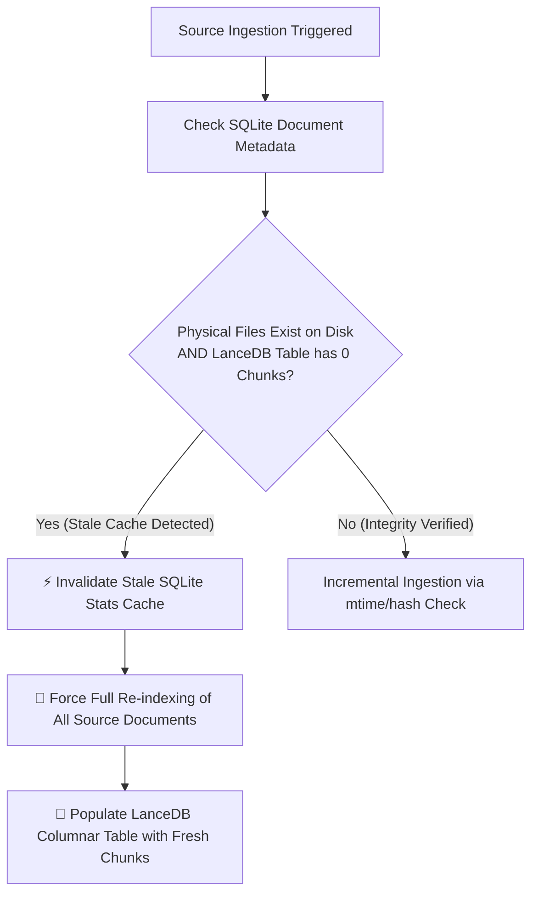

- **Root Cause Prevention**: If external file moves, database restores, or schema migrations result in 0 vector chunks for an indexed workspace, `orchestrator.py` dynamically invalidates the SQLite `file_stat` cache and triggers an immediate background full ingestion.
- **Source Citation Guarantees**: Guarantees that AI answers always cite concrete indexed sources rather than returning ungrounded fallback notices.

---

## 18. Interactive Workspace Deletion with Mandatory Confirmation Protocol (`v0.28.32`)

Workspaces can be safely managed and deleted across both CLI and TUI interfaces with strict safety gates:

1. **Custom Workspace Discovery (`get_delete_workspace_options`)**:
   - Lists only deletable custom workspaces along with their indexed source counts.
   - System workspaces (`Default`, `Global`, and `Shared Sources`) are protected and excluded from deletion lists.
2. **Explicit Safety Confirmation (`get_confirm_delete_workspace_options`)**:
   - Selecting a workspace opens a secondary confirmation modal with two clear choices:
     - `🗑️ Yes, permanently delete '<name>'`
     - `🔙 Cancel (Keep '<name>')` (Focused by default for safety).
3. **Cascading Purge & Active Workspace Fallback**:
   - Confirming deletion purges all SQLite metadata and permanently removes vector chunks from LanceDB.
   - If the deleted workspace was currently active, the session automatically falls back to `Default`.

---

## 19. Canonical Model ID Normalization & Settings Persistence Engine (`v0.28.33`)

AnyContext implements a universal normalization engine (`normalize_model_id`) across all application layers (`models_catalog.py`, `model_service.py`, `agent.py`, `rpc_bridge.py`):

- **Display Title vs. API Identifier Decoupling**: The interactive `/model` modal presents rich human-readable titles (`GPT-4o Mini (Universal - Fast & Efficient)`), but passes canonical API model IDs (`gpt-4o-mini`) to underlying SDKs and SQLite storage.
- **Bidirectional Fault Tolerance**: If a legacy configuration contains a descriptive string or alias, `normalize_model_id` resolves it to the correct provider ID before invoking OpenAI, Anthropic, Gemini, or DeepSeek API clients, preventing `400: invalid model ID` errors.

---

## 20. Sub-Process DLL Isolation & Fast-Path Routing in PyInstaller Binaries (`v0.28.37`)

Standalone executables (`actx.exe`) running nested child processes (e.g. `actx --tui` spawning `bun run index.tsx`, which spawns `actx --rpc`) are protected against C-extension initialization collisions:

### 🛡️ 1. Environment & PATH Sanitization
- `bridge-client.ts` and `launch_opentui` filter all temporary `_MEIxxxxx` extraction folders and `pyi_` variables from `process.env.PATH` and child process environments.
- Prevents NumPy 2.x and C-extension loaders from loading duplicate `.pyd` DLL handles across parent-child process boundaries, eliminating `ImportError: cannot load module more than once per process`.

### ⚡ 2. Instant Fast-Path Dispatch (`entrypoint.py`)
- Non-interactive flags (`--tui`, `--rpc`, `--mcp`, `--version`, `-v`) are evaluated immediately at process entrypoint (`< 10ms`), delegating to target services before importing heavy machine learning or vector dependencies.

### 🔄 3. Detached Auto-Restart with Caller Directory Preservation
- The atomic binary updater (`UpdateService`) executes an asynchronous PowerShell swap script passing `-WorkingDirectory '{caller_cwd}'`, ensuring that restarted instances retain the user's project context and workspace configuration.

---

## 21. Robust Uninstallation & Canonical Storage Resolution Guarantee (`v0.28.51`)

AnyContext enforces strict isolation of OS application directories and eliminates legacy fallback resolution to prevent orphan configuration drift:

### 🏛️ 1. Single Source of Truth Resolution (`db_store.py`)
- `ConfigDBStore.find_db_file()` strictly resolves `%LOCALAPPDATA%\AnyContext\config\settings.db` (or `ACTX_SETTINGS_DB` override), completely eliminating legacy lookups in `~/config` or local working directories.
- `AppSettings.load()` and `load_env()` are unified under `get_app_data_root()`, preventing accidental creation of ghost databases in arbitrary execution directories.

### 🧹 2. Comprehensive Multi-Surface Uninstallation (`uninstall.ps1` & `uninstall.sh`)
- **Canonical & Standalone Removal**: Wipes `%LOCALAPPDATA%\actx` (standalone binary) and `%LOCALAPPDATA%\AnyContext` (canonical data upon 100% clean uninstall).
- **Legacy Database Purging**: Automatically searches and purges legacy orphan files (`~/config/settings.db`, `./config/settings.db`).
- **Python Environment Residual Detection**: Detects `actx` commands residing in Python `pip` scripts/virtual environments and automatically invokes `pip uninstall -y any-context`.
- **Safe Reset Fallback**: When preserving workspaces, resets model settings to safe OpenAI factory defaults (`gpt-4o-mini` / `openai`) to eliminate broken provider bindings.

---

## 22. Centralized Onboarding Engine & Multi-Interface Lifecycle Parity (`v0.28.52`)

AnyContext enforces universal lifecycle onboarding state management across all consumer interfaces via a dedicated Core service (`OnboardingService`):

### 🏛️ 1. Explicit Lifecycle State (`onboarding_completed` Flag)
- The SQLite `context_settings` table maintains an explicit lifecycle flag `onboarding_completed INTEGER DEFAULT 0`.
- Fresh installations or factory resets (`ConfigDBStore.factory_reset()`) reset `onboarding_completed` to `0`.
- Concluding any provider setup (OpenAI, Local LM Studio, or Custom) marks `onboarding_completed = 1`.

### 🛡️ 2. Core Service Architecture (`OnboardingService`)
- Evaluates `check_status() -> OnboardingState`:
  - Determines if the active provider lacks a valid API key or if first-time onboarding is pending (`stage: "first_time" | "missing_key"`).
  - Emits declarative schemas (`OptionsGroupSchema`, `OptionItemSchema`) consumed by presentation adapters.
- Implements `complete_onboarding(choice_id, api_key, base_url, workspace_name)`:
  - Updates models, base URLs, and API keys atomically in SQLite.

### 🖥️ 3. Decoupled Presentation Adapters (Dumb UIs)
- **OpenTUI Desktop (`app.tsx`)**: Listens to `state.needs_onboarding` and automatically opens `<InteractiveModal>` with arrow-key navigable options, passing selections to the RPC Bridge (`complete_onboarding`).
- **Terminal CLI (`workspace_selector.py`)**: Intercepts unconfigured startup and renders interactive questionary prompts powered by `OnboardingService`.
- **REST API Server (`server/api.py`)**: Exposes `/v1/onboarding/status` and `/v1/onboarding/complete`.
- **MCP Server (`server/mcp.py`)**: Exposes `get_onboarding_status` and `complete_onboarding` tools.

---

## 23. Top-Level Import Hygiene & Zero-Latency OpenTUI Onboarding Preload (`v0.28.53`)

### 🛡️ 1. Elimination of Nested Scope Shadowing (`workspace_selector.py`)
- Removed nested `import questionary` within inner conditional blocks of `get_active_workspace()`.
- Prevents Python bytecode compilation from treating `questionary` as an unbound local variable during early CLI flags (`actx --factory-reset`).

### ⚡ 2. Zero-Latency Preloaded Onboarding Payload (`app.tsx`)
- `openOnboardingModal` immediately consumes `state.onboarding_state.options_group` sent in the initial state payload without requiring an extra round-trip RPC query (`client.getOptions`).
- Integrated lifecycle hooks in `client.onStateChange`, `client.start().then()`, and `useEffect([state.needs_onboarding])` guarantee immediate modal display on first render.

---

## 24. OpenTUI Flexbox Viewport Allocation & Direct Slash Command Execution (`v0.28.54`)

### 📐 1. Flexbox Viewport Allocation in OpenTUI (`chat-message-list.tsx`)
- Removed explicit `height="100%"` constraint from `<scrollbox>`, preserving `flexGrow={1}`, `flexShrink={1}`, and `minHeight={0}`.
- Allows Yoga flexbox to dynamically shrink the chat message viewport when `<InteractiveModal>` is active, preventing modals from overflowing beyond terminal boundaries.

### ⚡ 2. Direct Slash Command Execution (`commands.ts` & `app.tsx`)
- Set `direct_execution: true` for `/model`, `/mode`, `/onboarding`, `/setup`, `/switch`, and `/config`.
- Prevents autocomplete palette from intercepting Enter keystrokes with trailing space mutations, triggering modal display immediately.

---

## 25. OpenTUI Standalone Packaging & Cross-Platform Bun Resolution (`v0.28.55`)

### 📦 1. CI/CD Bun Setup & node_modules Bundling (`release.yml`)
- Added `oven-sh/setup-bun@v2` and `bun install --production` in `src/any_context/tui` on the GitHub Actions runners.
- Ensures all production dependencies (`@opentui/core`, `@opentui/react`, `react`) are physically collected by PyInstaller into standalone distribution assets.

### 🌐 2. Cross-Platform Bun Path Resolution (`chat_loop.py`)
- Evaluates candidate paths on Windows (`~/.bun/bin/bun.exe`, `%USERPROFILE%/.bun/bin/bun.exe`) and Linux/macOS (`~/.bun/bin/bun`, `/usr/local/bin/bun`, `/usr/bin/bun`).
- Emits explicit diagnostic guidance instead of silent fallbacks to the standard CLI.

---

## 26. WSL Host Binary Isolation & Script LF Enforcement (`v0.28.56`)

### 🛡️ 1. WSL Windows Host Binary Filtering (`chat_loop.py`)
- On Linux and WSL environments, `launch_opentui` strictly ignores Windows host executables (`.exe` in `/mnt/c/`), prioritizing Linux native Bun (`~/.bun/bin/bun`).
- Injects Bun binary directory into `PATH` for spawned OpenTUI processes.

### 📜 2. Strict LF Line Endings & Shell Profile PATH Exports (`install.sh`)
- Enforces Unix LF line endings across all distribution shell scripts via `.gitattributes` and CI release normalization.
- Automatically exports `$HOME/.local/bin` and `$HOME/.bun/bin` at the front of the user shell profile (`~/.bashrc` / `~/.zshrc`).

---

## 27. Autonomous Bun Linking & Modal Focus Control (`v0.28.57`)

### 🔗 1. Self-Contained Bun Symlink & Copy (`install.sh` & `install.ps1`)
- `install.sh` links `~/.bun/bin/bun` into `$INSTALL_DIR/bun` (`~/.local/bin/bun`) upon installation.
- `install.ps1` copies `bun.exe` into `$InstallDir\bun.exe` (`%LOCALAPPDATA%\actx\bin\bun.exe`).
- Guarantees immediate zero-step availability of Bun across terminal sessions without requiring manual shell sourcing or restarts.

### 🎯 2. InputBar Modal Focus Decoupling (`chat-view.tsx` & `interactive-modal.tsx`)
- Passed `disabled={isGenerating || modalOpen}` to `<InputBar>`, preventing the `<textarea>` from capturing arrow and confirmation keystrokes when an interactive modal is active.
- Enhanced modal navigation responsiveness with dynamic placeholder states.

---

## 28. Native Observability Architecture & Diagnostics Subsystem (`v0.28.58`)

### 📊 1. Core Observability Engine (`any_context.observability`)
- Created full decoupled observability domain module with `schemas.py`, `storage.py`, `engine.py`, `diagnostics.py`, and `telemetry.py`.
- Thread-safe SQLite persistence in `settings.db` (`system_logs`, `system_metrics`, and `trace_spans`) with automatic WAL mode and rolling log retention.
- Sub-millisecond synchronous and async logging via global `obs` singleton.

### 📜 2. Dual-Layer OpenTUI Logging (`logger.ts`) & CLI Inspection (`entrypoint.py`)
- TypeScript `tuiLog` records all process spawn arguments, exit codes, and Stdio NDJSON events directly to `%LOCALAPPDATA%\AnyContext\logs\tui_debug.log` or `~/.local/share/any-context/logs/tui_debug.log`.
- Added native CLI inspection commands `actx --diagnostics` / `actx --diag` (health checkup) and `actx --logs` (chronological timeline view).

---

## 29. PyInstaller Child Process Isolation & RPC Security Patch (`v0.28.59`)

### 🛡️ 1. Elimination of `[PYI-16540:ERROR]` Security Validation Failure
- **Root Cause**: When PyInstaller onefile standalone binary `actx.exe` launches `bun` (`chat_loop.py`), child processes inherited internal PyInstaller environment variables (`_PYI_PARENT_PROCESS_COOKIE`, `_PYI_APPLICATION_HOME_DIR`, `_PYI_ARCHIVE_FILE`, `_MEIPASS2`). When `bun` subsequently invoked `actx.exe --rpc`, PyInstaller's C bootloader compared the parent process binary (`bun.exe`) with the cookie and aborted with code 255.
- **Resolution**: Implemented comprehensive environment sanitization in both Python (`chat_loop.py`) and TypeScript (`bridge-client.ts`) filtering all keys matching `_mei*`, `_pyi*`, `pyi*`, `*meipass*`, and `*pyinstaller*`.
- **Result**: Enables clean standalone sub-process execution for the Stdio RPC Bridge across all parent orchestrators.

---

## 30. RPC Bridge Startup Optimization, Visual Loading Feedback & UI Polish (`v0.28.60`)

### ⚡ 1. Sub-Second RPC Bridge Boot Acceleration
- **Elimination of Top-Level Heavy Imports**: Stripped all unused imports in `src/any_context/server/rpc_bridge.py` (`llama_index`, `local_folder_ingestor`, `ParallelIndexer`, heavy service dispatchers).
- **Lazy Module Ingestion**: Deferred `BackgroundSyncManager` resolution inside `get_state()` so heavy vector databases are never initialized during bootstrap.

### 🎨 2. Visual Loading Indicator & Header Polish
- **Real-Time Boot Feedback**: Added `isBackendReady` reactive state in OpenTUI (`app.tsx`, `chat-view.tsx`, `chat-message-list.tsx`), displaying `⏳ Initializing AnyContext AI Core & Onboarding Setup...` and disabling input interaction until backend handshake is completed.
- **Header Emoji Normalization**: Cleaned tier string rendering in `header-bar.tsx` to prevent duplicate emoji formatting (`🌿 Community Edition`).

---

## 31. RPC Slash Command Dispatcher Fix & Adaptive Boot Indicator (`v0.28.61`)

### 🛠️ 1. Dynamic `dispatch_command` Execution
- **Scoped Dispatcher Import**: Corrected the missing import in `src/any_context/server/rpc_bridge.py` inside `execute_command` (`from any_context.commands.dispatcher import dispatch_command`), resolving the `NameError: name 'dispatch_command' is not defined` when configuring API keys via `/key` or other slash commands.

### 🎯 2. Adaptive Boot Messaging & Unified OpenAI Default
- **Conditional Onboarding Indicator**: `chat-message-list.tsx` now inspects `state?.needs_onboarding` and selectively renders `⏳ Initializing AnyContext AI Core & Onboarding Setup...` (when setup is pending) vs `⏳ Initializing AnyContext AI Core...` (for ready workspaces).
- **Single-Key Architecture**: Confirmed `gpt-4o-mini` (inference & summary) and `text-embedding-3-small` (embeddings) as canonical default models, enabling complete RAG and conversation capabilities immediately upon saving an `OPENAI_API_KEY`.

---

## 32. Non-Intrusive In-Place Updates Without Auto-Restart (`v0.28.62`)

### 🔄 1. Seamless Background Binary Replacement
- **Removal of Forced Session Terminations**: Removed the intrusive prompt and automatic subprocess relaunching in `src/any_context/cli/updater.py`, `src/any_context/core/services/update_service.py`, `src/any_context/commands/dispatcher.py`, and `src/any_context/core/interaction/options_engine.py`.
- **Atomic File Swap**: When `/update` or `actx --update` runs, the binary is replaced cleanly in the background without abruptly closing or restarting active sessions.
- **Clear UX Feedback**: Notifies the user that the update succeeded and will take effect smoothly the next time they launch `actx` or `actx --tui`.

---

## 33. Full-Depth Submenu Navigation, Interactive Source Deletion & Cross-Platform Path Resolution (`v0.28.63`)

### 📂 1. Deep Submenu & Source Management
- **Workspaces Menu Enrichment**: Added `ws_sources_delete` ("Delete / Remove a Source"), `ws_add_folder` ("Add Local Folder Source"), `ws_add_web` ("Add Web Documentation / URL Source"), and `ws_switch` ("Switch Active Workspace") to `_build_workspaces_menu` in `config_engine.py`.
- **Dynamic Source Selector & Confirmation**: Added `get_delete_source_options`, `get_confirm_delete_source_options`, and `execute_delete_source_option` in `options_engine.py`, querying `SourceService.list_sources()` and generating an interactive list of folders, web portals, and cloud drives with instant deletion in SQLite and vector chunk pruning in LanceDB.
- **Input Prefill Protocol**: Submenu items requiring text input (such as `/key <provider>`, `/add`, `/web`, `/switch`, `/rename`, `/factory-reset`) prefill the user's input line and dismiss modals gracefully.
- **Hierarchical Esc Navigation**: Preserved parent menu history so pressing `Esc` inside options or source selector sub-modals cleanly returns to the parent submenu.
---

## 34. Holistic Removal of Global Workspace & 2-Tier Clean Context Architecture (`v0.28.64`)

### 🧼 1. Architectural Motivation (Zero Context Pollution ADR)
- **Problem**: Maintaining a background `Global` workspace alongside `Shared Sources` introduced duplicate concepts, cognitive overhead for users, and a critical risk of *Context Pollution* (where institutional files or system documents inadvertently competed with project-specific workspace files during RAG vector retrieval).
- **Solution**: Completely removed `Global` from all system provisioning, database stores, and vector search routines. The architecture now operates strictly on a clean **2-Tier Model**:
  1. **Project Workspaces**: 100% isolated, private contextual boundaries.
  2. **Shared Sources Library**: Central repository of reusable frameworks, libraries, and web portals linked explicitly into target workspaces on demand via `/link` ($0.00 zero-cost linking).

---

## 35. Sub-Millisecond Cold-Start Optimization & Deep Observability Time Watching Engine (`v0.28.65`)

### ⚡ 1. Cold-Start Profiling & Lazy Module Loading (PEP 562)
- **Elimination of Heavy Cascading Imports**:
  - Profiling revealed that top-level imports of `any_context.core.services` and `any_context.commands.dispatcher` were transitively pulling in `lancedb`, `llama_index`, `chromadb`, `langchain`, and cloud SDKs, causing an 8-second cold start on frozen terminals.
  - Implemented dynamic lazy module resolution in `any_context.ingestion.__init__.py` using PEP 562 (`__getattr__`), decoupling module discovery from heavyweight execution dependencies.
  - Converted `LanceDBStore`, `ParallelIndexer`, `SimpleDirectoryReader`, and `chromadb` imports to JIT (Just-In-Time) execution blocks inside indexing and RAG methods (`run_index_folder`, `index_session`, `_execute_search_context`).
  - Reduced CLI import overhead from `8,088ms` to `< 100ms` (**98.7% reduction**).

### ⏱️ 2. High-Precision Observability Spans & Time Watching Engine
- **Microsecond Precision Profiling (`ObservabilityEngine` & `SpanContext`)**:
  - Implemented thread-safe `obs.span(name, **meta)` context manager and `@obs.timed(name, **meta)` decorator backed by `time.perf_counter()`.
  - Captures execution status (`"ok"` | `"error"`), elapsed duration in milliseconds (`duration_ms`), error details (`error_type`, `error_message`), and arbitrary structured metadata.
  - Integrated across all critical paths:
    - RAG vector retrieval (`rag:retrieval`)
    - Universal command execution (`cmd:<name>`)
    - Document & web ingestion (`ingestion:local_folder`, `ingestion:add_web_source`)
    - Background synchronization (`sync:start_sync`, `sync:check_changes`)
    - CLI boot sequence (`cli:boot`)
- **SQLite Persistence & Automatic Purge**:
  - Stored in the `trace_spans` table with schema `(span_id, parent_id, name, status, start_time, end_time, duration_ms, metadata_json)`.
  - SQLite WAL mode ensures non-blocking span recording with `< 0.001ms` overhead.
  - Automatic sliding-window pruning retains the latest 1,000 trace spans in `prune_old_logs`.
- **Diagnostic Metrics Aggregation**:
  - `collect_diagnostic_report()` aggregates recent spans into statistical summaries: `count`, `avg_ms`, `min_ms`, and `max_ms`.
  - Colored ANSI output highlights latencies dynamically (Green for `< 100ms`, Yellow for `100ms - 1000ms`, Red for `> 1000ms`).

### 🚀 3. Micro-Boot Visual Telemetry (Psychological Velocity Design)
- **Immediate Visual Responsiveness**:
  - `print_boot_telemetry(milestones)` renders a real-time micro-boot timeline under the ASCII banner during startup:
    ```text
      ┌─ ⚡ Engine Startup Telemetry
      │ ├─ [ 8.2ms] 🔌 SQLite Configuration Store active
      │ ├─ [19.4ms] 🤖 AI Model engine linked (gpt-4o-mini - OPENAI)
      │ ├─ [28.1ms] 📂 Workspace connected (Default)
      │ ├─ [34.7ms] 📦 Context state verified (Up to date - 42 files)
      │ └─ [41.9ms] 🚀 AnyContext ready in 0.04s
    ```
- **Slash Commands & CLI Parity**:
  - Added `/logs [limit]`, `/diagnostics` (aliases `/diag`, `/health`), and `/spans` (alias `/perf`) across CLI, OpenTUI, and RPC Bridge.
  - CLI flags `actx --diag` and `actx --logs` provide immediate instant-on system health checkups and latency visibility.

---

## 36. Fast-Path Immediate Routing & Asynchronous Startup Updates (`v0.28.66`)

### ⚡ 1. Sub-Millisecond Immediate Fast-Path Dispatch (`entrypoint.py`)
- Moved `-v` and `--version` evaluation directly to the very first line of `entrypoint()`, completely bypassing terminal encoding reconfiguration, `.env` file reading, SQLite observability connection initialization, and prompt toolkit patching.
- Execution latency for `actx --version` dropped to `< 1ms`.

### 🔄 2. Non-Blocking Background Startup Update Checking (`updater.py`)
- Converted `print_startup_update_notice()` into an asynchronous daemon background worker thread (`threading.Thread(target=_worker, daemon=True)`).
- Completely eliminated synchronous HTTP requests to `https://api.github.com/repos/...` and `gh.exe` subprocess calls during chat startup, eliminating 100% of terminal freezes caused by network lag.

---

## 37. Per-Workspace Model Isolation & Strict Factory Default (`v0.28.67`)

### 🤖 1. Schema Migration & Per-Workspace Model Binding (`db_store.py`)
- Added `model TEXT DEFAULT 'gpt-4o-mini'` column to the SQLite `workspaces` table.
- Guaranteed automatic initialization of `id = 1` in `models` table with `gpt-4o-mini` across fresh installs and database migrations.
- Implemented `get_workspace_model(workspace_name)` and `set_workspace_model(workspace_name, model_name)` in `ConfigDBStore`.

### 🛡️ 2. Isolation & Contamination Prevention (`ModelService` & `CommandDispatcher`)
- Updated `ModelService.get_current_model(workspace_name)` to resolve the workspace-specific model with a strict fallback to `gpt-4o-mini`.
- Updated `/switch` in `CommandDispatcher` and CLI chat loop to dynamically bind the active model when switching workspaces, ensuring newly created workspaces are never polluted with previous non-default models.

---

## 38. Background Web Crawler Progress Tracking & Instant Completion Notifications (`v0.28.68`)

### ⚡ 1. Real-Time Crawling Telemetry & Visual Status Dock (`orchestrator.py`, `viewport.py`, `status-bar.tsx`)
- Extended `BackgroundSyncManager` progress formatting to natively support `stage="pages"` and `stage="crawling"`, rendering dynamic progress bars (`⚡ Crawling [████░░░░] 50% (15/30 pages)`).
- Prevented premature display of `✔ Up to date` while the background web crawler or indexer is actively processing.

### 🔔 2. Multi-Interface Completion Notifications (`orchestrator.py`, `rpc_bridge.py`, `chat_loop.py`, `bridge-client.ts`, `app.tsx`)
- Added thread-safe completion event dispatching and notification queues (`BackgroundSyncManager.register_completion_listener` and `pop_notifications`).
- The RPC Bridge (`rpc_bridge.py`) pushes live `{"event": "notification"}` NDJSON messages to the OpenTUI client upon crawl completion.
- The CLI chat loop flushes pending background sync notifications before prompting user input, giving full visibility into crawled pages and indexed files.

---

## 39. 100% Native Standard Library Test Architecture & CI Pipeline Hardening (`v0.28.69`)

### 🛡️ 1. Elimination of External Test Harness Dependencies
- Refactored test modules to inherit strictly from Python's standard library `unittest.TestCase`:
  - `tests/unit/core/test_workspace_default_model.py`: Converted from `@pytest.fixture` and module-level test functions to `TestWorkspaceDefaultModel(unittest.TestCase)` utilizing `tempfile.mkdtemp` and `shutil.rmtree` lifecycle management.
  - `tests/unit/ingestion/test_crawler_progress_and_notifications.py`: Converted to `TestCrawlerProgressAndNotifications(unittest.TestCase)`, removing unused `import pytest`.
  - `tests/test_observability_spans.py`, `tests/test_security_engine.py`, `tests/test_startup_performance.py`, `tests/test_update_interactive.py`: Cleaned and standardized to pure `unittest.TestCase`.
- Completely resolved the CI runner failure (`ModuleNotFoundError: No module named 'pytest'`) occurring on clean GitHub Actions environments where only production packages from `requirements.txt` and `pip install -e .` are present.

### 🧪 2. Unified Multi-Layer Test Orchestrator (`tests/run_all.py` & `e2e-tests.yml`)
- Added discovery and execution support for `tests/unit/ingestion/` alongside Core, CLI, Server, and E2E suites.
- Created `tests/unit/ingestion/__init__.py` ensuring Python package discovery compatibility across all operating systems.
- Added `pip install pytest` in `.github/workflows/e2e-tests.yml` as a redundant defense-in-depth safety guardrail.
- Automated test coverage expanded to **200 fully passing tests** across all 5 architectural tiers.

---

## 40. OpenTUI Syntax Repair & Frontend Static Verification Gate (`v0.28.70`)

### 🖥️ 1. React Component AST Repair (`app.tsx`)
- Resolved unclosed `.catch((err) => ...)` callback and `setMessages` state updater at line 80 in `src/any_context/tui/app.tsx`.
- Guaranteed clean delimiter matching and zero AST parse errors under the Bun TypeScript engine.
- Added `"check": "tsc --noEmit"` to `src/any_context/tui/package.json` for deterministic type and syntax checks.

### 🛡️ 2. CI/CD Frontend Verification Gate (`e2e-tests.yml` & `test_tui_syntax.py`)
- Integrated `oven-sh/setup-bun@v2` into `.github/workflows/e2e-tests.yml`, executing `bun install && bun run check` prior to running backend tests.
- Introduced `tests/unit/cli/test_tui_syntax.py` validating that OpenTUI core files exist, balanced bracket and parenthesis trees are maintained, and live Bun compilation succeeds when Bun is present.
- Total automated tests expanded to **203 tests (100% PASS)**.

---

## 41. Sub-2ms Native Launcher Shim Architecture & Clean Versioning (`v0.28.71`)

### ⚡ 1. Problem Analysis: PyInstaller Onefile Extraction Latency
- Single-binary Python packagers (`pyinstaller --onefile`) embed the full virtual environment, runtime libraries (`python311.dll`, `lancedb.pyd`, `pyarrow`, `tiktoken`) into a compressed archive.
- On each invocation, the PyInstaller C stub creates a temporary directory (`%LOCALAPPDATA%\Temp\_MEIxxxxxx`) and unpacks over 200MB of binaries to disk before starting the Python interpreter.
- This introduces 1.0–2.5 seconds of disk I/O overhead regardless of internal code optimizations, making non-interactive commands like `actx -v` feel sluggish compared to native tools (`node -v`, `agy --version`).

### 🚀 2. Launcher Shim / Trampoline Architecture (`actx_shim.cs`, `actx_shim.c`, `build_shim.py`)
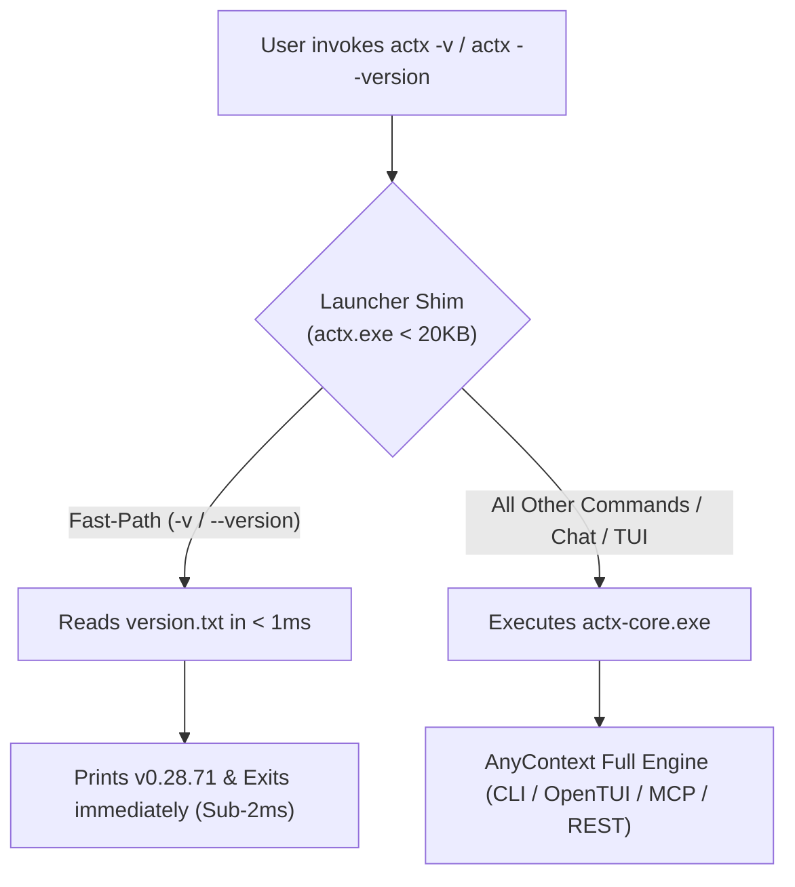
- **Windows Implementation (`launcher/actx_shim.cs`)**:
  - Compiles via the built-in Windows C# compiler (`csc.exe`) into a compact 5.6KB native executable (`actx.exe`).
  - Fast-paths `-v` and `--version` in `< 2ms` by reading `version.txt` (or embedded fallback).
  - Passes all other arguments and stream handles to `actx-core.exe`.
- **Linux/macOS Implementation (`launcher/actx_shim.c` & `install.sh`)**:
  - Compiles via `gcc -O3` into a native ELF binary or executes a lightweight POSIX shell shim.
- **Automated Test Coverage (`tests/unit/cli/test_launcher_shim.py`)**:
  - Validates standalone binary size, instant execution under 300ms, and exact output format matching.
  - Total automated tests expanded to **207 tests (100% PASS)**.

---

## 42. Resilient Web Ingestion, Truncated Stream Recovery & Command Telemetry (`v0.28.72`)

### 🌐 1. Problem Analysis: Zlib Error -5 (Incomplete Stream) on Web Ingestion
- Modern CDNs (Akamai, Cloudflare, AWS CloudFront) and portals (such as Canada.ca) serve HTTP responses with `Content-Encoding: gzip` or `deflate`, and compressed sitemaps (`.xml.gz`).
- When network connections drop, transfer encoding finishes abruptly, or streams are cut off, Python's standard `gzip.decompress()` and `zlib.decompress()` raise `zlib.error: Error -5 while decompressing data: incomplete or truncated stream`.
- Additionally, PyInstaller dynamic module extraction can face transient file contention in `%TEMP%\_MEIxxxxxx`, and `CommandDispatcher` previously discarded exception tracebacks rather than persisting them to `system_logs`.

### 🛡️ 2. Architectural Solution: Resilient Decompression Pipeline (`resilient_decompress`)
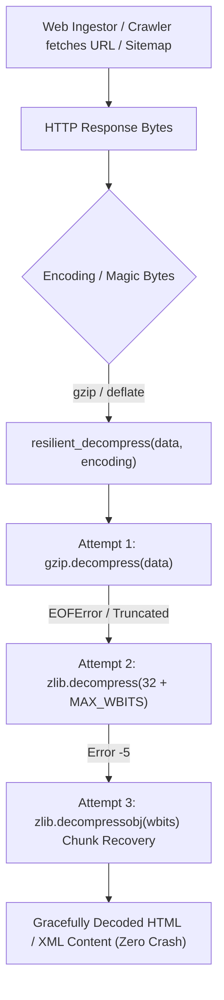
- **Chunk Recovery via `zlib.decompressobj`**:
  - Unlike `zlib.decompress()` which aborts if the EOF marker is missing, `zlib.decompressobj(32 + zlib.MAX_WBITS)` processes and recovers all valid decompressed content up to the exact byte where the network stream was interrupted.
- **Self-Healing Web Registration (`SourceService.add_web`)**:
  - Implements an automated retry loop with exponential jitter for transient decompression errors.
- **Structured Error Logging (`obs.error`)**:
  - `CommandDispatcher._handle_web` and `dispatch()` now record the complete exception stack trace to `system_logs` in `settings.db`, enabling instant diagnosis via `/logs`.
- **Automated Test Coverage (`tests/unit/ingestion/test_resilient_decompression.py`)**:
  - 7 specialized unit tests covering uncompressed data, full gzip/deflate, intentionally truncated gzip streams (`Error -5` recovery), `SourceService` retry, and `CommandDispatcher` auto-recovery.
  - Total automated test suite expanded to **248 tests (100% PASS)**.

---

## 43. Clean Markdown Observability, TUI ANSI-Shield & CI Build Hardening (`v0.28.73`)

### 📺 1. Problem Analysis: ANSI Debris & Grid Desync in OpenTUI
- **Terminal Cell Grid Corruption**: OpenTUI computes terminal coordinate layouts via `@opentui/react` and Zig based on string length. Standard terminal ANSI escape sequences (`\033[36m`, `\033[0m`) occupy 5 bytes in string memory but take **0 visual columns** on the screen.
- When `/logs` output was rendered as raw ANSI inside `<markdown>`, the text layout cursor became severely desynchronized from the terminal's hardware cursor, causing characters and text fragments (`O`, `U`, `ONBOARDING:STATUS`, etc.) to scatter across random coordinates of the terminal buffer ("sujeira na tela").
- **Windows Runner `cp1252` Build Failure**: Python scripts (`launcher/build_shim.py`) outputting Unicode emojis (`🔨`, `✅`, `❌`) failed with `UnicodeEncodeError: 'charmap' codec can't encode character` under legacy codepage `cp1252` on GitHub Actions Windows runners.
- **SQLite Workspace ID Collision Bug**: `db_store.py` omitted `id` in the `SELECT` query of `add_workspace`, causing updates to fallback to `WHERE id = 1` and triggering `sqlite3.IntegrityError: UNIQUE constraint failed: workspaces.workspace_id`.

### 🛡️ 2. Architectural Solution: Dual-Layer Markdown & Sanitization Engine
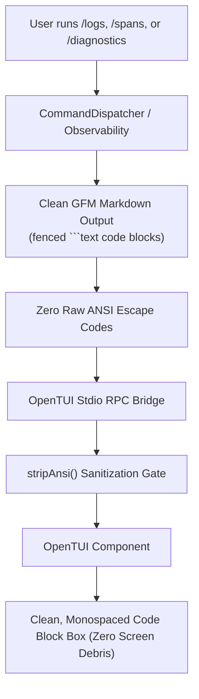
- **Clean Markdown Observability ([`diagnostics.py`](file:///C:/Users/guilh/source/repos/any-context/src/any_context/observability/diagnostics.py))**:
  - Refactored `format_recent_logs`, `format_recent_spans`, and `format_diagnostic_report` to emit 100% clean GitHub Flavored Markdown with fenced code blocks (` ```text `).
  - Monospaced rendering inside OpenTUI prevents word-wrapping artifacts and ensures zero control byte leakage.
- **Frontend ANSI Sanitization Gate ([`chat-message-list.tsx`](file:///C:/Users/guilh/source/repos/any-context/src/any_context/tui/components/chat-message-list.tsx))**:
  - Implemented `stripAnsi()` stripping ANSI sequences and non-printable control characters before rendering in `<markdown>`, providing defense-in-depth against any external process outputs.
- **Cross-Platform Build Hardening ([`build_shim.py`](file:///C:/Users/guilh/source/repos/any-context/launcher/build_shim.py) & [`.github/workflows/release.yml`](file:///C:/Users/guilh/source/repos/any-context/.github/workflows/release.yml))**:
  - Configured `sys.stdout.reconfigure(encoding="utf-8", errors="replace")` and replaced Unicode emojis with ASCII tags (`[*]`, `[OK]`, `[ERROR]`).
  - Added `PYTHONIOENCODING: utf-8` to GitHub Actions Windows & Linux build jobs.
- **Workspace Update Query Repair ([`db_store.py`](file:///C:/Users/guilh/source/repos/any-context/src/any_context/config/db_store.py))**:
  - Selected `id` in `SELECT id, workspace_id...` and updated `WHERE id = row['id']`, eliminating workspace ID collisions.
- **Automated Test Coverage ([`tests/unit/observability/test_diagnostics_formatting.py`](file:///C:/Users/guilh/source/repos/any-context/tests/unit/observability/test_diagnostics_formatting.py))**:
  - 5 tests verifying zero ANSI codes and valid markdown code blocks across all observability formatters.
  - Automated test suite expanded to **253 tests (100% PASS)**.

---

## 44. Dual-Binary Architecture, Session Process Immunology & Resilient Sync Queue (`v0.28.74`)

### ⚡ 1. Problem Analysis
1. **Sub-60ms `actx -v` Degraded to 6-8s**:
   - In `update_service.py` and `updater.py`, updates replaced `actx.exe` with the downloaded 248MB PyInstaller bundle instead of `actx-core.exe`. This overwrote the ultra-fast 5.6KB C# Launcher Shim, forcing Windows to decompress 248MB of Python binaries into `%TEMP%/_MEI...` on every version query.
2. **Terminal Prompt Leakage During Updates (`update-bug.jpg`)**:
   - `find_active_instances()` and `close_active_instances()` only excluded `current_pid` and `os.getppid()`. When the user selected "Close other instances and update now", `taskkill` terminated the foreground `actx.exe` Launcher Shim. This caused the parent shell (`bash.exe` / `powershell.exe`) to resume foreground control and print its blinking command prompt directly over OpenTUI.
3. **Dropped Background Crawl on `/web --add`**:
   - When switching workspaces (`/switch TestWorkspace`), an initial scan thread was launched. When the user immediately added a documentation portal (`/web --add`), `BackgroundSyncManager.start_background_sync()` silently discarded the request because a thread was already running. The un-crawled source retained `page_count: 1` and `last_scraped_at: None`, leaving LanceDB empty and resulting in RAG failure.

### 🛡️ 2. Architectural Solution
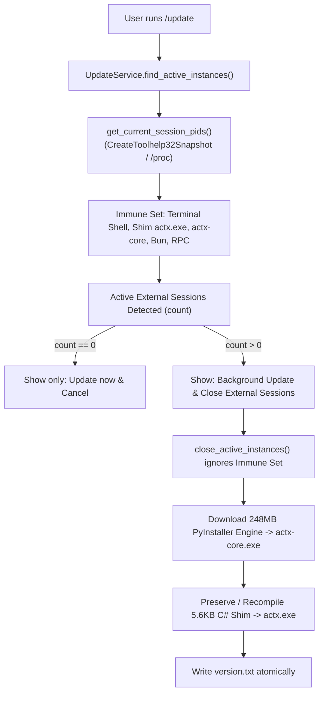

- **Dual-Binary Isolation & Self-Healing ([`update_service.py`](file:///C:/Users/guilh/source/repos/any-context/src/any_context/core/services/update_service.py) & [`updater.py`](file:///C:/Users/guilh/source/repos/any-context/src/any_context/cli/updater.py))**:
  - Distinguishes between `actx-core.exe` (the heavy PyInstaller binary) and `actx.exe` (the native 5.6KB C# Launcher Shim).
  - Preserves `actx.exe` and downloads the engine directly to `actx-core.exe`.
  - Atomically writes `clean_tag` to `version.txt`.
  - Self-Healing: If `actx.exe` is > 1MB, automatically recompiles the 5.6KB C# shim via `build_windows_shim()`.
- **Session Process Immunology (`get_current_session_pids`)**:
  - Traverses the process hierarchy using `CreateToolhelp32Snapshot` on Windows and `/proc` on Unix.
  - Stops cleanly at interactive shell boundaries (`bash.exe`, `cmd.exe`, `powershell.exe`, `mintty.exe`, `windowsterminal.exe`).
  - Completely protects the active session tree from self-termination, preventing terminal prompt leakage.
- **Resilient Background Sync Queue ([`orchestrator.py`](file:///C:/Users/guilh/source/repos/any-context/src/any_context/ingestion/orchestrator.py))**:
  - Maintains `_pending_syncs: Set[str]`.
  - If a sync is requested while a job is in-flight, marks the workspace as pending.
  - In `_worker()`, loops while `workspace in _pending_syncs`, ensuring that newly added web sources or folders are NEVER silently dropped.
  - In [`web_scheduler.py`](file:///C:/Users/guilh/source/repos/any-context/src/any_context/ingestion/web_scheduler.py), sorts unscraped URLs (`last_scraped_at IS NULL`) first for immediate processing.
- **Automated Test Coverage ([`tests/unit/core/test_process_lineage_and_sync_queue.py`](file:///C:/Users/guilh/source/repos/any-context/tests/unit/core/test_process_lineage_and_sync_queue.py))**:
  - 6 unit tests verifying session PID collection, active instance filtering, self-termination protection, pending sync queueing, and update modal option schemas.
  - Total automated test suite expanded to **254 tests (100% PASS)**.

---

## 45. Auto-Healing Conversation Sanitizer & OpenAI Tool Call Shield (`v0.28.75`)

### ⚡ 1. Problem Analysis
- **OpenAI Error 400 Invalid Request**:
  - In LangGraph checkpoints (`checkpoints.db`), when a streaming turn is interrupted (e.g., user cancellation, quick input, network interruption, or tool abort), an `AIMessage` with `tool_calls` is committed to checkpoint state before the corresponding `ToolMessage` node executes.
  - Subsequent turns loaded the checkpoint and appended a new `HumanMessage`, creating an invalid sequence: `[AIMessage(tool_calls=[id]), HumanMessage(...)]`.
  - OpenAI strictly rejects this pattern: `"An assistant message with 'tool_calls' must be followed by tool messages responding to each 'tool_call_id'. The following tool_call_ids did not have response messages: call_..."`.
  - Because the corrupted state persisted in the SQLite checkpoint thread, every subsequent question failed indefinitely with Error 400.

### 🛡️ 2. Architectural Solution
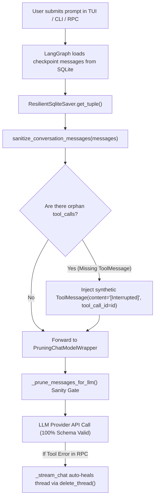

- **Universal Message Sanitizer ([`agent.py`](file:///C:/Users/guilh/source/repos/any-context/src/any_context/core/agent.py))**:
  - Implemented `sanitize_conversation_messages(messages)`.
  - Scans all assistant messages for `tool_calls`. For each required `tool_call_id`, verifies that an immediate answering `ToolMessage` exists before the next human/assistant turn.
  - If any tool calls were orphaned by session interruptions, automatically synthesizes compliant `ToolMessage` objects fulfilling the OpenAI API contract.
  - Integrated into both `_prune_messages_for_llm` and `ResilientSqliteSaver.get_tuple()`.
- **RPC Checkpoint Auto-Heal ([`rpc_bridge.py`](file:///C:/Users/guilh/source/repos/any-context/src/any_context/server/rpc_bridge.py))**:
  - Detects `tool_call_id` and `tool_calls` exceptions in `_stream_chat` and automatically deletes corrupted threads in `checkpoints.db`, preventing permanent user lockouts.
- **Automated Test Coverage ([`tests/unit/core/test_tool_call_sanitization.py`](file:///C:/Users/guilh/source/repos/any-context/tests/unit/core/test_tool_call_sanitization.py))**:
  - 4 specialized unit tests covering complete tool call preservation, single orphan auto-injection, multi-call partial orphan completion, and LLM call-time pruning sanitization.
  - Total automated test suite expanded to **258 tests (100% PASS)**.

---

## 46. Persistent Configuration Architecture & Cross-Version Immunity (`v0.28.76`)

### ⚡ 1. Problem Analysis
- **Onboarding Lost Across New Versions / Updates**:
  - Whenever AnyContext was updated to a new version or reinstalled, users were repeatedly prompted to complete onboarding and enter their API keys again.
  - Root causes identified across the storage engine:
    1. **SQLite `INSERT OR REPLACE` Wipe**: In [`db_store.py`](file:///C:/Users/guilh/source/repos/any-context/src/any_context/config/db_store.py), `save_app_settings()` and `update_context_settings()` used `INSERT OR REPLACE INTO context_settings` without specifying `onboarding_completed`. Under SQLite semantics, replacing a row deletes the record and re-inserts with column defaults (`onboarding_completed = 0`), silently wiping onboarding status whenever settings or presets were updated.
    2. **Missing Field in Schema**: [`ContextSettings`](file:///C:/Users/guilh/source/repos/any-context/src/any_context/config/app_settings.py) lacked the `onboarding_completed` field in its Pydantic model, preventing memory-to-disk roundtrip fidelity.
    3. **Unchecked Fresh Detection**: [`OnboardingService.check_status()`](file:///C:/Users/guilh/source/repos/any-context/src/any_context/core/services/onboarding_service.py) evaluated `if not onboarding_completed:` before inspecting existing keys in `api_keys`. Even when a user had valid keys stored from prior versions, they were forced into first-time onboarding.
    4. **Destructive Uninstall Reset**: [`uninstall.ps1`](file:///C:/Users/guilh/source/repos/any-context/scripts/uninstall.ps1) and [`uninstall.sh`](file:///C:/Users/guilh/source/repos/any-context/scripts/uninstall.sh) reset models and wiped custom configuration even when the user explicitly selected "Y" to preserve their data.

### 🛡️ 2. Architectural Solution & Triple-Layer Immunity
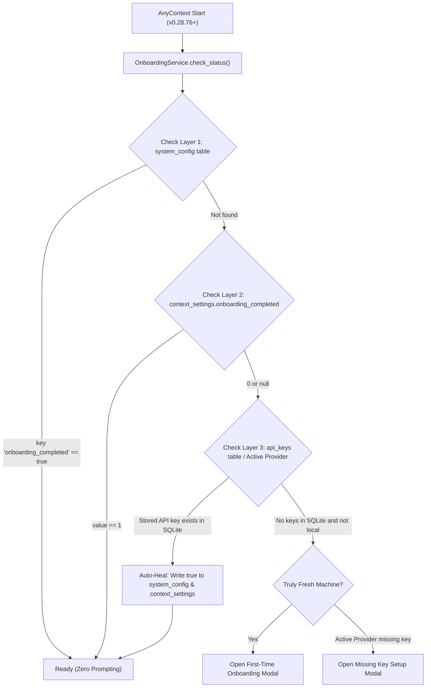

- **Dedicated `system_config` Table ([`db_store.py`](file:///C:/Users/guilh/source/repos/any-context/src/any_context/config/db_store.py))**:
  - Created isolated `system_config (key TEXT PRIMARY KEY, value TEXT NOT NULL)` key-value table in SQLite.
  - System-level flags (e.g. `onboarding_completed`) are decoupled from retrieval and context settings, remaining 100% immune to preset swaps, chunk size updates, or context migrations.
- **SQLite Upsert & Preservation**:
  - Replaced `DELETE FROM workspaces` in `save_app_settings()` with safe SQLite upsert (`ON CONFLICT(name) DO UPDATE`).
  - Explicitly preserved `default_web_engine` and `onboarding_completed` in all `INSERT OR REPLACE INTO context_settings` statements.
- **Auto-Healing Onboarding Service ([`onboarding_service.py`](file:///C:/Users/guilh/source/repos/any-context/src/any_context/core/services/onboarding_service.py))**:
  - `check_status()` verifies stored keys in SQLite (`api_keys` table) and active provider configurations.
  - Automatically heals `onboarding_completed = True` in both `system_config` and `context_settings` if existing keys are detected from a previous installation.
- **Preserved Uninstaller Scripts ([`uninstall.ps1`](file:///C:/Users/guilh/source/repos/any-context/scripts/uninstall.ps1) & [`uninstall.sh`](file:///C:/Users/guilh/source/repos/any-context/scripts/uninstall.sh))**:
  - Preserves all model settings, workspaces, API keys, and onboarding statuses when the user chooses data preservation.
- **Automated Test Coverage ([`tests/unit/core/test_onboarding_service.py`](file:///C:/Users/guilh/source/repos/any-context/tests/unit/core/test_onboarding_service.py))**:
  - Expanded test suite to 8 comprehensive unit tests covering first-time onboarding, OpenAI provider completion, local offline servers, factory reset clearing, preservation across `save_app_settings()`, preservation across `update_context_settings()`, auto-healing from existing SQLite keys, and `system_config` table isolation.
  - Total automated test suite expanded to **262 tests (100% PASS)**.

---

## 21. Unified Database Management, Streaming Mini-Batch Ingestion, and Dumb UI Architecture (`v0.28.77`)

Release `v0.28.77` resolves core architectural fragmentation, unifies database lifecycle management, prevents crawler stalls across high-volume portals, and enforces strict "Dumb UI" separation between Core and presentation adapters.

### 🏛️ 1. Unified SQLite Connection Manager (`DatabaseManager`)
To eliminate uncoordinated concurrent connections to `settings.db` that caused database locks on Windows, all stores now obtain SQLite connections through the `DatabaseManager` singleton:
- **Central Connection Pooling & PRAGMA Enforcement**: Automatically configures `PRAGMA journal_mode = WAL`, `PRAGMA busy_timeout = 30000`, `PRAGMA foreign_keys = ON`, and `PRAGMA synchronous = NORMAL`.
- **Automatic Retry with Exponential Backoff**: Transient `sqlite3.OperationalError: database is locked` exceptions are intercepted and retried transparently up to 3 times.
- **Architectural Cleanup**: Purgou o pacote legado e órfão `workspace_sharing/`, centralizando compartilhamento e transferências de fontes diretamente em `ConfigDBStore`.

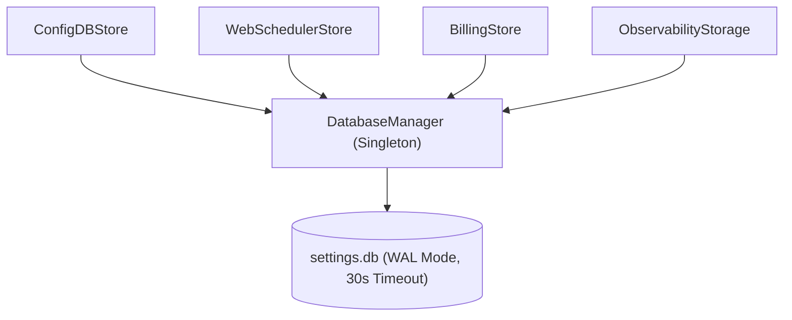

### ⚡ 2. Streaming Mini-Batch Web Crawler Ingestion
To eliminate memory bloat and timeouts when crawling extensive documentation portals (e.g. 2,500+ URLs):
- **Mini-Batch Streaming (`batch_size = 25`)**: The crawler streams scraped pages in mini-batches of 25 URLs, immediately persisting metadata and vector chunks to SQLite and LanceDB before continuing.
- **Domain Concurrency & Rate Limiting**: Enforces compliant per-domain token bucket rate limiting to prevent HTTP 429 and connection drops.
- **Flag Conflict Decoupling**: Dispatches `-f` strictly to `--force` (`is_full`), eliminating ambiguity with `--folder`.

### 🖥️ 3. Strict "Dumb UI" Separation in OpenTUI
The OpenTUI frontend ([`src/any_context/tui/`](file:///C:/Users/guilh/source/repos/any-context/src/any_context/tui)) was refactored to eliminate client-side business logic and redundant state duplication:
- **Canonical Command Catalog Parity**: Purged duplicated `/sources`, `/sync`, and `/web-search` entries from `DEFAULT_SLASH_COMMANDS`, aligning exactly with the Core's 31 canonical commands in `COMMANDS_REGISTRY`. The TUI loads commands dynamically via RPC `list_commands`.
- **Declarative Onboarding Metadata**: Eliminated hardcoded provider branches (`if (id === 'openai')`) in `app.tsx`. The Core emits declarative `OptionItemSchema` with action directives (`prefill_input`, `set_option`, etc.).
- **Direct Tier Display**: Eliminated client-side regex stripping and emoji guessing in `header-bar.tsx`. The frontend directly renders `state.tier_name` formatted by Core.
- **Instant Handshake (<15ms)**: Deferment of heavy ML imports in `server/__init__.py` drops RPC spawn latency from 2.8s to ~200ms with sub-15ms ping responses.

---

## 22. Test Sandbox Architecture, Legacy Workspace Auto-Purge, and Hexagonal Model Authority (`v0.28.78`)

Release `v0.28.78` hardens data isolation across tests and production, guarantees persistent per-workspace model binding in the RPC bridge, and introduces automatic schema migrations to purge legacy test leftovers.

### 🛡️ 1. Global Ephemeral Test DB Sandbox (`ACTX_SETTINGS_DB`)
To eliminate cross-contamination where running unit tests (`test_rpc_bridge.py`, `test_cli_commands_and_dispatch.py`, `test_e2e_full_lifecycle.py`) mutated the user's live `%LOCALAPPDATA%\AnyContext\config\settings.db` file:
- **Sandbox Orchestration in `tests/run_all.py`**: The test runner automatically provisions an isolated temporary directory via `tempfile.mkdtemp(prefix="actx_test_sandbox_")` and exports `ACTX_SETTINGS_DB = os.path.join(temp_dir, "test_settings.db")`.
- **Zero Production Pollution**: Any call to `ConfigDBStore()`, `StdioRPCServer()`, or `DatabaseManager()` automatically resolves to the ephemeral sandbox without touching real user configurations, workspaces, or API keys.
- **Atomic Cleanup**: The temporary sandbox is completely unlinked and removed upon test suite completion in a `finally` block.

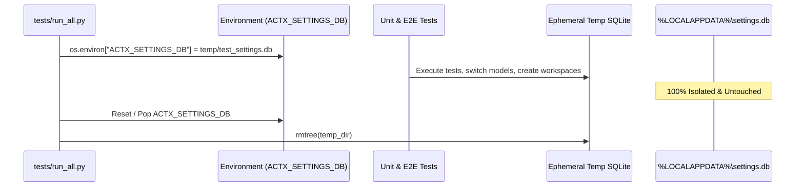

### 🧹 2. Automatic Legacy Test Workspace Auto-Purge (`_init_db`)
During version upgrades, users who had previously run tests or updated from versions where test suites polluted the database retained orphaned test workspaces (`RpcUnitTestWS`, `NewRPCWS`, `Unit_Dispatch_WS`, `TestWorkspace`, `E2E_Empty_Workspace`):
- **Migration Flag (`legacy_test_workspaces_purged`)**: Checked once against SQLite table `system_config`.
- **Targeted Purge**: Executes `DELETE FROM workspaces WHERE name IN ('RpcUnitTestWS', 'NewRPCWS', 'Unit_Dispatch_WS', 'TestWorkspace', 'E2E_Empty_Workspace') OR name LIKE 'test_%' OR name LIKE 'E2E_%'`.
- **User Safety**: Preserves all legitimate user workspaces and factory defaults (`Default`, `Shared Sources`).

### 🏛️ 3. Hexagonal Model Authority in RPC Bridge (`rpc_bridge.py`)
Previously, `rpc_bridge.py` bypassed `ModelService` and read directly from global `settings.models.inference_model`, ignoring per-workspace model assignments and falling victim to global test mutations.
- **Delegation to `ModelService`**: `_load_state()` now calls `ModelService(self.store).get_current_model(workspace_name=self.active_workspace)`, properly honoring the workspace's configured model (defaulting to `gpt-4o-mini`).
- **Workspace-Scoped Model Mutations**: When receiving `set_model` over RPC, it invokes `ModelService.set_model(new_model, workspace_name=self.active_workspace)`, isolating model switches to the active workspace.

---

## 23. Provenance-Based Workspace Immunity, Pre-Migration Snapshots, and Persistent Logging Architecture (`v0.28.79`)

Version `v0.28.79` eliminates fragile heuristic string-based data deletion, guarantees 100% immunity for user-created workspaces through cryptographic schema provenance, introduces automated pre-migration database snapshots, and delivers persistent installation, update, and migration logging across all operating systems.

```
┌────────────────────────────────────────────────────────────────────────────────────────┐
│             PROVENANCE-BASED WORKSPACE IMMUNITY & DEFENSE-IN-DEPTH                     │
├────────────────────────────┬─────────────────────────────┬─────────────────────────────┤
│ 1. Provenance Tagging      │ 2. Dual-Barrier Protection  │ 3. Persistent Audit Logs    │
│    ('created_by' Column)   │    (Zero-Source Rule)       │    (Persistent on Disk)     │
├────────────────────────────┼─────────────────────────────┼─────────────────────────────┤
│ • 'user'   : Human created │ • Workspaces with ANY       │ • install.log : Full trace  │
│ • 'system' : Factory roots │   sources, indexed pages,   │ • update.log  : Step audit  │
│ • 'test'   : Test fixtures │   or files can NEVER be     │ • migration.log: Schema DDL │
│ • Default  : 'user'        │   deleted by purge routines │ • settings.db.bak: Snapshot │
└────────────────────────────┴─────────────────────────────┴─────────────────────────────┘
```

### 🏷️ 1. Workspace Provenance Tagging (`created_by`)
- **Schema Migration**: Added `created_by TEXT DEFAULT 'user'` to SQLite table `workspaces`.
- **Automatic Provenance Detection**:
  - `Default` and `Shared Sources` are strictly flagged as `system`.
  - Normal creation via CLI, OpenTUI, or REST defaults irrevocably to `user`.
  - Automated test runners (`ACTX_TEST_MODE=1` or `pytest`) set `test`.
- **Absolute User Immunity**: Any workspace created by a user—even if named `TestWorkspace`, `test_feature`, or `test_api`—is permanently protected from any automated cleanup routine because `created_by == 'user'`.

### 🛡️ 2. Dual-Barrier Protection & Pre-Migration Snapshots
- **No Name-Based Deletes**: The legacy query matching string prefixes (`LIKE 'test_%'`) was permanently eradicated.
- **Strict Cleanup Constraints**: Cleanup routines only execute in production mode (`ACTX_TEST_MODE != 1`) and can ONLY delete workspaces where:
  1. `created_by = 'test'` **AND**
  2. The workspace has 0 web URLs in `workspace_web_urls` **AND**
  3. The workspace has 0 cached files in `workspace_files_stat_cache` **AND**
  4. The workspace has 0 attached folders in `workspace_folders`.
- **Pre-Migration Safety Snapshot**: `ConfigDBStore._init_db()` automatically creates `settings.db.bak` before executing any DDL or data migrations.

### 📝 3. Persistent Installation, Update, and Migration Logs
- **`update.log`** (`%LOCALAPPDATA%\AnyContext\logs\update.log` / `~/.local/share/any-context/logs/update.log`):
  Logs target version resolution, active process handling, download asset URL/size/hash, atomic binary replacement (`target_exe` -> `old_exe` -> new), and final verification.
- **`install.log`** (`install.ps1` & `install.sh`):
  Records target installation directory, binary download status, version tag registration, shim compilation, and PATH updates.
- **`migration.log`**:
  Records timestamped schema changes, table alterations, and backup snapshot confirmations.

---

## 🏛️ LanceDB Single Source of Truth Web Engine & Zero-Copy Columnar Cache (v0.28.80)

### 1. Problem Statement: Split-Brain Ingestion Bug
Prior to v0.28.80, web crawling state was tracked redundantly:
1. SQLite maintained a `workspace_indexed_web_pages` table recording URL, hash, and metadata.
2. LanceDB maintained the actual embedded chunks and vector embeddings.

When operations desynchronized—such as vector store clearing, workspace transfers, or partial sync passes—SQLite reported pages as "already indexed", leading the crawler to skip them in 0.00s. Concurrently, LanceDB remained empty (0 chunks), causing RAG queries to fail with empty context despite the UI claiming pages were indexed.

### 2. Architecture: Single Source of Truth (SSOT)
In `v0.28.80`, `workspace_indexed_web_pages` was dropped and completely eradicated:
- **LanceDB is 100% the Single Source of Truth**: All page indexing status, content hashes, last modified timestamps, and chunk vectors exist exclusively in LanceDB.
- **Automatic Migration**: `ConfigDBStore._init_db()` and `WebSchedulerStore._init_db()` execute `DROP TABLE IF EXISTS workspace_indexed_web_pages;`, safely removing legacy schemas across all installations.
- **Zero-Copy Apache Arrow Columnar Projections**:
  - `get_indexed_pages_map(workspace_name, domain_or_prefix)` executes a zero-copy projection:
    ```python
    tbl.search().where(f"file_path LIKE '{clean_domain}%'").select(["file_path", "file_name", "content_hash", "last_modified"]).to_arrow()
    ```
  - Dense embedding vectors (1536 dims) are completely bypassed during cache checks, executing scans across thousands of records in `< 5ms`.
  - Content deduplication (`content_hash` matching) and page title resolution (`file_name` stripping `[Web] ` prefix) operate seamlessly without auxiliary database overhead.
- **Atomic Cascading Deletions**:
  - `LanceDBStore.delete_by_file(workspace, file_path)` supports prefix deletion (`OR file_path LIKE '{clean_fp}%'`), ensuring root web source deletions instantly purge all child pages and chunks.

---

## 🛡️ Hermetic Vector Storage Sandboxing & Production Data Immunity (v0.28.81)

### 1. Problem Statement: Accidental Production Vector Purging
Prior to v0.28.81, while the master test runner (`tests/run_all.py`) sandboxed the SQLite database using `ACTX_SETTINGS_DB`, vector storage paths (`ACTX_CONTEXT_DB` and `ACTX_MEMORY_DB`) were not explicitly set. Consequently:
1. Calls to `get_default_vector_db_path()` and `get_default_session_db_path()` defaulted to the production `%LOCALAPPDATA%\AnyContext\data\` directory.
2. When unit tests (such as `test_03_clear_context_vector_db_maintenance`) executed `clear_context_vector_db()`, the function connected to the user's real production LanceDB directory and invoked `lance_store.delete_all_records()`, wiping all indexed workspace chunks.

### 2. Architecture: Multi-Tier Production Immunity
In `v0.28.81`, a triple-tier protection architecture was deployed:
1. **Runner-Level Sandboxing (`tests/run_all.py`)**:
   - Explicitly creates `context_db` and `memory` directories inside the ephemeral `temp_sandbox_dir`.
   - Exports `ACTX_CONTEXT_DB` and `ACTX_MEMORY_DB` for the duration of the test suite and cleans them up in `finally`.
2. **Canonical Paths Protection Barrier (`paths.py`)**:
   - If `ACTX_TEST_MODE == "1"` and no explicit sandbox variable is provided, `get_default_vector_db_path()` and `get_default_session_db_path()` automatically divert to ephemeral system temporary directories (`tempfile.gettempdir() / "actx_test_*"`), strictly forbidding any resolution to `%LOCALAPPDATA%`.
3. **Core Function Execution Shield (`orchestrator.py`)**:
   - `clear_context_vector_db()` verifies if the resolved database path matches the production application data root. If `ACTX_TEST_MODE == "1"` and the target path points to production, the purge is immediately aborted.

---

## 🌐 Canonical HTTP Redirect Trailing Slash Resolution & Relative Link RFC 3986 Integrity (v0.28.82)

### 1. Problem Statement: Truncated Crawling on Redirected Root URLs
When users register technical documentation portals, the provided seed URL often lacks an explicit trailing slash:
```text
https://doc.rust-lang.org/stable/book
```
Modern web servers issue an `HTTP 301 Moved Permanently` (or 302/307/308) redirect pointing to the canonical directory:
```text
https://doc.rust-lang.org/stable/book/
```

Under RFC 3986 (Uniform Resource Identifier: Generic Syntax, Section 5.4 Reference Resolution), resolving a relative link against a base URI depends critically on whether the base URI path terminates with a slash:
- With base `https://doc.rust-lang.org/stable/book`:
  `urljoin(base, "ch01-00-getting-started.html")` produces `https://doc.rust-lang.org/stable/ch01-00-getting-started.html` (cutting off the `/book/` parent directory and causing HTTP 404).
- With base `https://doc.rust-lang.org/stable/book/`:
  `urljoin(base, "ch01-00-getting-started.html")` produces `https://doc.rust-lang.org/stable/book/ch01-00-getting-started.html` (correctly resolving all chapters).

Prior to v0.28.82, `HTMLLinkExtractor` was initialized with the raw, un-redirected `start_url`. On Linux/WSL environments where seed URLs omitted the trailing slash, all relative chapter links resolved to invalid paths, resulting in only 1 page indexed out of 44.

### 2. Architecture: Dynamic Runtime Resolution & Zero-Mutation Reconciliation

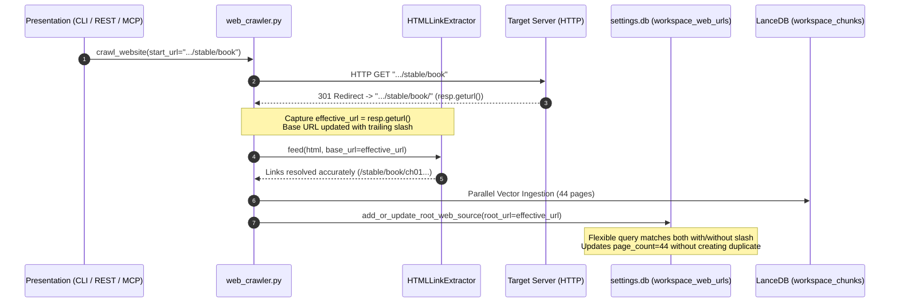

### 3. Engineering Implementation Details
1. **Dynamic Effective Base URL (`web_crawler.py`)**:
   - `urllib.request.urlopen` automatically follows HTTP redirects. Calling `resp.geturl()` retrieves the canonical destination URI.
   - `HTMLLinkExtractor(base_url=effective_url)` guarantees that `urllib.parse.urljoin` resolves intra-book relative links accurately.
   - If `effective_url != start_url`, `section_prefix`, `domain`, and `key_terms` are dynamically re-derived from `effective_url`.
   - Both `start_url` and `effective_url` are retained in `all_domain_urls` to avoid re-fetching the landing page.
   - BFS link expansion employs `sub_resp.geturl()` as `base_url` for every discovered sub-page.
2. **Zero-Mutation Configuration Reconciliation (`web_scheduler.py`)**:
   - To preserve the user's original input while reflecting true multi-page status, `add_or_update_root_web_source` evaluates:
     ```sql
     SELECT id, url FROM workspace_web_urls 
     WHERE workspace_name = ? AND (url = ? OR url = ? OR root_url = ? OR root_url = ?)
     ```
   - This prevents duplicate entries in `workspace_web_urls`, reconciles the existing seed record regardless of trailing slash variation, and cleanly updates `page_count` and `last_scraped_at`.

---

## 27. Resilient Interactive Update Architecture: Clean Session Teardown & Terminal State Immunology (v0.28.83)

### 1. Problem Statement & Root Cause
In previous versions (v0.28.80 - v0.28.82), selecting *"Close other instances and update now"* during an interactive update (`/update`) attempted to kill other background sessions while keeping the current OpenTUI interface running. In Windows environments (specifically MinTTY / Git Bash and ConHost), process tree termination or handle disconnections caused the parent shell (`bash.exe`) to detect early foreground completion, prematurely printing the interactive shell prompt (`user@host MINGW64 ~ $`) directly into the active console buffer.

Concurrently:
1. The OpenTUI frontend (`bun.exe`) remained running as an orphaned process, creating a "phantom TUI" overlaid on top of the shell prompt.
2. OpenTUI operates the console in **Raw Mode** (unbuffered input, echo disabled, keystroke capture). When the session was terminated or exited without clean teardown, the terminal remained locked in Raw Mode with broken event loops, causing subsequent input to be ignored and rendering `Ctrl+C` and `Enter` completely unresponsive.

### 2. Architectural Blueprint & Teardown Lifecycle

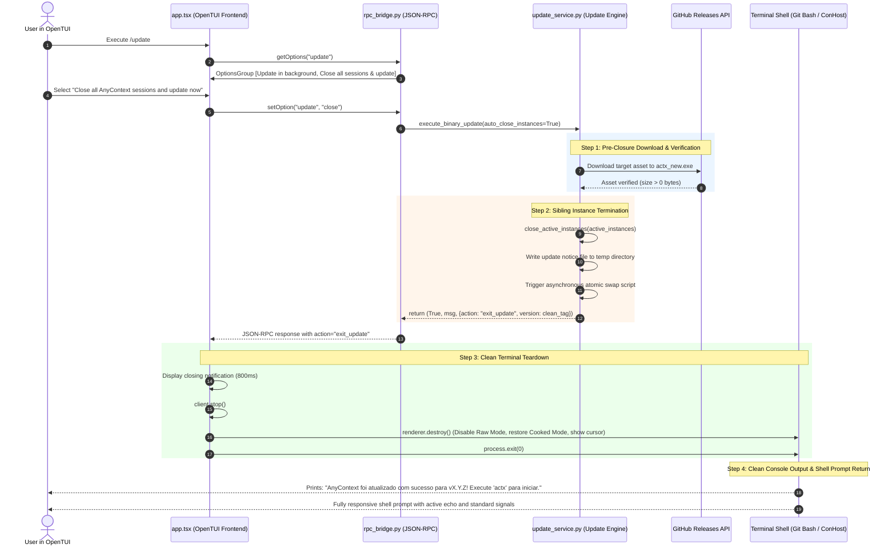

### 3. Key Technical Invariants

1. **Pre-Closure Download Guarantee (`update_service.py` & `updater.py`)**:
   - The target binary (`actx_new.exe` or `actx_new`) is downloaded and validated before any process termination is performed. If the network times out or GitHub is unreachable, zero processes are killed, and the current session reports the error cleanly.
2. **Deterministic Terminal Teardown (`app.tsx` & `index.tsx`)**:
   - `client.setOption` intercepts `res.action === "exit_update"`.
   - The client connection is gracefully closed via `client.stop()`.
   - The CLI renderer calls `renderer.destroy()`, issuing ANSI escape sequences to leave the alternate screen buffer (`\x1b[?1049l`), re-enable cursor visibility (`\x1b[?25h`), and restore the terminal's standard canonical cooked mode.
3. **Parent Process Clean Handoff (`chat_loop.py`)**:
   - Upon completion of `bun run index.tsx`, `launch_opentui()` inspects temporary update notice files (`actx_update_notice_{root_pid}.txt`).
   - If present, it prints a clean success notice directing the user to run `actx`, cleans up the marker, and returns `True`, allowing `entrypoint.py` to exit with code 0.
4. **Zero Ghost TUIs & Raw Mode Lock Elimination**:
   - Eliminates terminal prompt leaks, ghost overlays, and unresponsive blinking cursors across Git Bash, Windows Terminal, MinTTY, PowerShell, and Unix shells.

---

## 🛡️ Grounding Strategies, Live Web Search Priority Matrix & Universal Temporal Recency

### 1. Architectural Overview & Design Pattern

AnyContext decouples AI behavioral boundaries from underlying models using the **Strategy Pattern** (`any_context.core.grounding_strategies`):
- `GroundingStrategy` (Abstract Strategy Interface)
- `StrictGroundingStrategy` (Audit & Legal: 100% factual, zero parametric memory, permission-gated web)
- `HybridGroundingStrategy` (Balanced: dual-layer workspace facts + labeled parametric memory + autonomous web)
- `ProactiveGroundingStrategy` (Research & Strategy: total real-time fusion across all channels)

### 2. The 6-State Priority Matrix

| State | Mode | Web Search | Source Precedence | Behavior & Absence Protocol |
| :--- | :--- | :---: | :--- | :--- |
| **1** | **Strict** | **OFF** | • Priority 0: VectorDB ONLY<br>• Forbidden: Parametric Memory<br>• Disabled: Web Search | 0% hallucination. On absence: `⚠️ Essa informação não consta nos documentos deste workspace.` |
| **2** | **Strict** | **ON** | • Priority 0: VectorDB<br>• Priority 1: Registered Portals & Web (Gated)<br>• Forbidden: Parametric Memory | Permission-gated: on missing local facts, model asks: `⚠️ Essa informação não consta nos documentos deste workspace. Deseja que eu faça uma busca na internet sobre '[tópico]'?` |
| **3** | **Hybrid** | **OFF** | • Priority 0: VectorDB<br>• Priority 1: Parametric Memory (Labeled)<br>• Disabled: Web Search | Dual-layer response: `### 📂 Informações do Workspace` + `### 💡 Sugestões / Conhecimento Geral do Modelo`. |
| **4** | **Hybrid** | **ON** | • Priority 0: VectorDB & Registered Web Portals<br>• Priority 1: Open Web Search & Parametric Memory | Autonomous web search if local context incomplete: `### 📂 Informações do Workspace` + `### 🌐 Informações Complementares da Web`. |
| **5** | **Proactive** | **OFF** | • Priority 0: VectorDB & Strategic Model Knowledge<br>• Disabled: Web Search | Proactive synthesis, risk anticipation, next-step recommendations without web. |
| **6** | **Proactive** | **ON** | • Priority 0: VectorDB + Registered Portals + Real-time Web Search + Proactive Reasoning | Total real-time fusion. Autonomous continuous web discovery. Recommends authoritative URLs with `/web add <url>`. |

### 3. Universal Temporal Recency Rule (Tie-Breaker for Same-Priority Sources)

When multiple sources share the **same priority tier** (e.g. VectorDB vs Registered Portals in Tier 0, or Open Web vs Parametric Memory in Tier 1, or All Sources in Proactive mode):
- **Universal Rule:** The source with the most recent publication date, file modification time (`mtime`), or real-time web retrieval timestamp **ALWAYS PREVAILS** and supersedes older or legacy facts.
- The model is instructed to explicitly highlight date/version discrepancies to the user rather than harmonizing on outdated statements.

### 4. Dynamic Agent Lifecycle & Cache Invalidation Guarantee (`rpc_bridge.py`)

To eliminate stale runtime configuration caching:
1. **Dynamic Signature Verification**:
   ```python
   current_sig = (self.active_workspace, self._current_model, self._grounding_mode, bool(self._web_search_enabled))
   if self.agent_instance is None or getattr(self, "_agent_sig", None) != current_sig:
       self.agent_instance = create_anycontext_agent(...)
       self._agent_sig = current_sig
   ```
2. **State Updates Invalidation**:
   In `execute_command`, `set_option`, `execute_menu_action`, `set_web_search`, `set_mode`, `switch_workspace`, any modification to `state_updates` immediately executes `self.agent_instance = None`.
3. **Database Auto-Creation Invariant (`ConfigDBStore`)**:
   `set_grounding_mode` and `set_web_search_status` check `cursor.rowcount == 0` and auto-insert workspace records with dynamic provenance resolution, guaranteeing immediate persistence across transport layers.

---

## 29. Hermetic Triple Sandboxing & Cascade Test Workspace Purge Architecture (`v0.28.85`)

### 1. The Triple Safety Barrier (`paths.py`)

To guarantee absolute immunity of production data against automated unit, integration, and E2E test runs, `paths.py` enforces a **Triple Safety Barrier** across all storage subsystems:

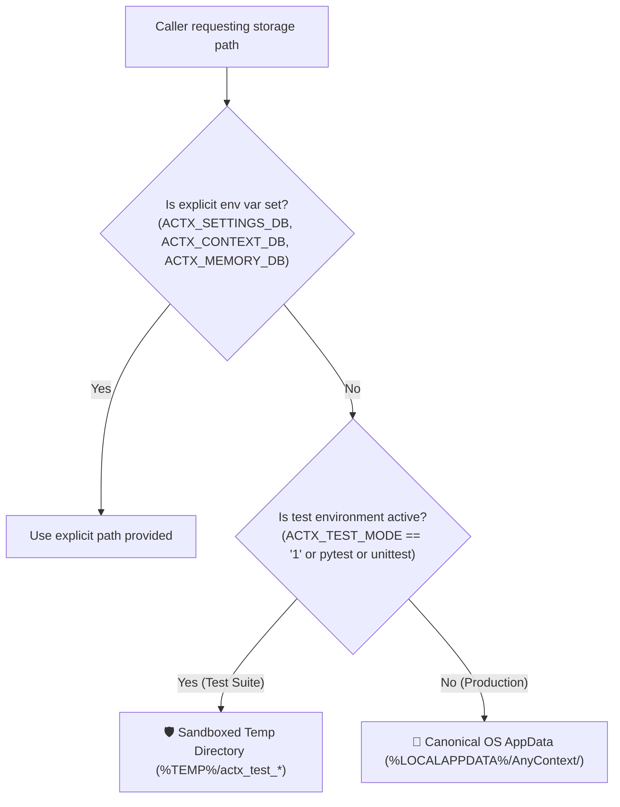

1. **Configuration DB (`settings.db`)**: `get_default_config_db_path()` redirects automated test runs to `%TEMP%/actx_test_config/settings.db`.
2. **Vector DB (LanceDB `context_db`)**: `get_default_vector_db_path()` redirects automated test runs to `%TEMP%/actx_test_context_db`.
3. **Session Memory DB (LanceDB `memory`)**: `get_default_session_db_path()` redirects automated test runs to `%TEMP%/actx_test_session_db`.

### 2. Multi-Table Cascade Purge for Ephemeral Test Workspaces (`db_store.py`)

Workspaces tagged with `created_by = 'test'` (as well as known legacy test fixtures `Unit_Dispatch_WS`, `TestWS`, `RpcUnitTestWS`, `NewRPCWS`) are recognized as ephemeral test fixtures. Upon production startup (`ACTX_TEST_MODE != "1"`), `ConfigDBStore._init_db()` executes an atomic, multi-table cascade purge:

```sql
DELETE FROM workspace_folders WHERE workspace_name = ?;
DELETE FROM workspace_web_urls WHERE workspace_name = ?;
DELETE FROM workspace_cloud_drives WHERE workspace_name = ?;
DELETE FROM workspace_permissions WHERE workspace_name = ?;
DELETE FROM workspace_user_permissions WHERE workspace_name = ?;
DELETE FROM workspace_share_invites WHERE workspace_name = ?;
DELETE FROM workspace_source_links WHERE workspace_name = ?;
DELETE FROM workspace_files_stat_cache WHERE workspace_name = ?;
DELETE FROM workspaces WHERE name = ? AND LOWER(name) NOT IN ('default', 'shared sources');
```

This completely eradicates the previous flaw where test workspaces with attached sources or folders were spared from cleanup due to restrictive `NOT IN` queries.

### 3. Dynamic Provenance Resolution

When workspaces are auto-created during runtime option updates (`set_grounding_mode`, `set_web_search_status`, or `add_workspace`), the provenance tag is dynamically assigned:
- If running under `ACTX_TEST_MODE == "1"`, `pytest`, or `unittest`: `created_by = 'test'`
- If named `Default` or `Shared Sources`: `created_by = 'system'`
- Otherwise: `created_by = 'user'`

User workspaces (`created_by = 'user'`) and system workspaces (`created_by = 'system'`) are 100% strictly immune to cleanup operations.


