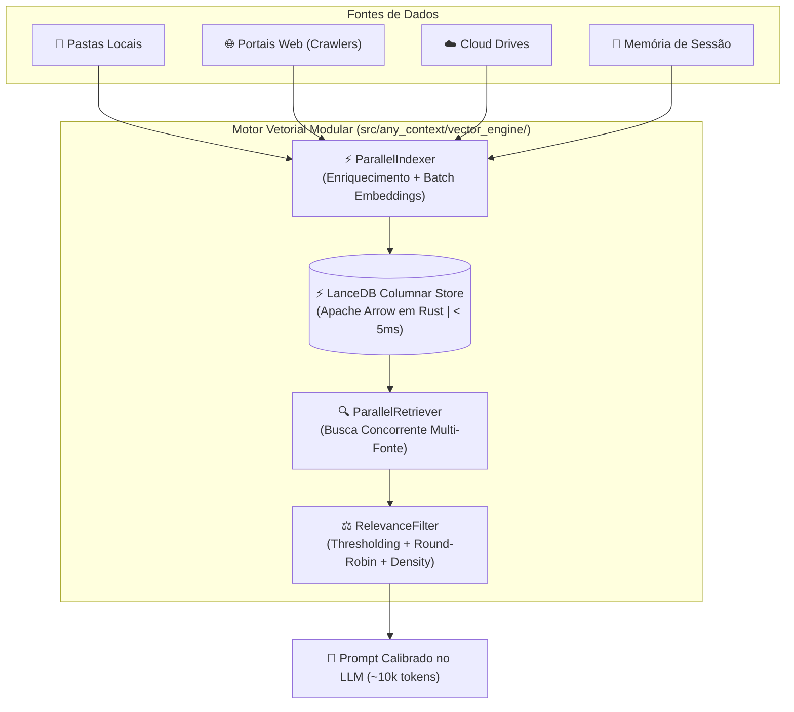

# 🔬 AnyContext Technical Documentation (`TecDoc`)

> **Comprehensive Engineering, Architecture, and Deep-Dive Technical Manual for AnyContext (`actx`).**

---

## 📑 Table of Contents
1. [System Architecture & 3-Tier Context Model](#1-system-architecture--3-tier-context-model)
2. [100% LanceDB Columnar Vector Engine & Modular RAG Architecture](#2-100-lancedb-columnar-vector-engine--modular-rag-architecture)
3. [Temporal RAG & Metadata Freshness Engine](#3-temporal-rag--metadata-freshness-engine)
4. [Intelligent Web Ingestion & Recursive Crawler Engine](#4-intelligent-web-ingestion--recursive-crawler-engine)
5. [3-Level Structured Long-Term Memory Architecture](#5-3-level-structured-long-term-memory-architecture)
6. [Unified Synchronization & Multi-Source Parity Engine](#6-unified-synchronization--multi-source-parity-engine)
7. [REST API Server Architecture & Security (`actx --serve`)](#7-rest-api-server-architecture--security-actx---serve)
8. [Model Context Protocol (MCP) Implementation (`actx --mcp`)](#8-model-context-protocol-mcp-implementation-actx---mcp)
9. [Cross-Version Python Compatibility (3.10 - 3.13) & AST Engineering](#9-cross-version-python-compatibility-310---313--ast-engineering)
10. [Observability & Telemetry Pipeline (LangSmith)](#10-observability--telemetry-pipeline-langsmith)
11. [Multi-Interface Surface Parity & Governance Protocol](#11-multi-interface-surface-parity--governance-protocol)

---

## 1. System Architecture & 3-Tier Context Model

AnyContext implements a fully modular, decoupled architecture designed for local-first execution, enterprise privacy, and zero data leakage.

### 🏛️ The 3-Tier AI Context Hierarchy
To eliminate redundant re-indexing and guarantee multi-department data isolation, AnyContext organizes context into three distinct tiers:

1. **🏢 Institutional Global Knowledge Base (`Global`)**:
   - Organization-wide knowledge base curatable by system administrators.
   - Automatically inherited and queried across all authorized project workspaces during RAG retrieval.
2. **📦 Reusable Shared Sources Library (`Shared Sources`)**:
   - Dedicated central library workspace for reusable frameworks, technical codebases, and web documentation portals.
   - **Zero-Cost Source Linking**: Any project workspace can link an existing indexed source in `< 50ms` with **$0.00 in embedding API costs** via `/link` or the REST API.
   - LanceDB columnar vector datasets and SQLite metadata are referenced dynamically without physical duplication.
3. **📁 Scoped Project Workspaces**:
   - Isolated contextual boundaries guaranteeing zero cross-project data leakage.
   - Workspaces can exist as empty logical scopes (ideal for documentation portals, market research, or agent tasks) before attaching local folders or web URLs.

```mermaid
graph TD
    subgraph "🏛️ 3-Tier Context Hierarchy"
        A["🏢 Institutional Global (Global)"] --> D["📁 Project Workspace A (Legal)"]
        A --> E["📁 Project Workspace B (Engineering)"]
        B["📦 Reusable Shared Sources (Frameworks, Docs)"] -.->|Zero-Cost Link < 50ms ($0.00)| D
        B -.->|Zero-Cost Link < 50ms ($0.00)| E
    end
```

### ⚙️ 3-Tier Configuration Resolution Hierarchy
AnyContext resolves settings, API credentials, and environment overrides through a strict three-tier precedence model:

```
1. Operating System Environment Variables  (Highest Precedence - export OPENAI_API_KEY=...)
2. Local .env File                         (Loaded cumulatively from AppData/Local/actx & project root)
3. Local SQLite Secure Database            (Lowest Precedence - Managed interactively via /config)
```

---

## 2. 100% LanceDB Columnar Vector Engine & Modular RAG Architecture

Starting in version `v0.21.0`, AnyContext has **fully unified all vector operations into LanceDB (Apache Arrow / Rust)**, completely eliminating ChromaDB, SQLite write-lock contentions, and `docstore.json` serialization bottlenecks.



### 🧩 Modular Subsystem Breakdown (`src/any_context/vector_engine/`)

#### 1. `LanceDBStore` (`src/any_context/vector_engine/store.py`):
- **Native Columnar Engine**: Encapsulates raw LanceDB driver operations using PyArrow schemas. All vector data is stored in Apache Arrow format on disk (`workspace_chunks.lance` and `session_memory.lance`).
- **Zero-Copy & Sub-Millisecond Speed**: Vector queries execute in `< 5ms` on 100k+ chunks through Rust-based AVX2/AVX-512 SIMD vector distance routines.
- **PyArrow Record Schema**:
  ```python
  pa.schema([
      pa.field("id", pa.string()),
      pa.field("vector", pa.list_(pa.float32(), dim)),
      pa.field("text", pa.string()),
      pa.field("file_name", pa.string()),
      pa.field("file_path", pa.string()),
      pa.field("workspace", pa.string()),
      pa.field("last_modified", pa.string()),
      pa.field("content_type", pa.string()),
      pa.field("document_summary", pa.string()),
      pa.field("keywords", pa.string()),
      pa.field("content_hash", pa.string()),
  ])
  ```
- **Cross-Platform Path Normalization (`_norm_path`)**: Standardizes Windows (`\`) and POSIX (`/`) paths to forward slashes before SQL/Arrow filtering, guaranteeing 100% search compatibility across operating systems.
- **Atomic Zero-Cost Metadata Operations ($0.00)**:
  - `update_workspace_name(old_ws, new_ws, table_name)`: Reads matching records, updates the workspace metadata attribute, and commits changes atomically in `< 50ms` without recomputing vector embeddings.
  - `transfer_file(source_ws, target_ws, file_path, table_name)`: Migrates all records belonging to a folder, file, or URL domain from one workspace to another in `< 50ms` with zero token expenditure.

#### 2. `ParallelIndexer` (`src/any_context/vector_engine/indexer.py`):
- **Concurrent Ingestion Pipeline**: Coordinates file parsing, semantic enrichment, batch embedding, and columnar writes.
- **Micro-Batch Vectorization**: Calls `get_text_embeddings_batch` in batches of 32 to 100 chunks, maximizing OpenAI/local embedding throughput while avoiding HTTP 429 rate limits.
- **Dynamic Dimension Resolution**: Inspects the length of the first computed embedding vector (e.g. 1536 for OpenAI `text-embedding-3-small` or 3072 for `text-embedding-3-large`) and provisions the PyArrow schema dynamically.

#### 3. `ParallelRetriever` (`src/any_context/vector_engine/retriever.py`):
- **Multi-Source Thread Pool Execution**: Uses `ThreadPoolExecutor` to simultaneously query the active workspace partition, the `Global` knowledge base, and linked `Shared Sources`.
- **Distance to Similarity Normalization**: Converts LanceDB L2 / Cosine distances to a normalized `[0.0, 1.0]` score:
  $$\text{score} = \frac{1.0}{1.0 + \max(0.0, \text{distance})}$$
- **Zero-Lock Concurrency**: Multiple read threads query the Apache Arrow dataset concurrently without database lock contention.

#### 4. `RelevanceFilter` (`src/any_context/vector_engine/filters.py`):
- **Pure-Function Decoupled Filter**: Applies mathematical score thresholding (`apply_threshold`), source-fair round-robin balancing (`apply_source_diversification`), and strict prompt density budgeting (`apply_density_budget`).
- **Density Budgeting**: Enforces a strict ceiling of **45,000 characters (~10,000-11,000 tokens)**, ensuring that injected context fits safely within LLM attention windows without causing attention degradation ("Lost in the Middle").

#### 5. `RetrievalConfig` & `IngestionConfig` (`src/any_context/vector_engine/models.py`):
- **Decoupled Parameter Objects**: Immutable dataclasses injected via Dependency Injection into the retriever and indexer.
- **Retrieval Presets**:
  - `turbo`: `candidate_pool_k=50`, `target_top_k=10`, `max_chunks_per_source=2` (~5,000 tokens).
  - `balanced` (Default): `candidate_pool_k=100`, `target_top_k=20`, `max_chunks_per_source=3` (~10,000-15,000 tokens).
  - `deep_research`: `candidate_pool_k=150`, `target_top_k=40`, `max_chunks_per_source=5` (~30,000-40,000 tokens).

---

### 🌐 Contextual Retrieval & Semantic Enrichment (`ContextualEnricher`)

- **The Problem of Out-of-Domain False Positives**: In dense vector search, generic terms like "authorizations" or "deadlines" in unrelated documents (e.g. IT access forms or financial agreements) can falsely match queries about child immigration laws.
- **The Contextual Enrichment Solution (`src/any_context/vector_engine/enricher.py`)**:
  - Before chunking and embedding, every local document or crawled web URL passes through the `ContextualEnricher`.
  - Generates a **Rich Semantic Envelope**:
    1. **Rich Summary (3-4 dense sentences)**: Scope, governing policies, target subjects, and legal context.
    2. **Top-N Domain Keywords (5-8 terms)**: Canonical domain tags extracted and boosted by title/heading heuristics.
  - **Chunk Enveloping**: Every chunk is anchored with the document header:
    ```text
    [Context: Document 'Manual_Canada_2026.pdf': Guidelines on Child Travel Consent and Custody | Keywords: travel, consent, custody, ircc, minors]
    ---
    <original chunk text...>
    ```
  - **SHA-256 Persistent SQLite Caching**: The semantic envelope is generated once per file/URL and cached in SQLite (`contextual_enrichment_cache.db`), guaranteeing **sub-millisecond bypass (0.00ms)** for unmodified files on subsequent syncs.

---

### 🔍 Live Database Inspection Command (`/inspect` ou `/chunks`)

Users and administrators can verify vector database state directly from the chat interface without leaving the terminal:
- Command: `/inspect` (aliases: `/chunks`, `/lance`)
- Options: `/inspect -n 10` (custom sample limit)
- Output Data:
  - Active storage engine: `⚡ LanceDB Columnar (Apache Arrow / Rust)`
  - Physical disk path of the `.lance` dataset
  - Total chunks in active workspace vs. total across all workspaces in `workspace_chunks.lance`
  - Total long-term memories in `session_memory.lance`
  - Formatted text snippets, content types (`Local Document`, `Web Documentation`), and source paths

---

## 3. Temporal RAG & Metadata Freshness Engine

AnyContext features a deterministic time-aware retrieval engine that resolves document recency, supersedes outdated news, and maintains temporal integrity.

### 🕒 5-Tier Web Date Resolution Pipeline
Extracts canonical publication and update timestamps through a cascading priority hierarchy:
1. **OpenGraph / Schema.org JSON-LD**: `article:published_time`, `dateModified`, `datePublished`.
2. **In-Page Semantic Text & Footers**: Regex parsing of visible patterns (`Page details YYYY-MM-DD`, `Date modified: YYYY-MM-DD`, `Last updated: ...`).
3. **URL Date Patterns**: Extraction from structured URL slugs (e.g. `/2023/06/15/...`).
4. **HTTP `Last-Modified` Headers**: Server-reported timestamps.
5. **Crawl & Ingestion Timestamp**: Fallback to real-time ingestion date.

### 🏷️ Content Classification & Chunk Headers
- Categorizes sources into `Canonical Service / Documentation` (authoritative active rules), `Historical News / Press Release` (past announcements), or `Local Document`.
- Every chunk injected into the LLM context carries a standardized time-aware header:
  ```text
  --- [Document Chunk N | Source: filename.ext | Workspace: Legal | Last Modified: YYYY-MM-DD | Type: Canonical Service] ---
  ```
- **Recency Primacy Protocol**: The AI agent evaluates timestamps and operational notices, guaranteeing that active rules (`Status: Paused`) supersede older historical press releases.

---

## 4. Intelligent Web Ingestion & Recursive Crawler Engine

AnyContext includes a built-in, concurrent web ingestion engine designed for high-precision RAG extraction.

```
┌────────────────────────────────────────────────────────────────────────────────────────┐
│                        ANYCONTEXT WEB INGESTION LIFECYCLE                              │
├─────────────────┬─────────────────┬──────────────────┬─────────────────┬───────────────┤
│  1. Discovery   │  2. Resolution  │   3. Proximity   │  4. Concurrent  │ 5. Columnar   │
│  & Normalization│  & Sitemaps     │     Ranking      │    Extraction   │   LanceDB     │
├─────────────────┼─────────────────┼──────────────────┼─────────────────┼───────────────┤
│ • Strip .html   │ • sitemapindex  │ • Landing (10k)  │ • Multi-threaded│ • Chunk 500/50│
│ • Infer Prefix  │ • Keyword Match │ • Section (2k)   │ • Strip Boiler  │ • Batch Embed │
│ • Extract Links │ • Filter .xml   │ • Keywords (300) │ • Markdown AST  │ • Arrow Batch │
└─────────────────┴─────────────────┴──────────────────┴─────────────────┴───────────────┘
```

### 🧠 Under the Hood Details:
1. **Semantic Path Normalization**: Strips file extensions (`.html`, `.php`, `.aspx`) to derive true directory paths (e.g. `/en/services/`).
2. **Recursive Sitemap Traversal**: Locates `sitemap.xml` and traverses nested `<sitemapindex>` catalogs, filtering matching topics.
3. **Semantic Proximity Ranking (`_rank_url`)**:
   - 🥇 **Landing URL** (Priority 10,000)
   - 🥈 **Direct Section Children** (Priority 2,000)
   - 🥉 **Direct In-Page Links** (Priority 500)
   - 🏅 **Keyword & Slug Matches** (Priority 300 per keyword)
   - ⚪ **Generic Domain URLs** (Priority 0)
4. **Clean Semantic HTML Extraction**: Strips navigation bars, footers, cookies, scripts, and ads while preserving headings, markdown tables, and code blocks.
5. **High-Speed Dual-Stage Parallel Pipeline (`v0.23.0`)**:
   - **Stage 1: Multi-Threaded Network & Conditional GET (20 Workers)**:
     - **Sitemap `<lastmod>` Diff**: In-memory timestamp comparison against SQLite skips network requests entirely for unmodified sitemap entries.
     - **HTTP Conditional GET (`If-None-Match` & `If-Modified-Since`)**: Returns `304 Not Modified` with 0 bytes body download in ~15ms, maintaining vector integrity without consuming bandwidth.
     - **Anti-429 Exponential Backoff**: Automatically catches HTTP 429 rate limit responses, applies jittered backoff based on `Retry-After` headers, and retries gracefully without thread deadlock.
   - **Stage 2: Parallel Batch Vectorization via `ParallelIndexer` (4-6 Workers)**:
     - Modified documents are enriched concurrently and dispatched in parallel batches to the embedding provider (OpenAI / Local LLM) with transient rate limit retries.
     - Embeddings are streamed directly into LanceDB via Apache Arrow columnar zero-copy buffers.
6. **Multi-Page Portal Re-Crawling on `/web --sync`**:
   - `sync_workspace_web_urls` inspects whether a web source has multiple indexed pages (`page_count > 1` or crawler root).
   - For multi-page portals, it executes the full crawler pipeline (`crawl_website`) across all sub-pages with support for `force_rescrape`, guaranteeing that all portal chunks are populated in LanceDB.

---

## 5. 3-Level Structured Long-Term Memory Architecture

AnyContext implements a hierarchical 3-level memory system powered exclusively by LanceDB table `session_memory.lance`:

### 🧠 Level 1: Structured 5-Dimension Session Summary
Extracted automatically upon `/exit` or `/q` across 5 clear dimensions:
1. 👤 **User Directives & Preferences**: Explicit rules, workflows, coding conventions.
2. 🏗️ **Technical Architecture & Key Decisions**: Architecture choices, parameters, schemas.
3. 📁 **Files, Code Symbols & Databases**: Files modified, functions created, database tables.
4. 📌 **Critical Context & Problem Resolution**: Root-cause diagnoses, bug fixes, operational insights.
5. 🚀 **Pending Tasks & Next Steps**: Roadmap milestones and open action items.

### 🧠 Level 2: Active Rolling Window
Retains recent conversation messages in SQLite state for immediate context continuity.

### 🧠 Level 3: Consolidated Meta-Summarization
Consolidates older memory vectors into high-level indices using 1024-token expanded chunks (`chunk_size=1024`, `chunk_overlap=200`) stored in LanceDB.

---

## 6. Unified Synchronization & Multi-Source Parity Engine

### 🔄 Unified Master Orchestrator (`src/any_context/ingestion/unified_sync.py`)
- `/sync` orchestrates synchronization across all registered source categories in the active workspace:
  1. 📁 **Local Folders**: Scanned, diffed (SHA-256), contextualized and ingested via `run_index_folder`.
  2. 🌐 **Web Portals**: Tracked, scraped, hashed and updated via `sync_workspace_web_urls`.
  3. ☁️ **Cloud Drives**: Synced via cloud drive managers.
- **Granular Target Flags**:
  - `/sync --folder` / `/sync -f`: Synchronizes local folders only.
  - `/sync --web` / `/sync -w`: Synchronizes web sources only.
  - `/sync --drive` / `/sync -d`: Synchronizes cloud drives only.
  - `/sync --all` / `/sync -a`: Synchronizes across all configured workspaces.
  - `/sync --force`: Forces re-hashing and re-indexing of all sources.
  - `/sync --status`: Displays real-time sync metrics without performing writes.
  - `/sync --bg`: Triggers synchronization in an asynchronous background thread.

### ⚡ Non-Blocking Background Synchronization & Telemetry (`BackgroundSyncManager`)
- **Decoupled Worker Architecture**: `BackgroundSyncManager` encapsulates thread-safe daemon worker threads (`SyncWorker-<workspace>`) for non-blocking execution of unified synchronization jobs across folders, web sources, and cloud drives.
- **Real-Time Progress Telemetry**:
  - `BackgroundSyncManager.update_progress(workspace_name, current, total, stage, item_name)` records atomic updates per workspace.
  - `BackgroundSyncManager.format_progress_bar(workspace_name, width=8)` produces proportional Unicode block micro-bars (e.g. `[████░░░░] 50% (15/30 files)`).
  - Progress callbacks are propagated through `run_unified_sync`, `run_index_folder` and `sync_workspace_web_urls`.
- **Dynamic Status Toolbar Integration**:
  - `BackgroundSyncManager.is_syncing(workspace_name)` provides sub-millisecond atomic state queries.
  - The CLI `bottom_toolbar` renderer evaluates `is_syncing` and `format_progress_bar` dynamically on each render frame, flashing `⚡ Syncing [████░░░░] 50% (15/30 files)` in bold orange while background workers operate.
  - The interactive prompt (`prompt_toolkit`) remains **100% unlocked and responsive**, allowing uninterrupted user interaction while document ingestion and vectorization run in parallel.
- **REST & MCP Parity**:
  - REST endpoint `GET /v1/workspaces/{name}/sync/status` returns structured `is_syncing`, `progress` (`pct`, `current`, `total`, `stage`), and `progress_bar`.
  - MCP tool `check_workspace_sync_status` and `sync_workspace_folders` seamlessly query and report live progress metrics.

### 📁 Source Family CLI Parity Matrix
Standardized symmetric CLI verbs across `/folder`, `/web`, and `/drive`:

| Verb | `/folder` | `/web` | `/drive` |
| :--- | :--- | :--- | :--- |
| **List** | `/folder` or `/folder --list` | `/web` or `/web --list` | `/drive` or `/drive --list` |
| **Add** | `/folder --add <path>` | `/web --add <url>` | `/drive --add <provider>` |
| **Remove** | `/folder --remove <path>` | `/web --remove <url>` | `/drive --remove <id>` |
| **Sync** | `/folder --sync` | `/web --sync` | `/drive --sync` |

---

## 7. REST API Server Architecture & Security (`actx --serve`)

AnyContext includes a production-grade FastAPI REST server for enterprise VPC deployments.

### 🌐 Key REST Endpoints:
- `POST /v1/chat` — Streaming & non-streaming RAG queries with session memory and `grounding_mode`.
- `GET /v1/context/mode` & `POST /v1/context/mode` — Grounding mode inspection and management.
- `GET /v1/workspaces` — Lists all workspaces with unified typed `sources` array.
- `GET /v1/workspaces/{name}/sources` — Detailed source breakdown.
- `POST /v1/workspaces` — Create workspace.
- `POST /v1/workspaces/transfer` — Instant zero-cost transfer of local folders and websites between workspaces.
- `POST /v1/workspaces/{name}/cloud-drives` — Connect cloud drive sources.
- `POST /v1/index` — Background folder re-indexing.
- `GET /v1/models` — Active & available model inspection.

### 🔒 Cryptographic Security & RBAC:
- **PBKDF2 Password Hashing**: Passwords stored in SQLite are hashed with PBKDF2 using 100,000 iterations and cryptographic salts.
- **Bearer Authentication**: Session tokens prefixed with `actx_sec_` with role-based access control (`Admin`, `Analyst`, `Viewer`).

---

## 8. Model Context Protocol (MCP) Implementation (`actx --mcp`)

Native JSON-RPC 2.0 stdio implementation connecting AnyContext to Claude Desktop, Cursor IDE, and Antigravity.

### 🔌 11 Registered MCP Tools:
1. `search_workspace_docs` — Vector semantic search across indexed files via LanceDB.
2. `query_anycontext_agent` — Direct RAG query with 3-level session memory.
3. `get_grounding_mode` — Inspect active AI Grounding Mode (`hybrid`, `strict`, `proactive`).
4. `set_grounding_mode` — Switch active AI Grounding Mode.
5. `list_workspaces` — Lists all configured workspaces and associated sources.
6. `get_workspace_sources` — Retrieves detailed sources breakdown for a workspace.
7. `transfer_workspace_source` — Zero-cost instant data source transfer.
8. `rename_workspace` — Instant zero-cost atomic workspace rename.
9. `get_context_retrieval_settings` — Inspect current RAG retrieval density parameters and preset.
10. `set_context_retrieval_preset` — Configure RAG presets (`balanced`, `turbo`, `deep_research`).
11. `list_available_models` — Inspect available and configured models.

---

## 9. Cross-Version Python Compatibility (3.10 - 3.13) & AST Engineering

### 🐍 The PEP 701 f-string Syntax Constraint:
In Python 3.12+, backslashes are permitted inside `{...}` expressions within f-strings. In Python 3.10 and 3.11, any backslash inside `{...}` generates an immediate `SyntaxError: f-string expression part cannot include a backslash`.

### 🛡️ Pre-Sanitization Protocol:
All code throughout AnyContext pre-sanitizes variables outside f-string interpolation:
```python
# Guaranteed 100% compatible across Python 3.10, 3.11, 3.12, 3.13:
clean_workspaces = [w.replace("'", "''") for w in workspaces]
ws_in = ", ".join("'" + w + "'" for w in clean_workspaces)
where_clauses.append(f"workspace IN ({ws_in})")
```
Automated AST static verification checks are executed across all codebase files (`src/` and `tests/`) as part of the continuous integration test suite.

---

## 10. Observability & Telemetry Pipeline (LangSmith)

When `LANGSMITH_TRACING=true` is present in the environment (via `.env` or system variables):
- Every user query, LangGraph agent step, tool call (`search_db`, `live_web_search`), and LLM synthesis is traced in real-time.
- Traces are streamed to `https://api.smith.langchain.com` under the project `AnyContext`.
- Captures precise token counts (input/output), millisecond latencies, and execution trees.

---

## 11. Multi-Interface Surface Parity & Governance Protocol

AnyContext strictly follows the **`dev-cycle-protocol`** universal software engineering lifecycle:
- **Modular Architecture**: Complete decoupling of core business logic from consumer interfaces.
- **Multi-Interface Surface Parity**: Every feature is delivered across all 3 active interfaces (`CLI`, `REST API`, `MCP Server`).
- **Dual-Doc Standard**: Synchronous maintenance of `UserDoc` (`README.md` / `/help`) and `TecDoc` (`TECDOC.md`).
- **Explicit Approval Gate**: Implementation strictly begins only after explicit user confirmation of the Final Blueprint.
