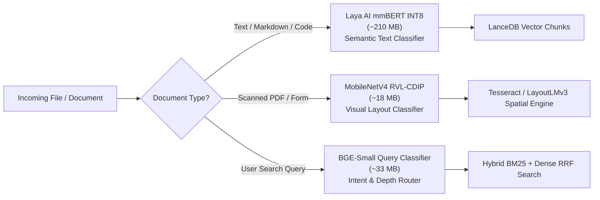

# 🌌 AnyContext System Knowledge & Technical Manual
> **Version:** `v0.36.0`  
> **Core Engine:** 100% Native Rust Architecture (Zero Python/Node.js dependencies)  
> **UI Architecture:** Aurora Boreal Design System & Ratatui Interactive Terminal Interface  
> **Storage Layer:** Apache Arrow Columnar Vector Tables (LanceDB) & SQLite Configuration Vault (`NativeConfigDb`)

---

## Chapter 1: System Identity, Philosophy & Architecture

### 1.1 Purpose and Identity
AnyContext (`actx`) is an enterprise-grade, offline-first contextual intelligence and Retrieval-Augmented Generation (RAG) platform. Designed specifically for high-security, privacy-critical enterprise and developer environments, AnyContext indexes vast repositories of local source code, architectural documentation, scanned legal PDFs, and web developer documentation into a unified, lightning-fast semantic knowledge graph.

### 1.2 Standalone Zero-Runtime Architecture
Unlike traditional RAG systems that rely heavily on bloated Python virtual environments, unpinned PyTorch dependencies, or external microservices, AnyContext is engineered entirely from scratch in **100% Native Rust**.
- **Zero External Dependencies:** The application compiles into a single, self-contained standalone binary with zero dependencies on Python, Node.js, Docker, or external daemon processes.
- **Microsecond Ingestion Latency:** Text parsing, tokenization, semantic chunking, and metadata extraction execute in native machine code, achieving sub-millisecond per-document processing speeds.
- **Memory Safety and Predictable Footprint:** Built on Rust's strict ownership model, AnyContext eliminates garbage collection pauses, data races, and unexpected memory spikes. The entire CLI runtime typically operates within 30–60 MB of system RAM.

### 1.3 Storage Subsystems: The Hybrid Columnar Vault
AnyContext utilizes a decoupled two-tier storage architecture designed for speed, referential integrity, and atomic vector search:
1. **LanceDB & Apache Arrow (`NativeLanceStore`):**
   - Stores dense high-dimensional embedding vectors (1536-dimensional floating-point vectors) alongside chunk text, document summaries, keyword arrays, and content hashes.
   - Leverages Apache Arrow columnar memory layouts and SIMD CPU vector extensions (AVX2, AVX-512, ARM Neon) to compute cosine similarity across tens of thousands of chunks in under 15 milliseconds.
   - Organizes data into partitioned workspaces, ensuring complete tenant isolation between projects while providing universal access to system-level technical manuals stored in the `Global` workspace.
2. **SQLite Embedded Configuration Vault (`NativeConfigDb`):**
   - Manages relational state, workspace metadata, provider API keys, incremental sync stat caches, semantic envelopes, and decoupled source aliases.
   - Operates with write-ahead logging (`PRAGMA journal_mode = WAL`), a 30-second busy timeout (`PRAGMA busy_timeout = 30000`), and synchronous normal mode, guaranteeing ACID compliance and zero database corruption even during ungraceful system restarts.

### 1.4 Offline-First Air-Gapped Security & Privacy Guarantees
- **Strict Local Isolation:** By default, all file crawlers, text chunking engines, vector indexes, and SQLite databases reside strictly on the user's local filesystem (`%LOCALAPPDATA%\AnyContext\` on Windows or `~/.local/share/any-context/` on Unix).
- **Zero Telemetry Guarantee:** AnyContext does not contain tracking pixels, analytics beacons, or remote telemetry pings. No metadata or chunk content is ever transmitted to Levix Digital or external logging servers.
- **Air-Gapped Operation:** When configured with local ONNX models or offline LLM endpoints (such as local Ollama instances), AnyContext functions completely detached from the public internet.

---

## Chapter 2: Grounding Strategies & Behavioral Directives

### 2.1 The Three Grounding Modes
AnyContext provides three distinct grounding strategies to balance precision, creativity, and domain synthesis:

#### 1. STRICT Mode (`/mode strict` - Default)
- **Zero Parametric Memory:** The language model is strictly prohibited from answering factual questions using general pre-trained weights from past knowledge cutoffs.
- **Mandatory Autonomous Retrieval:** On the very first turn of any user query, the model must invoke retrieval tools (`search_db` / `system_status`) before synthesizing an answer.
- **Permission-Gated Web Access:** Even if the workspace has internet access enabled, the assistant cannot query external web sources unless the user explicitly orders web verification.
- **Factual Absence Protocol:** If a requested fact, shipment, date, or document is missing from the workspace, the assistant states what was verified clearly and conversationally without alarming warnings or fabricated details.

#### 2. HYBRID Mode (`/mode hybrid`)
- **Balanced Synthesis:** Blends retrieved workspace data with broad conceptual, mathematical, and programming knowledge from the LLM.
- **Explicit Attribution Tags:** Distinguishes between facts drawn from indexed files (`[Workspace: <filename>]`) and general conceptual principles (`[Knowledge: <concept>]`).
- **Autonomous Web Clarification:** Can query configured web documentation portals to complement missing local details.

#### 3. PROACTIVE Mode (`/mode proactive`)
- **Strategic Exploration:** Acts as an architectural partner and research advisor.
- **Cross-Domain Synthesis:** Connects disparate workspace documents, detects architectural bottlenecks, identifies missing test coverage, and proposes next steps labeled as `[Recommendation]`.

### 2.2 Mandatory Autonomous Retrieval & Tool Invocation
To maintain grounding integrity, the assistant adheres to strict tool execution invariants:
- **First-Turn Execution:** The tool `search_db` must be executed before formulating answers to user prompts, ensuring that answers reflect the ground truth of the workspace.
- **Single Execution Rule:** The assistant invokes `search_db` at most once per turn, analyzing all returned snippets comprehensively rather than thrashing in search loops.
- **Cross-Lingual Domain Query Translation:** When a query is posed in Portuguese, Spanish, or other languages concerning codebases or documentation written in English, the retrieval engine translates search terms into bilingual keyword pairs to maximize vector and BM25 recall.

### 2.3 Universal Temporal Recency Rule
When multiple documents within the same workspace contain conflicting or evolving facts (such as updated API signatures, revised policies, or superseded shipment schedules):
> **Inviolable Principle:** The document with the most recent modification timestamp (`last_modified`) or explicit contextual date always supersedes and invalidates older records.

### 2.4 Strict Attribution and Citation Footers
Every factual response synthesized from workspace data or web portals concludes with a structured attribution block:
```markdown
---
📄 Sources Consulted:
- Tokio Engine Core (crates/tokio/src/runtime.rs)
- Architecture Manual (docs/architecture/pipeline.md)
🌐 Web Portals Consulted:
- Tokio Documentation (https://docs.rs/tokio/latest/tokio/index.html)
```
The assistant never invents placeholder strings (such as `[DocumentName.pdf]`); citations reference solely the real file paths and URLs returned by retrieval.

---

## Chapter 3: Complete Command Reference (Slash Commands)

AnyContext provides a comprehensive command engine (`CommandEngine`) accessible via terminal slash commands:

### 3.1 Workspace Management
- `/switch [workspace_name]`: Switches the active workspace. If called without arguments, opens the interactive workspace switcher menu (`F2`).
- `/switch create <name> [description]`: Creates a new isolated workspace with default strict grounding.
- `/switch delete <name>`: Deletes a user workspace and its associated metadata. System-protected workspaces (`Default` and `Global`) cannot be deleted.
- `/rename <old_name> <new_name>`: Renames a custom workspace, automatically updating SQLite records and migrating LanceDB vector partitions in $< 50\text{ms}$.

### 3.2 Sources & Intelligent Naming
- `/sources`: Displays all local folders and web portals attached to the active workspace, with 1-based indexes and intelligent display names.
- `/sources --all`: Lists all data sources across all workspaces in the system.
- `/sources rename <number_id_or_name> <new_display_name>`:
  - Updates the human-readable display alias of a source in $O(1)$ time in SQLite without modifying LanceDB vector chunks.
  - Supports numeric indexes (e.g. `/sources rename 1 "Tokio Async Engine"`), existing display names, or source IDs.
  - Zero chunks are rewritten in LanceDB, eliminating write amplification.
- `/folder [path]`: Without arguments, lists monitored folders. With a path, adds the folder to the active workspace.
- `/folder --add <path>`: Recursively attaches and monitors a filesystem folder.
- `/folder --remove <path>`: Detaches a folder and purges its indexed chunks.
- `/web [url]`: Without arguments, lists registered web portals. With a URL, registers the documentation website for crawling.
- `/web --add <url>`: Adds a web documentation portal.
- `/web --remove <url>`: Detaches a web documentation source.

### 3.3 Engine, Grounding & Retrieval Tuning
- `/mode [strict|hybrid|proactive]`: Configures the active grounding strategy.
- `/search [auto|fast|deep]`: Configures retrieval candidate depth:
  - `auto`: Dynamically selects between Fast and Deep search based on query complexity.
  - `fast`: Single-turn, sub-50ms dense vector search optimized for quick lookups.
  - `deep`: Multi-turn reflexive hybrid search combining BM25 keyword matching, vector similarity, and Reciprocal Rank Fusion (RRF).
- `/fast [query]`: Shortcut to run an immediate Fast search query.
- `/deep [query]`: Shortcut to run an immediate Deep multi-turn reflexive search.
- `/web-search [on|off]`: Toggles real-time internet search capability for the active workspace.
- `/model [name]`: Selects or inspects the active language model provider (e.g., `gemini-2.5-flash`, `gemini-1.5-pro`, `gpt-4o`, `claude-3-5-sonnet`, `mock`).
- `/models`: Displays the full catalog of supported AI providers, capabilities, and context windows.

### 3.4 Synchronization & Data Health
- `/sync`: Runs incremental background synchronization. Inspects filesystem mtime timestamps and SHA-256 hashes, indexing only modified or newly added files.
- `/sync --force`: Forces a complete re-read, chunking, and re-embedding of all monitored files in the workspace.
- `/sync cancel` (or `/cancel`): Cancels an active background file synchronization job.
- `/inspect`: Audits LanceDB vector tables, displaying record counts, embedding dimensions, and index health.
- `/status`: Displays native operational telemetry, including active models, grounding modes, attached folders, chunk counts, and Document AI engine readiness.
- `/diagnostics`: Generates a deep diagnostic report covering platform details, memory usage, database paths, and runtime health.

### 3.5 Security, Session & Maintenance
- `/keys`: Opens the credential management menu to inspect and configure API keys for Google Gemini, OpenAI, Anthropic, OpenRouter, and Cohere.
- `/keys audit`: Prints an in-terminal credential status audit report with sensitive keys masked.
- `/clear`: Clears the visible chat conversation viewport.
- `/reset-memory`: Clears active session conversation memory in SQLite while preserving indexed vector documents.
- `/history`: Displays recent conversation turn history.
- `/onboarding`: Relaunches the interactive first-time setup wizard.
- `/update`: Checks for new releases, verifies binary signatures, and applies zero-lock atomic updates.
- `/exit`: Terminates the session and gracefully exits AnyContext.

---

## Chapter 4: Keyboard Shortcuts & TUI Navigation

### 4.1 The Aurora Boreal Design System
The AnyContext Terminal User Interface (TUI) is built using `ratatui` with an Aurora Boreal color scheme:
- **Primary Accent (Cyan / `#56B6C2`):** Highlights active workspaces, command inputs, and focus borders.
- **Secondary Accent (Emerald / `#98C379`):** Indicates healthy statuses, completed syncs, and verified citations.
- **Tertiary Accent (Purple / `#C678DD`):** Designates reasoning traces and AI thinking blocks.
- **Smooth Braille Spinner (`⠋⠙⠹⠸⠼⠴⠦⠧⠇⠏`):** Smooth, uninterrupted 10-step Braille rotation during background operations and model downloads.

### 4.2 Keyboard Navigation & Shortcuts
| Keybinding | Function | Operational Context |
| :--- | :--- | :--- |
| `Ctrl + T` | **Toggle Reasoning Accordion** | Expands or collapses the ReAct reasoning and tool execution trace. Collapsed by default. |
| `Ctrl + L` | **Clear Viewport** | Clears the active chat log viewport instantly. |
| `PageUp` / `PageDown` | **Scroll Chat History** | Scrolls up or down through conversation messages. |
| `Shift + PageUp` / `Shift + PageDown` | **Scroll Reasoning Trace** | Scrolls within the inner ReAct reasoning trace when the accordion is expanded. |
| `Up` / `Down` | **Prompt History Navigation** | Cycles through previous input commands and queries in the readline buffer. |
| `F1` | **Interactive Options Menu** | Opens the primary menu covering Workspaces, Models, Sync, Sources, and Keys. |
| `F2` | **Workspace Switcher** | Opens a rapid workspace selection popup. |
| `Esc` | **Dismiss / Cancel** | Closes active menus, cancels active ONNX model downloads, or exits modals. |
| `[Enter]` on Source Item | **Inline Source Rename** | When highlighting a source in the `/sources` menu, pre-populates `/sources rename "<name>" ` for one-keystroke alias editing. |

---

## Chapter 5: Document AI, Local ONNX Models & Vision Engine

### 5.1 Architecture of Embedded Document AI
AnyContext incorporates specialized, local ONNX neural models to understand document structures, parse layouts, and classify content with zero cloud API reliance:



### 5.2 Model Specifications
1. **Laya AI (mmBERT INT8 ONNX - ~210 MB):**
   - Quantized multilingual BERT architecture optimized for CPU SIMD execution.
   - Classifies raw document chunks into semantic categories: source code, API reference, legal policy, configuration, or technical prose.
2. **MobileNetV4 RVL-CDIP INT8 ONNX (~18 MB):**
   - High-speed visual document classifier trained on the RVL-CDIP dataset.
   - Distinguishes between scanned invoices, tax forms, scientific papers, memos, and handwritten notes.
3. **BGE-Small Query Intent Classifier (~33 MB):**
   - Analyzes incoming user queries in $< 2\text{ms}$ to determine whether Fast lexical search or Deep reflexive RAG is required.
4. **Multimodal Vision Engine:**
   - Supports native multimodal inspection via Cloud/VPC models (Gemini 1.5 Pro, GPT-4o) alongside local CLIP ViT ONNX embeddings for embedded charts, diagrams, and figures.

### 5.3 ADR-110 Zero-Breakage Guarantee & Fallback Engine
AnyContext enforces the **ADR-110 Invariant**:
> **Zero-Breakage Guarantee:** The absence, corruption, or incomplete download of local ONNX models must never crash or block AnyContext.
- When model weights are absent or downloading in the background, AnyContext falls back instantly to **Pure Rust Deterministic Heuristics**.
- The fallback heuristic classifies documents and routes queries in under $1\mu\text{s}$ using 0 MB of extra memory, ensuring 100% uninterrupted operation.

---

## Chapter 6: Storage Subsystems, Smart Path Healing & Data Persistence

### 6.1 Database Schema Reference (`NativeConfigDb`)
The SQLite configuration database (`settings.db`) maintains the following core schema:

```sql
-- Workspaces
CREATE TABLE workspaces (
    id TEXT PRIMARY KEY,
    name TEXT UNIQUE NOT NULL,
    description TEXT,
    grounding_mode TEXT NOT NULL DEFAULT 'strict',
    search_mode TEXT NOT NULL DEFAULT 'auto',
    model TEXT NOT NULL DEFAULT 'gpt-4o-mini',
    web_search_enabled INTEGER NOT NULL DEFAULT 0,
    paths_json TEXT DEFAULT '[]',
    created_at TEXT NOT NULL,
    updated_at TEXT NOT NULL
);

-- Decoupled Source Aliases (O(1) Renaming)
CREATE TABLE workspace_sources (
    id TEXT PRIMARY KEY,
    workspace TEXT NOT NULL,
    source_type TEXT NOT NULL,         -- 'folder' | 'web_url'
    raw_target TEXT NOT NULL,          -- Filesystem path or URL
    canonical_slug TEXT NOT NULL,      -- Slug for URL/CLI references
    display_name TEXT NOT NULL,        -- User-editable display name
    created_at TEXT NOT NULL,
    updated_at TEXT NOT NULL,
    UNIQUE(workspace, raw_target)
);

-- File Metadata and Change Detection
CREATE TABLE file_metadata (
    id TEXT PRIMARY KEY,
    workspace TEXT NOT NULL,
    file_path TEXT NOT NULL,
    content_hash TEXT NOT NULL,
    last_modified TEXT NOT NULL,
    size_bytes INTEGER NOT NULL,
    status TEXT NOT NULL,
    updated_at TEXT NOT NULL,
    UNIQUE(workspace, file_path)
);
```

### 6.2 Intelligent Source Naming Heuristics
When a new source is attached via `/folder` or `/web`, AnyContext generates an intelligent initial name:
1. **Web Documentation Portals:**
   - GitHub repositories (`github.com/org/repo`) $\rightarrow$ `"GitHub: repo"`.
   - Docs.rs crates (`docs.rs/tokio/...`) $\rightarrow$ `"Tokio Docs"`.
   - Crates.io packages (`crates.io/crates/rusqlite`) $\rightarrow$ `"Crate: rusqlite"`.
   - General URLs $\rightarrow$ Capitalized hostname and primary path segment.
2. **Local Folders:**
   - Manifest Detection: If the folder contains a `Cargo.toml`, `package.json`, or `pyproject.toml`, the package name is automatically extracted.
   - Leaf Directory: If no manifest exists, the leaf folder name is used (e.g. `C:\repos\my-project` $\rightarrow$ `"my-project"`). Generic folders (`src`, `lib`, `dist`) include their parent directory (e.g. `"financial-engine/src"`).

### 6.3 Smart Path Healing (ADR-117)
When users rename parent folders or migrate repositories to new drive letters:
- AnyContext detects missing files during synchronization.
- Rather than discarding vector embeddings and incurring costly re-indexing, the Smart Path Healing engine calculates phonetic similarity (Double Metaphone) and Levenshtein edit distance against existing paths.
- Confirmed path shifts are updated in SQLite and LanceDB metadata in $< 10\text{ms}$, preserving existing vector embeddings.

---

## Chapter 7: Release Lifecycle, CI/CD Standards & Atomic Binary Updates

### 7.1 Semantic Versioning & Conventional Releases
AnyContext follows strict Semantic Versioning (`MAJOR.MINOR.PATCH`):
- Release pull requests and GitHub Releases adhere to the standardized **Conventional Commits** format:
```markdown
## What's Changed
* feat(sources): intelligent source naming and decoupled SQLite alias by @author in #1080
* fix(pipeline): enforce strict workspace isolation and deprecate shared sources by @author in #1081
* docs(manual): canonical system knowledge and technical manual by @author in #1082
```

### 7.2 Zero-Lock Atomic Binary Updates
On Windows and Unix systems, replacing an executing binary directly is blocked by operating system file locks (`ERROR_ACCESS_DENIED`). AnyContext resolves this using a **Launcher Proxy Shim Architecture**:
1. When the user executes `/update` or `actx --update`, AnyContext checks GitHub Releases for new binary releases.
2. The new binary is downloaded to a staging file (`actx.exe.new`) and verified against cryptographic SHA-256 checksums.
3. The launcher proxy renames the active executable to a temporary file (`actx.exe.old`), moves `actx.exe.new` into place, and spawns the new process.
4. On the subsequent boot, the old executable is cleaned up cleanly without process deadlocks.

---
*End of AnyContext System Knowledge & Technical Manual (v0.36.0).*
