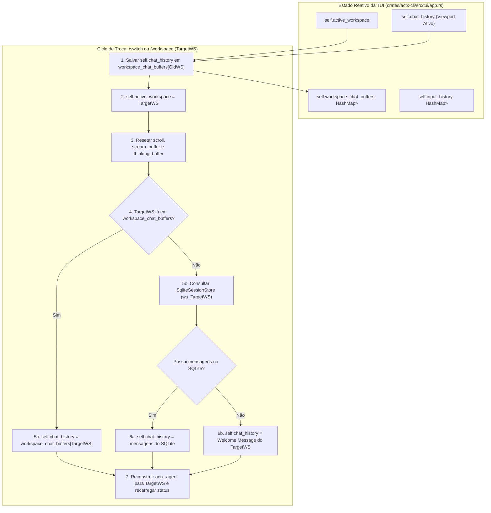

# 📐 Blueprint v0.32.10: Isolamento Hermético de Buffers de Chat e Histórico por Workspace na TUI Nativa (crates/actx-cli)

## 📌 Metadados do Plano
- **Projeto**: AnyContext (`actx`)
- **Versão Alvo**: `v0.32.10`
- **Status**: Ativo (`active`)
- **Data**: 2026-10-04
- **Conversation ID**: `09953e71-964e-4480-b790-66a5d4797cd7`
- **Princípio Arquitetural**: Padrão Virtual Tab Workspace Isolation (ADR-052 & Hexagonal Ports & Adapters)

---

## 🔍 1. Diagnóstico do Problema & Causa Raiz
Na TUI nativa em Rust (`crates/actx-cli/src/tui/app.rs`), o estado da aplicação mantinha:
- `pub input_history: HashMap<String, Vec<String>>` (corretamente isolado por workspace para navegação de histórico de prompts Up/Down).
- **`pub chat_history: Vec<ChatMessageItem>`** (monolítico e compartilhado entre todos os workspaces).

Ao alternar de workspace via `/workspace <target>`, `/switch <target>` ou pelo menu modal (`[F1] -> Workspaces`):
1. O `chat_history` do workspace anterior não era preservado em nenhum mapa.
2. `self.active_workspace` mudava para o novo workspace.
3. `load_session_history_for_workspace()` era executado e chamava `self.chat_history.push(...)` sem esvaziar o histórico anterior.
4. Se o novo workspace não tivesse mensagens prévias (ex: recém-criado), nenhuma mensagem era adicionada, e a tela permanecia mostrando 100% das mensagens do workspace anterior com apenas um aviso no rodapé informando a troca.
5. Ao alternar de volta, as mensagens eram puxadas novamente e duplicadas no final do vetor único.

---

## 🏛️ 2. Arquitetura da Solução (Virtual Tab Workspace Isolation)

---

## 🎯 3. Marcos de Execução (Milestones)

- **M1: Estrutura de Buffers por Workspace no `App`**:
  - Adicionar `pub workspace_chat_buffers: std::collections::HashMap<String, Vec<ChatMessageItem>>` em `App`.
  - Criar função auxiliar `create_welcome_message` para padronizar cabeçalhos de entrada por workspace.
- **M2: Método Atômico `switch_to_workspace` em `App`**:
  - Salvar `chat_history` do workspace de origem em `workspace_chat_buffers`.
  - Restaurar histórico do workspace de destino do cache de sessão ou carregar do `SqliteSessionStore` (`ws_<target>`).
  - Caso o workspace seja novo, renderizar a mensagem de boas-vindas canônica do workspace com seu modelo, grounding e status de busca.
  - Resetar variáveis efêmeras de viewport (`current_stream_buffer`, `current_thinking_buffer`, `scroll_offset`, `auto_scroll`).
- **M3: Integração com `/clear` e `/reset-memory`**:
  - Em `/clear`: Limpar buffer em tela e remover entrada de cache em `workspace_chat_buffers` do workspace ativo.
  - Em `/reset-memory`: Acoplar ação `CommandAction::ClearChat` no `engine.rs` para garantir que o reset de memória no SQLite também limpe a tela do workspace ativo.
- **M4: Suíte de Testes Automatizados no Rust**:
  - Criar testes unitários em `crates/actx-cli/tests/cli_tests.rs` validando que ao alternar entre `WorkspaceA` e `WorkspaceB`:
    - `WorkspaceA` tem suas mensagens retidas.
    - `WorkspaceB` inicia limpo ou com seu próprio histórico.
    - Retornar a `WorkspaceA` restaura exatamente suas mensagens sem vazamento nem duplicação.
- **M5: Atualização Dual-Doc & Cenário de Teste Manual**:
  - Sincronizar `TECDOC.md` (ADR-092) e `README.md`.
  - Adicionar Cenário 11 (ou complementar Cenário 10) em `tests/MANUAL_TESTS.md` detalhando a validação passo a passo do isolamento de telas de chat.
- **M6: Validação de Gate & Preparação da Release `v0.32.10`**:
  - Bump de versão em todos os manifests, compilação de binários e acompanhamento de release.
