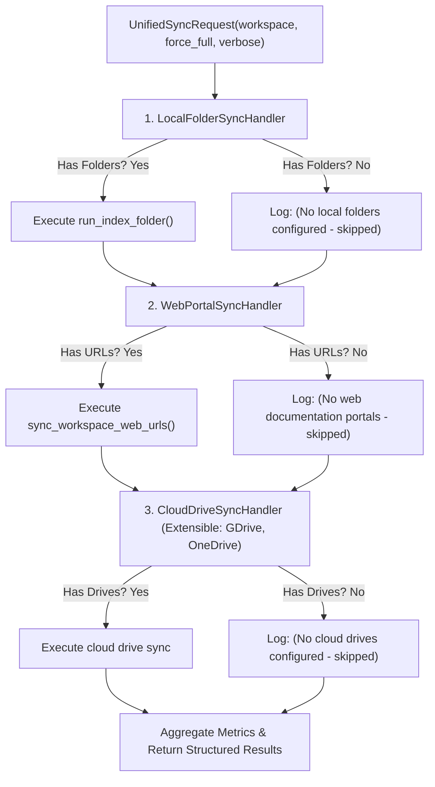

# 🏗️ AnyContext Architecture Blueprint: Sync Worker Background Stdio Isolation & Chain of Responsibility Synchronization Engine (v0.32.11)

> **Document ID**: `anycontext_blueprint_v03211_sync_worker_isolation_and_chain_of_responsibility`  
> **Status**: DRAFT (Awaiting Gate 3 Approval)  
> **Target Version**: `v0.32.11`  
> **Author**: Antigravity (Google DeepMind) & Levi Guilherme  
> **Date**: 2026-10-04  

---

## 1. Executive Summary & Problem Statement

### 1.1 Context & Symptoms
During manual verification of Step 3 in Scenario 10 (`/sync --force` in the interactive Ratatui TUI), two critical issues were uncovered:

1. **Terminal Viewport Corruption from Leaked Background Worker Stdout**:
   - `crates/any-context-core-rs/src/commands/engine.rs` spawned the background sync worker child process (`core_exe` or `python main.py --sync-worker`) using `cmd.spawn()` without redirecting standard I/O streams (`stdout` and `stderr`).
   - The child process inherited the terminal file descriptor of the parent TUI process. As the child began printing ingestion telemetry (`🔄 Executing unified sync worker...`, `• Storage: LanceDB...`, `❌ No valid documents...`), raw ASCII text was written directly into the terminal while Ratatui was rendering its Alternate Screen Buffer.
   - This corrupts the TUI visual canvas, destroys the prompt input box (`>`), breaks the bottom shortcut bar (`[Tab] Complete...`), and leaves terminal visual artifacts.

2. **False-Positive Error on Local Folders (`❌ No valid documents found across configured paths`)**:
   - For workspaces containing exclusively web documentation portals (e.g., `Default` with `https://www.canada.ca/...`) and zero configured local folders (`(none configured. Use /folder --add <path>)`), `run_unified_sync` unconditionally called `run_index_folder`.
   - `local_folder_ingestor.py` observed an empty file list and emitted a harsh failure log (`❌ No valid documents found across configured paths.`), misleading the user into thinking synchronization had failed, even though the web documentation portals were properly queued for synchronization.

---

## 2. Architectural Solution

### 2.1 Pattern 1: Hermetic Background Worker Process Isolation (Rust Core)
In `crates/any-context-core-rs/src/commands/engine.rs`:
1. **Dedicated Log File Redirection**:
   - Determine canonical log directory: `<app_data_dir>/logs` (e.g. `%LOCALAPPDATA%\AnyContext\logs` on Windows).
   - Ensure directory exists: `std::fs::create_dir_all(&log_dir)`.
   - Open append-only log file: `sync_<workspace>.log`.
   - Route `cmd.stdout(Stdio::from(log_file))` and `cmd.stderr(Stdio::from(log_file_clone))` (with fallback to `Stdio::null()`).
2. **OS-Level Detached Process (`CREATE_NO_WINDOW`)**:
   - On Windows: attach `CREATE_NO_WINDOW` (`0x08000000`) flag via `std::os::windows::process::CommandExt`.
   - Ensures the child process never connects to the console device or creates any console window.
3. **Transparent User Feedback**:
   - The TUI feedback message includes the exact path to the worker log file:
     `📝 Sync worker log: C:\Users\...\AppData\Local\AnyContext\logs\sync_Default.log`.

### 2.2 Pattern 2: Chain of Responsibility Multi-Source Synchronization (Python Core)
In `src/any_context/ingestion/unified_sync.py`:
Implement a decoupled, extensible **Chain of Responsibility** (Pipeline) pattern with typed handlers:

1. **`LocalFolderSyncHandler`**:
   - Inspects `ws.paths`. If empty: logs `(No local folders configured - skipped)` with status `skipped` and zero error flags. Never invokes `run_index_folder`.
2. **`WebPortalSyncHandler`**:
   - Inspects `workspace_web_urls`. If empty: logs `(No web documentation portals configured - skipped)` with status `skipped`. If present: invokes `sync_workspace_web_urls`.
3. **`CloudDriveSyncHandler`**:
   - Extensible handler for future cloud storage integrations (OneDrive, Google Drive, Dropbox, Box). If none configured: logs `(No cloud drives configured - skipped)`.
4. **`local_folder_ingestor.py` Sanitization**:
   - If `run_index_folder` is invoked directly, check if `ws.paths` was actually configured before emitting `❌ No valid documents...`.

---

## 3. Implementation Milestones

- [ ] **M1: Process Stdio Isolation in Rust Core** (`crates/any-context-core-rs/src/commands/engine.rs`):
  - Redirect child `stdout` and `stderr` to `logs/sync_<workspace>.log`.
  - Add `CREATE_NO_WINDOW` on Windows.
  - Expose log file path in command return text.
- [ ] **M2: Chain of Responsibility Engine in Python Core** (`src/any_context/ingestion/unified_sync.py`):
  - Implement `SyncContext`, `BaseSyncHandler`, `LocalFolderSyncHandler`, `WebPortalSyncHandler`, `CloudDriveSyncHandler`.
  - Wire chain in `run_unified_sync`.
- [ ] **M3: Suppress False-Positive Local Folder Warning** (`src/any_context/ingestion/local_folder_ingestor.py`):
  - Distinguish between "no paths configured" vs "paths configured but 0 valid files found".
- [ ] **M4: Automated Tests Suite**:
  - Rust tests for `execute_sync` stdio configuration and log path formatting.
  - Python tests for `LocalFolderSyncHandler` skipping empty folders without errors.
- [ ] **M5: Dual-Doc Updates & Manual Test Suite**:
  - `TECDOC.md`: ADR-093 (Sync Worker Process Isolation & Chain of Responsibility Multi-Source Ingestion).
  - `README.md`: Document sync worker logging and silent background execution.
  - `tests/MANUAL_TESTS.md`: Add Scenario 12 for testing clean `/sync --force` in TUI and log inspection.
- [ ] **M6: Version Bump & Release v0.32.11**:
  - Bump to `0.32.11` across all crates and packages.
  - Release build on GitHub Actions.
