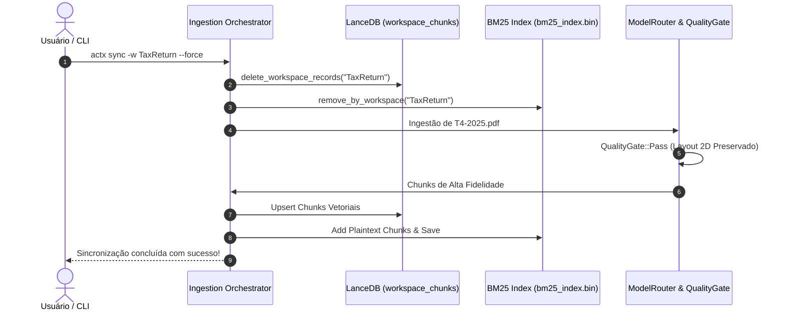

# AnyContext Technical Blueprint v0.34.5
## Recuperação de Integridade Semântica do RAG: Preservação de Layout 2D, Eliminação de Corrupção de Chunks e Descriptografia Transparente no BM25

**Versão Alvo:** `v0.34.5`  
**Data:** 10 de Outubro de 2026  
**Status:** `PLANEJADO (Aguardando Aprovação Gate 3)`  
**Autor:** Antigravity (Google DeepMind Team) & Levi Guilherme  
**Protocolo:** `dev-cycle-protocol` (Marco 3 - Estabilização de Qualidade RAG)  

---

## 1. Arquitetura e Componentes Impactados (Hexagonal / Ports & Adapters)

O bug identificado destrói o propósito central do AnyContext (RAG local com alta acurácia). A correção atua na fronteira de domínio e adaptadores da arquitetura hexagonal:

```
┌────────────────────────────────────────────────────────────────────────┐
│                          HEXAGONAL ARCHITECTURE                        │
│                                                                        │
│   [CLI / TUI Layer] (Driving Port)                                     │
│         │                                                              │
│         ▼                                                              │
│   [Ingestion Orchestrator] (Application Core)                          │
│         │                                                              │
│         ├──► [QualityGate] (Domain Service - Pure Logic)               │
│         │          - Determina se chunk é Pass, Reject ou NeedsDocAI   │
│         │                                                              │
│         ├──► [ModelRouter] (Domain Routing Engine)                     │
│         │          - Roteia entre Vision SLM, Extractor ou Layout Nativo│
│         │                                                              │
│         ├──► [SpatialFormChunker] (Domain Utility)                     │
│         │          - Parsing conservador e não destrutivo de campos    │
│         │                                                              │
│         ▼                                                              │
│   [Native LanceStore & BM25 Index] (Driven Adapters)                   │
│         │                                                              │
│         ▼                                                              │
│   [NativeHybridPipeline] (Retrieval Application Service)               │
│         - RRF 60, BM25 Lexical, Dense Vector, Decryption On-The-Fly     │
└────────────────────────────────────────────────────────────────────────┘
```

### Componentes Impactados:
1. **`ingestion::quality_gate`**:
   - Elimina o falso-positivo em `is_dense_complex_form` que marcava tabelas Markdown 2D legítimas como lixo estrutural.
   - Tabelas reconstruídas com sucesso pelo parser de PDF nativo passam como `QualityDecision::Pass` com score máximo.
2. **`ingestion::chunkers::spatial_form`**:
   - Remove o emparelhamento cego `cells[0] -> cells[1]` que transformava valores numéricos ou nomes de transportadoras em chaves artificiais.
   - Pareamento chave-valor passa a exigir delimitadores explícitos (`:`, `-`) ou cabeçalhos inequívocos de formulário (`Field/Value`, `Key/Value`).
3. **`ingestion::model_router`**:
   - Estabelece a regra de **Preservação Sagrada**: na ausência de modelo de Visão, o texto original reconstruído em Markdown **nunca** é descartado nem substituído por fragmentos incompletos.
4. **`ingestion::orchestrator`**:
   - Garante que a limpeza de workspace (`--force`) purgue com precisão registros antigos no LanceDB e remova termos corrompidos no BM25.
5. **`retrieval::pipeline`**:
   - Implementa descriptografia defensiva transparente (`decrypt_text`) para qualquer documento recuperado do BM25 ou LanceDB que apresente o prefixo `enc::`.

---

## 2. Diagramas de Sequência e Fluxo (Mermaid)

### 2.1. Fluxo de Decisão de Qualidade e Ingestão (Antes vs. Depois)

```mermaid
flowchart TD
    subgraph ANTES ["❌ Pipeline Anterior (Destrutivo)"]
        A1["PDF com Tabelas / Layout 2D"] --> B1["pdf.rs gera Markdown 2D (| Col 1 | Col 2 |)"]
        B1 --> C1{"QualityGate: pipe_ratio >= 0.55?"}
        C1 -- Sim --> D1["NeedsDocumentAi: DenseComplexForm"]
        D1 --> E1{"Vision ativo?"}
        E1 -- Não --> F1["SpatialFormChunker::chunk_dense_text"]
        F1 --> G1["Heurística: cell[0] < 50 chars vira CHAVE!"]
        G1 --> H1["DESCARTA Markdown original e salva pares invertidos: '58792.60: 7976.60'"]
        H1 --> I1["LLM recebe lixo e não acha respostas"]
    end

    subgraph DEPOIS ["✅ Novo Pipeline (Fidelidade Semântica Sagrada)"]
        A2["PDF com Tabelas / Layout 2D"] --> B2["pdf.rs gera Markdown 2D (| Col 1 | Col 2 |)"]
        B2 --> C2{"QualityGate: É pdf_scan sem texto?"}
        C2 -- Não (Tem texto 2D) --> D2["QualityDecision::Pass (Score 0.95)"]
        D2 --> E2["Preserva Tabela Markdown Intacta com Todas as Relações"]
        E2 --> F2["Indexação no LanceDB e BM25 em Plaintext Limpo"]
        F2 --> G2["LLM lê tabela perfeitamente: 'Box 14: 58792.60'"]
    end
```



### 2.2. Fluxo de Re-Sync e Auto-Cura



---

## 3. Estruturas de Dados e Assinaturas de Tipos

### 3.1. Ajuste em `QualityGate` (`crates/any-context-core-rs/src/ingestion/quality_gate.rs`)

```rust
impl QualityGate {
    /// Avalia se o texto representa um formulário denso não-estruturado que necessita de Vision AI.
    /// Tabelas Markdown bem-formadas NÃO são consideradas formulários densos problemáticos,
    /// pois já possuem representação relacional 2D válida.
    pub fn is_dense_complex_form(&self, text: &str) -> bool {
        // Se já possui blocos de tabela estruturados com cabeçalhos válidos, é alta qualidade!
        let lines: Vec<&str> = text.lines().map(|l| l.trim()).filter(|l| !l.is_empty()).collect();
        if lines.is_empty() {
            return false;
        }

        let pipe_lines = lines.iter().filter(|l| l.contains('|')).count();
        let pipe_line_ratio = (pipe_lines as f32) / (lines.len() as f32);

        // Dispara apenas se houver fragmentação caótica de pipes (muitas células vazias ou ruído de OCR)
        // e NÃO for uma tabela Markdown válida com delimitador
        let has_markdown_table_delimiter = lines.iter().any(|l| l.contains("| ---") || l.contains("|:---"));
        
        if has_markdown_table_delimiter && pipe_line_ratio >= 0.30 {
            // Tabela Markdown válida! Não necessita de OCR/Vision se já tem texto legível.
            return false;
        }

        // Formulário denso caótico: alta densidade de pipes sem delimitador estruturado
        pipe_line_ratio >= self.config.max_table_pipe_ratio
    }
}
```

### 3.2. Regra Conservadora em `SpatialFormChunker` (`crates/any-context-core-rs/src/ingestion/chunkers/spatial_form.rs`)

```rust
impl SpatialFormChunker {
    pub fn extract_fields_from_dense_text(&self, text: &str) -> Vec<FormField> {
        let mut fields = Vec::new();
        let mut table_headers: Option<Vec<String>> = None;

        for raw_line in text.lines() {
            let line = raw_line.trim();
            if line.is_empty() || line.starts_with("// Context:") {
                continue;
            }

            if line.starts_with('|') && line.ends_with('|') {
                if line.contains("---") {
                    continue;
                }
                let cells: Vec<&str> = line
                    .trim_matches('|')
                    .split('|')
                    .map(|c| c.trim())
                    .filter(|c| !c.is_empty())
                    .collect();

                if cells.is_empty() {
                    continue;
                }

                // Header detection
                if table_headers.is_none() {
                    table_headers = Some(cells.iter().map(|c| c.to_string()).collect());
                    continue;
                }

                // SÓ pareia como chave-valor se o cabeçalho for explicitamente Key-Value
                if let Some(ref headers) = table_headers {
                    if headers.len() == 2 && cells.len() == 2 {
                        let h0 = headers[0].to_lowercase();
                        let h1 = headers[1].to_lowercase();
                        let is_kv_header = matches!(h0.as_str(), "property" | "key" | "field" | "attribute" | "campo" | "chave" | "propriedade")
                            && matches!(h1.as_str(), "value" | "val" | "description" | "detail" | "info" | "data" | "valor" | "descrição");

                        if is_kv_header {
                            fields.push(FormField {
                                label: cells[0].trim_end_matches([':', '-']).to_string(),
                                value: cells[1].to_string(),
                                section: None,
                            });
                        }
                    }
                }
            } else {
                table_headers = None;
                // Linha padrão: exige que a chave termine com dois-pontos ou hífen inequívoco
                if let Some(pos) = line.find(':') {
                    let label = line[..pos].trim();
                    let value = line[pos + 1..].trim();
                    if !label.is_empty() && !value.is_empty() && label.len() < 50 && !value.contains(':') {
                        fields.push(FormField {
                            label: label.to_string(),
                            value: value.to_string(),
                            section: None,
                        });
                    }
                }
            }
        }
        fields
    }
}
```

### 3.3. Preservação Sagrada em `ModelRouter` (`crates/any-context-core-rs/src/ingestion/model_router.rs`)

```rust
// No fallback de process_document_ai_candidates:
// NUNCA descartar o chunk original!
if !chunk.text.trim().is_empty() {
    processed.push(chunk);
}
```

### 3.4. Descriptografia Transparente no BM25 Retrieval (`crates/any-context-core-rs/src/retrieval/pipeline.rs`)

```rust
// Ao extrair o texto de doc no BM25:
let sec = crate::security::SecurityEngine::default();
let clear_text = if text.starts_with("enc::") {
    sec.decrypt_text(&text)
} else {
    text
};
```

---

## 4. Mudanças em Documentação (Dual-Doc & Manual Tests)

1. **`TECDOC.md`**:
   - **Seção 106**: "Arquitetura de Ingestão de Alta Fidelidade Semântica e Preservação de Layout 2D".
   - **ADR-113**: "Eliminação de Inversão Heurística em Chunker Tabular e Preservação Incondicional de Formatos Markdown 2D".
2. **`README.md`**:
   - Atualizar a seção sobre capacidade de processamento de formulários fiscais (T4, W-2, IRPF) e logísticos (CMR, Invoices), detalhando que a geometria 2D é preservada com exatidão semântica.
3. **`MANUAL_TESTS.md`**:
   - Adicionar o **Cenário 28: Validação Cumulativa de Fidelidade Semântica de Chunks e RAG em Documentos Fiscais e Logísticos Complexos (T4 e CMR)**.
   - Preservar integralmente todos os Cenários de 1 a 27 sem truncamento.

---

## 5. Suite de Testes (Unitários, Integração e E2E)

### 5.1. Testes Unitários
* **`tests/quality_gate_tests.rs`**:
  - `test_quality_gate_passes_markdown_tables`: Verifica que páginas com tabelas Markdown com 2 ou mais colunas recebem `QualityDecision::Pass` e não `NeedsDocumentAi`.
  - `test_quality_gate_detects_pure_scans`: Garante que apenas `pdf_scan` genuíno ou ruído binário seja roteado para Document AI ou rejeitado.
* **`tests/spatial_form_tests.rs`**:
  - `test_spatial_chunker_does_not_invert_arbitrary_columns`: Verifica que tabelas numéricas como `| 58792.60 | 7976.60 |` não viram pares chave-valor.
  - `test_spatial_chunker_extracts_explicit_kv`: Verifica que `| Chave | Valor |` explícito continua funcionando.
* **`tests/hybrid_retrieval_tests.rs`**:
  - `test_retrieval_decrypts_legacy_chunks_transparently`: Garante que chunks com prefixo `enc::` retornem texto legível na consulta.

### 5.2. Testes de Integração
* Ingestão de buffer sintético de PDF simulando formulário T4 com colunas de salário e imposto.
* Verificação no LanceDB e BM25 de que os chunks armazenados contêm a tabela Markdown íntegra.

### 5.3. Teste E2E no Workspace Real
* Executar `actx sync -w TaxReturn --force`.
* Executar `actx -w TaxReturn -q "qual o valor de employment income no T4?"`.
* Verificar que o LLM responde com o valor exato `$58,792.60` (Box 14).

---

## 6. Riscos, Mitigações e Rollback

| Risco | Impacto | Mitigação |
|---|---|---|
| Testes legados de `spatial_form_tests` quebrarem por esperar emparelhamento arbitrário | Médio | Atualizar os testes para esperar preservação de tabelas e emparelhamento estrito |
| Chunks corrompidos persistirem no banco do usuário | Alto | Instruir e validar a execução do `actx sync --force` nos workspaces afetados |
| Performance de descriptografia no BM25 | Baixo | `decrypt_text` utiliza AES-GCM acelerado por hardware e só é acionado se a string começar com `enc::` |

**Plano de Rollback:**
Caso surja regressão, restauração do commit anterior na branch `dev` via `git revert`. O banco de dados LanceDB e SQLite não sofrem alteração de schema, garantindo retrocompatibilidade total.

---

## 7. Plano de Execução Passo a Passo

- [ ] **Passo 1:** Atualizar versão para `0.34.5` em `crates/actx-cli/Cargo.toml` e dependências internas.
- [ ] **Passo 2:** Ajustar `crates/any-context-core-rs/src/ingestion/quality_gate.rs` para passar tabelas Markdown 2D com `QualityDecision::Pass`.
- [ ] **Passo 3:** Ajustar `crates/any-context-core-rs/src/ingestion/chunkers/spatial_form.rs` tornando o pareamento de campos conservador.
- [ ] **Passo 4:** Ajustar `crates/any-context-core-rs/src/ingestion/model_router.rs` para preservar incondicionalmente os chunks de texto originais.
- [ ] **Passo 5:** Ajustar `crates/any-context-core-rs/src/retrieval/pipeline.rs` para descriptografia transparente no BM25.
- [ ] **Passo 6:** Atualizar testes unitários (`quality_gate_tests.rs`, `spatial_form_tests.rs`) e compilar via `cargo check --workspace` e `cargo test --workspace`.
- [ ] **Passo 7:** Atualizar documentação Dual-Doc (`TECDOC.md`, `README.md`, `MANUAL_TESTS.md` com Cenário 28).
- [ ] **Passo 8:** Realizar teste E2E real com `actx sync -w TaxReturn --force` e consulta de auditoria do T4.

---

## 8. Critérios de Aceite e Verificação Automática

1. `cargo check --workspace` compila com **zero erros**.
2. Todos os testes unitários e de integração (`cargo test --workspace`) passam com **100% de sucesso**.
3. O teste E2E do T4 responde com precisão factual sobre o valor do rendimento de emprego.
4. Os arquivos `TECDOC.md` (Seção 106 + ADR-113), `README.md` e `MANUAL_TESTS.md` (Cenário 28) estão plenamente documentados e sincronizados.
