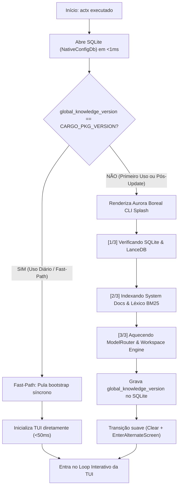
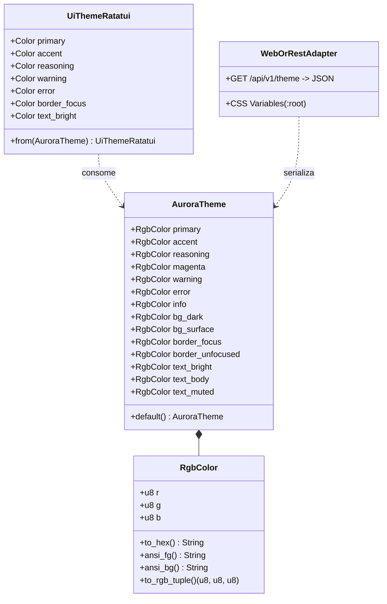

# Blueprint Técnico - AnyContext v0.34.6: Aurora Boreal Design System & Fast Startup (Opção C)

**Versão Alvo**: `v0.34.6`  
**Data**: 2026-10-10  
**Autor**: Levix Digital / Antigravity AI  
**Status**: Proposto (Aguardando Gate 3)  
**ID do Plano**: `anycontext_blueprint_v0346_aurora_theme_and_fast_startup`  

---

## 1. Arquitetura e Componentes Impactados

### 1.1 Visão Geral Arquitetural
A versão **v0.34.6** foca em dois pilares centrais de excelência de produto:
1. **Identidade Visual Unificada (Aurora Boreal Design System)**:
   - Extração e centralização dos Design Tokens institucionais da Levix Digital (Esmeralda Boreal, Ciano Glacial, Violeta Cósmico, Rosa Polar, Âmbar Solar e Noite Polar) no crate `any-context-core-rs`.
   - Arquitetura desacoplada e modular baseada no padrão *Hexagonal / Ports & Adapters*: o Core define tokens puros em RGB e Hex com suporte a serialização JSON (para Web, RPC, REST e Desktop), enquanto o `actx-cli` implementa os adaptadores nativos para o `ratatui` (TUI) e ANSI TrueColor de 24-bits (CLI Headless).
   - Qualquer alteração futura na paleta no Core repercute automaticamente em todas as interfaces.
2. **Otimização de Inicialização e Splash Telemetry (Opção C - Híbrido Inteligente)**:
   - Eliminação de gargalos bloqueantes de inicialização no caminho crítico (`ensure_global_knowledge_bootstrap`).
   - Verificação em < 1ms no SQLite: se a versão já está provisionada (`stored_version == current_version`), executa o *Fast-Path* abrindo a TUI em < 50ms sem chamadas desnecessárias a disco.
   - Na primeira execução ou após um upgrade de versão (`stored_version != current_version`), exibe um Splash Loader elegante com as cores Aurora Boreal na linha de comando, provendo telemetria passo a passo de inicialização do LanceDB e índice BM25 antes de abrir a TUI.

### 1.2 Componentes e Módulos Modificados
- `crates/any-context-core-rs/src/theme/mod.rs` (NOVO):
  - Definição dos tokens semânticos: `RgbColor`, `AuroraTheme`.
  - Helpers de conversão: `to_hex()`, `ansi_fg()`, `ansi_bg()`, `to_rgb_tuple()`.
- `crates/any-context-core-rs/src/lib.rs`:
  - Exportação pública de `pub mod theme;` e `pub use theme::{AuroraTheme, RgbColor};`.
- `crates/actx-cli/src/theme.rs` (NOVO):
  - Adaptador `UiTheme` para `ratatui::style::Color`.
  - Paleta com mapeamento para `Color::Rgb(r, g, b)`.
- `crates/actx-cli/src/tui/ui.rs`:
  - Refatoração dos widgets (Header, Chat, Accordion de Raciocínio ReAct, Prompt Multilinhas, Paleta de Comandos, Footer e Menu Interativo) para consumir a paleta institucional Aurora Boreal.
- `crates/actx-cli/src/cli/oneshot.rs`:
  - Atualização dos logs do CLI (pensamentos, tool calls, status de sincronização, badge do ModelRouter) para utilizar sequências ANSI TrueColor da paleta Aurora Boreal.
- `crates/actx-cli/src/engine.rs`:
  - Desacoplamento da chamada bloqueante de bootstrap síncrono dentro de `build_agent_sync`.
  - Nova função `needs_global_bootstrap() -> bool` e `run_bootstrap_with_telemetry<F>(callback: F)`.
- `crates/actx-cli/src/tui/mod.rs` & `crates/actx-cli/src/main.rs`:
  - Implementação da Opção C: verificação rápida pré-TUI, renderização do Splash Loader quando necessário e abertura imediata quando em regime estável.
- `Cargo.toml` (workspace e crates): Bump de versão para `0.34.6`.

---

## 2. Diagramas Mermaid

### 2.1 Fluxo de Inicialização - Opção C (Híbrido Inteligente)



### 2.2 Hierarquia de Design Tokens & Desacoplamento de UIs



---

## 3. Estruturas de Dados e Assinaturas

### 3.1 Módulo `any_context_core_rs::theme`
```rust
#[derive(Debug, Clone, Copy, PartialEq, Eq, serde::Serialize, serde::Deserialize)]
pub struct RgbColor {
    pub r: u8,
    pub g: u8,
    pub b: u8,
}

impl RgbColor {
    pub const fn new(r: u8, g: u8, b: u8) -> Self;
    pub fn to_hex(&self) -> String;
    pub fn ansi_fg(&self) -> String;
    pub fn ansi_bg(&self) -> String;
    pub const fn to_rgb_tuple(&self) -> (u8, u8, u8);
}

#[derive(Debug, Clone, serde::Serialize, serde::Deserialize)]
pub struct AuroraTheme {
    pub primary: RgbColor,          // Esmeralda Boreal (#00E5A3)
    pub accent: RgbColor,           // Ciano Glacial (#00F0FF)
    pub reasoning: RgbColor,        // Violeta Cósmico (#A855F7)
    pub magenta: RgbColor,          // Rosa Polar (#EC4899)
    pub warning: RgbColor,          // Âmbar Solar (#F59E0B)
    pub error: RgbColor,            // Carmesim Polar (#EF4444)
    pub info: RgbColor,             // Azul Ártico (#38BDF8)
    pub bg_dark: RgbColor,          // Noite Polar (#0B0F19)
    pub bg_surface: RgbColor,       // Superfície Meia-Noite (#161F30)
    pub border_focus: RgbColor,     // Borda Foco (#00F0FF)
    pub border_unfocused: RgbColor, // Borda Neutra (#334155)
    pub text_bright: RgbColor,      // Gelo Polar Branco (#F1F5F9)
    pub text_body: RgbColor,        // Prata Glacial (#CBD5E1)
    pub text_muted: RgbColor,       // Ardósia Mudo (#64748B)
}
```

### 3.2 Módulo `actx_cli::theme`
```rust
pub struct UiTheme {
    pub primary: ratatui::style::Color,
    pub accent: ratatui::style::Color,
    pub reasoning: ratatui::style::Color,
    pub magenta: ratatui::style::Color,
    pub warning: ratatui::style::Color,
    pub error: ratatui::style::Color,
    pub info: ratatui::style::Color,
    pub bg_dark: ratatui::style::Color,
    pub bg_surface: ratatui::style::Color,
    pub border_focus: ratatui::style::Color,
    pub border_unfocused: ratatui::style::Color,
    pub text_bright: ratatui::style::Color,
    pub text_body: ratatui::style::Color,
    pub text_muted: ratatui::style::Color,
}

impl UiTheme {
    pub fn global() -> &'static UiTheme;
}
```

### 3.3 Telemetria de Inicialização no `actx-cli/src/engine.rs`
```rust
pub fn check_upgrade_needed() -> bool;
pub fn execute_bootstrap_with_progress<F>(on_step: F) -> Result<(), String>
where
    F: FnMut(usize, usize, &str);
```

---

## 4. Mudanças em Documentação (Dual-Doc Standard)

1. **`TECDOC.md`**:
   - Inclusão da **Seção 107**: *Aurora Boreal Design System & Zero-Delay Modular Theme Architecture*.
   - Inclusão do **ADR-114**: *Modular Theme Tokens Extraction & Fast-Path Telemetry Startup (Option C)*.
2. **`README.md`**:
   - Atualização da seção de Interface Visual e Identidade da Levix Digital.
   - Destaque para a inicialização ultra-rápida (< 50ms) e telemetria de primeiro uso.
3. **`tests/MANUAL_TESTS.md`**:
   - Inclusão do **Cenário 29**: Validação da fidelidade cromática Aurora Boreal (TUI e CLI) e tempo de startup do Fast-Path (< 50ms em regime e exibição correta do Splash no primeiro boot).
   - Preservação estrita e integral de todos os 28 cenários pré-existentes.

---

## 5. Suíte de Testes

1. **Testes Unitários em `any-context-core-rs::theme`**:
   - `test_rgb_hex_conversion`: Conversão exata de RGB para Hex uppercase (`#00E5A3`, `#00F0FF`, etc.).
   - `test_theme_json_serialization`: Validação de que `AuroraTheme` serializa e desserializa perfeitamente via `serde_json` sem perdas para consumo por Web/WASM.
   - `test_ansi_escape_generation`: Geração correta de códigos `\x1b[38;2;R;G;Bm`.
2. **Testes Unitários em `actx-cli::theme`**:
   - `test_ui_theme_ratatui_mapping`: Verificação de mapeamento de todos os tokens para `ratatui::style::Color::Rgb`.
3. **Testes de Inicialização e Upgrade Check**:
   - `test_upgrade_detection_logic`: Simulação de versão SQLite antiga vs versão do pacote e disparo correto de flag.
4. **Testes Manuais de Regressão e Produção**:
   - Inicialização em modo normal: benchmark de abertura em tempo recorde (< 50ms).
   - Forçar upgrade simulado alterando versão no SQLite: verificação da renderização do Splash Loader com spinner e transição suave.
   - Execução de queries headless (`actx -w TaxReturn -q "..."`): confirmação de badges Aurora Boreal e legibilidade perfeita.

---

## 6. Riscos, Mitigações e Rollback

| Risco | Impacto | Mitigação |
|---|---|---|
| Terminais legados sem suporte a TrueColor (24-bit) apresentarem cores distorcidas | Baixo | Ratatui e Crossterm possuem fallback automático para 256 cores / ANSI 16 cores. Os tokens hexadecimais possuem luminância balanceada compatível com paletas 256. |
| Perda de contraste entre texto e fundo em terminais com tema claro | Médio | O contraste dos textos (`text_bright` = `#F1F5F9`, `text_body` = `#CBD5E1`) foi especificamente calibrado com alto índice WCAG AAA sobre fundos escuros (`#0B0F19` / `#161F30`). |
| Travamento no carregamento do splash em caso de falha de I/O no LanceDB | Médio | O bootstrap possui timeouts defensivos e captura erros com fallback gracioso sem abortar a aplicação. |
| **Plano de Rollback** | N/A | Caso haja regressão, `git revert` para a tag `v0.34.5` restaura o comportamento anterior imediatamente. |

---

## 7. Plano de Execução Passo a Passo

1. **Marco 1: Criação do Módulo de Tema no Core (`any-context-core-rs`)**:
   - Implementar `theme/mod.rs` com `RgbColor`, `AuroraTheme` e testes unitários.
   - Exportar no `lib.rs`.
2. **Marco 2: Criação do Adaptador de Tema no `actx-cli`**:
   - Implementar `actx-cli/src/theme.rs` com `UiTheme`.
   - Refatorar `tui/ui.rs` (Header, Chat, Accordion, Prompt, Palette, Footer, Menu).
   - Refatorar `cli/oneshot.rs` para badges e mensagens ANSI Aurora.
3. **Marco 3: Implementação do Fast Startup & Splash Loader (Opção C)**:
   - Desacoplar chamada síncrona redundante em `engine.rs`.
   - Implementar verificação rápida no SQLite em `main.rs` / `tui/mod.rs`.
   - Implementar o componente `StartupLoader` na linha de comando com progresso e spinner.
4. **Marco 4: Validação, Testes e Verificação Visual**:
   - Executar `cargo check --workspace` e `cargo test --workspace`.
   - Testar inicialização rápida e simulação de splash.
   - Validar testes manuais e compilação do executável de release.
5. **Marco 5: Dual-Doc, Version Bump & Release**:
   - Atualizar `Cargo.toml` para `0.34.6`.
   - Atualizar `TECDOC.md`, `README.md` e `tests/MANUAL_TESTS.md`.
   - Criar commit `feat(theme): v0.34.6 - aurora boreal design system & fast-path startup loader`, tag `v0.34.6` e push para `origin/dev`.

---

## 8. Critérios de Aceite

1. **100% dos testes verdes**: Suíte completa do workspace sem erros (`cargo test --workspace`).
2. **Modularidade e Reusabilidade**: A paleta de cores reside exclusivamente no Core e pode ser serializada para JSON por qualquer outra interface.
3. **Consistência Visual Aurora Boreal**: Header, Chat, Reasoning Accordion, Menus e Headless CLI exibem consistentemente as cores da Levix Digital com legibilidade de alto contraste.
4. **Startup < 50ms**: Inicializações normais do dia-a-dia abrem a TUI instantaneamente.
5. **Splash Loader Telemetry**: Atualizações ou primeiro boot exibem telemetria com progresso na linha de comando antes de abrir a TUI.
6. **Dual-Doc e Cenário 29**: Documentação atualizada e Cenário 29 adicionado sem truncar testes anteriores.
