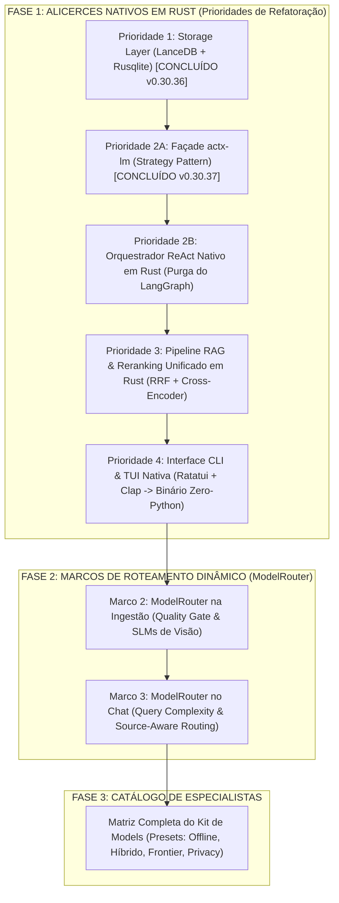

# 🗺️ Roadmap Integrado de Engenharia (Python -> Rust -> ModelRouter -> Kit de Models)

## 📌 Metadados do Plano
- **Projeto**: AnyContext (`actx`)
- **Versão Base**: `v0.30.37`
- **Data de Aprovação**: 2026-09-25
- **Status**: Ativo (`active`)
- **Conversation ID**: `9f488dbf-db54-4ecb-8ed2-b7a6ac1b2372`

---

## 🏛️ Visão Geral e Diagrama de Dependências

---

## 🧱 FASE 1: Prioridades de Refatoração Python -> Rust (Alicerces de Engenharia)

> **Regra**: O motor precisa estar 100% nativo em Rust para que o roteamento de modelos opere com latência sub-milissegundo, zero concorrência pelo GIL e sem dependências pesadas de bibliotecas de orquestração.

### 1.1. Prioridade 1: Camada de Armazenamento e Banco Vetorial em Rust
* **Status**: 🟢 **CONCLUÍDO (`v0.30.36`)**
* **Entregas**:
  - `NativeLanceStore` (LanceDB + Apache Arrow em runtime Tokio isolado).
  - `NativeConfigDb` (SQLite via Rusqlite com WAL obrigatório, sem locks em Windows).
  - Bindings PyO3 (`PyLanceStore`, `PyConfigDb`).

### 1.2. Prioridade 2A: Motor de Provedores e Modelos em Rust (`actx-lm`)
* **Status**: 🟢 **CONCLUÍDO (`v0.30.37`)**
* **Entregas**:
  - Crate modular `crates/actx-lm` com os padrões Strategy (`LmProvider`) e Façade (`LmClient`).
  - Suporte nativo a SLMs locais (Ollama, LM Studio) e cloud (OpenAI, Anthropic com Thinking, Gemini, Groq, DeepSeek).
  - Parser SSE nativo e streaming token-a-token sem alocações supérfluas.

### 1.3. Prioridade 2B: Orquestrador ReAct e Loop do Agente em Rust (Próxima Implementação)
* **Status**: 🔴 **A FAZER**
* **O que fazer**:
  1. **Purga do LangGraph/LangChain**: Substituir o grafo ReAct em Python por uma máquina de estados finitos (FSM) nativa em Rust.
  2. **Ciclo de Raciocínio ReAct Nativo**: `Thought` -> `Action (Tool Call)` -> `Observation (Tool Result)` -> `Final Answer`.
  3. **Invocação Direta de Ferramentas**: Conectar o orquestrador diretamente às tools (`search_db`, `/sync`, inspeção de arquivos) sem cruzar a ponte Python.
  4. **Proteção Anti-Recursão**: Controle de teto de turnos estrito e determinístico (eliminando permanentemente o erro `Recursion limit of 50 reached`).

### 1.4. Prioridade 3: Pipeline RAG e Reranking Nativo em Rust
* **Status**: 🔴 **A FAZER**
* **O que fazer**:
  1. **Fusão em Memória Zero-Copy**: Executar a busca densa vetorial (`NativeLanceStore`) e a busca esparsa léxica (`bm25.rs`) dentro do mesmo processo Rust.
  2. **Reranker RRF & Cross-Encoder em Rust**: Otimização SIMD para Reciprocal Rank Fusion sem marshalling de dados para o Python.
  3. **Context Density Budgeting Integrado**: Truncamento inteligente e source-fair round-robin operando direto na memória antes de passar os tokens para o `actx-lm`.

### 1.5. Prioridade 4: Interface CLI & TUI 100% Nativa (Binário Único)
* **Status**: 🔴 **A FAZER**
* **O que fazer**:
  1. **Terminal CLI Nativo**: Interface construída com `clap` (parsing de flags) e `ratatui` + `crossterm` (TUI interativa rápida).
  2. **Eliminação do Runtime Python da Distribuição**: O AnyContext passa a ser distribuído como um único arquivo executável estático (`actx.exe` / `actx`), com consumo de memória RAM inferior a 40MB e inicialização em `< 10ms`.

---

## 🎯 FASE 2: Os Marcos de Roteamento Dinâmico (`ModelRouter`)

> Com o Core e o `actx-lm` rodando nativamente em Rust, implementamos a inteligência de roteamento na Ingestão e na Inferência.

### 2.1. Marco 2: `ModelRouter` na Ingestão (SLMs Especialistas & Quality Gate)
* **Status**: 🟡 **A FAZER (Alicerces prontos)**
* **O que fazer**:
  1. **Módulo `IngestionModelRouter` (`crates/any-context-core-rs/src/ingestion/router.rs`)**:
     - Avalia a confiança da extração 2D de `pdf.rs`.
  2. **Quality Gate de Estrutura**:
     - *Nível 1 (Texto/2D Geométrico)*: Sucesso -> Indexação direta.
     - *Nível 2 (OCR Tesseract)*: Se texto escasso mas puramente alfanumérico -> OCR rápido.
     - *Nível 3 (SLM de Visão Especialista)*: Se formulário distorcido, diagrama visual, tabela sem bordas ou recibo escaneado -> Roteia para um modelo de visão local via `actx-lm` (*Qwen2-VL*, *MiniCPM-V* ou *Llama-3.2-Vision* no Ollama/LM Studio).
  3. **Conversão Estruturada em Markdown**: O SLM de visão extrai a tabela em Markdown padronizado antes da vetorização no LanceDB.

### 2.2. Marco 3: `ModelRouter` no Chat (Dynamic Query & Source-Aware Routing)
* **Status**: 🔴 **A FAZER**
* **O que fazer**:
  1. **Classificador de Complexidade de Pergunta (*Query Complexity Classifier*)**:
     - Análise sintática e semântica da consulta do usuário:
       - *Tier Leve (Consultas Simples/Factuais)*: Roteadas para **SLM Local (0 tokens, custo zero, latência < 200ms)** ou Groq.
       - *Tier Pesado (Análise Cruzada, Síntese Multidocumento)*: Roteadas para **LLM Frontier** (Claude 3.7 Sonnet com Thinking, GPT-4o, Gemini 2.5 Pro).
  2. **Roteamento Baseado em Tipologia de Fontes (*Source-Aware Routing*)**:
     - O `ModelRouter` inspeciona os metadados dos chunks recuperados pelo RAG:
       - Chunks de Código (`Rust`, `Python`, `Go`, `TypeScript`) -> Roteia para modelo especialista em código (ex: *Qwen 2.5 Coder* ou *Claude*).
       - Chunks Financeiros e Contábeis (`CSV`, `OFX`, balanços) -> Roteia para modelo com alta precisão matemática.
       - Chunks Gerais / Conversacionais -> Roteia para modelo geral.
  3. **Configuração de Políticas pelo Usuário (`/model-router`)**:
     - Modos: `Eco` (máximo SLM local), `Balanced` (SLM para simples, LLM para complexo), `Quality` (sempre Frontier).

---

## 🗃️ FASE 3: A Matriz Completa do "Kit de Models" (Catálogo Curado & Presets)

> A **Matriz Completa do Kit de Models** é a definição dos papéis especializados para cada tamanho e perfil de modelo, permitindo que o usuário escolha ou alterne entre perfis de execução pré-configurados.

### 3.1. A Matriz de Especialistas (Layers de Modelos)

| Papel / Camada | Modelos Locais Recomendados (SLM) | Modelos Cloud Recomendados (LLM) |
| :--- | :--- | :--- |
| **1. Triagem & Roteamento** | Qwen 2.5 1.5B / Llama 3.2 1B | Groq (Llama 3.3 70B) / Claude 3.5 Haiku |
| **2. Ingestão & Visão (OCR)** | Qwen2-VL 7B / MiniCPM-V 2.6 8B | GPT-4o-mini / Gemini 2.0 Flash |
| **3. Especialista em Código** | Qwen 2.5 Coder 7B / 14B | Claude 3.7 Sonnet / DeepSeek V3 |
| **4. Embeddings Vetoriais** | BGE-m3 / Nomic-Embed-Text | OpenAI text-embedding-3-small / Gemini |
| **5. Chat & Raciocínio RAG** | Llama 3.2 3B / Qwen 2.5 7B | Claude 3.7 Sonnet (Thinking) / GPT-4o |
| **6. Raciocínio Profundo** | DeepSeek R1 7B / 8B (Distill) | DeepSeek R1 / OpenAI o3-mini / Gemini 2.5 |

### 3.2. Os Quatro Presets Oficiais do "Kit de Models"

O usuário poderá alternar entre "Kits" com um único comando (ex: `/kit <nome>`):

1. 💻 **Preset `Offline-Local-Free` (100% Gratuito & On-Device via Ollama/LM Studio)**:
   - **Triagem**: Qwen 2.5 1.5B
   - **Chat Geral**: Llama 3.2 3B
   - **Código**: Qwen 2.5 Coder 7B
   - **Visão**: MiniCPM-V ou Qwen2-VL 2B
   - **Embedding**: Nomic-Embed-Text local
   - **Benefício**: Zero custo de API, 100% privado, roda sem internet em laptops modernos.

2. ⚡ **Preset `Hybrid-Balanced` (Melhor Custo x Benefício)**:
   - **Triagem & Perguntas Rápidas**: SLM local ou Groq (velocidade absurda).
   - **Perguntas Complexas & Síntese**: Claude 3.7 Sonnet ou GPT-4o.
   - **Visão**: Gemini 2.0 Flash.
   - **Benefício**: Reduz em até 80% o custo de tokens em nuvem mantendo máxima qualidade quando necessário.

3. 👑 **Preset `Maximum-Frontier` (Qualidade Absoluta)**:
   - **Chat & Síntese**: Claude 3.7 Sonnet com Extended Thinking.
   - **Raciocínio Matemático/Lógico**: DeepSeek R1 / OpenAI o3-mini.
   - **Código**: Claude 3.7 Sonnet.
   - **Benefício**: Precisão cirúrgica para auditorias financeiras e contratos críticos.

4. 🛡️ **Preset `Enterprise-Privacy` (Isolamento Corporativo)**:
   - Modelos hospedados em servidores locais seguros ou instâncias dedicadas (Azure OpenAI / vLLM privado).
