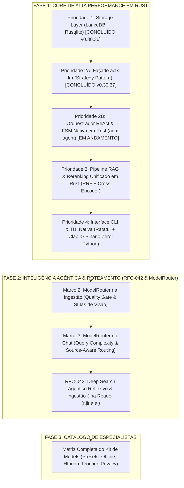

# 🗺️ Roadmap Integrado de Engenharia (Python -> Rust -> RFC-042 Deep Search -> ModelRouter -> Kit de Models)

## 📌 Metadados do Plano
- **Projeto**: AnyContext (`actx`)
- **Versão Base**: `v0.30.38` (Sucessora de `v0.30.37`)
- **Data de Aprovação**: 2026-09-25
- **Status**: Ativo (`active`)
- **Conversation ID**: `9f488dbf-db54-4ecb-8ed2-b7a6ac1b2372`
- **Especificações de Referência**: RFC-042 (`Architectural Evolution Specification.docx`), `actx-lm` RFC-041.

---

## 🏛️ Visão Geral e Topologia Arquitetural

O desenvolvimento do AnyContext segue uma transição metódica e sem quebras de compatibilidade em **3 Fases Estratégicas**, assegurando que o Core seja 100% nativo em Rust antes de expandirmos a inteligência de roteamento e busca profunda:

---

## 🚀 FASE 1: Refatoração Python $\rightarrow$ Rust (Alicerces de Performance)

### 1.1. Prioridade 1: Storage Layer Nativo em Rust (LanceDB + Rusqlite)
* **Status**: 🟢 **CONCLUÍDO** (Entregue na versão `v0.30.36`)
* **Entregáveis**:
  - `NativeLanceStore` em `crates/any-context-core-rs/src/storage/lancedb.rs`.
  - Busca vetorial cosseno e armazenamento de metadados sem intermediários Python.
  - Eliminação de bugs de serialização de tipos no Windows.

### 1.2. Prioridade 2A: Façade Nativo de Modelos de Linguagem (`actx-lm`)
* **Status**: 🟢 **CONCLUÍDO** (Entregue na versão `v0.30.37`)
* **Entregáveis**:
  - Nova crate independente [`crates/actx-lm`](file:///C:/Users/guilh/source/repos/any-context/crates/actx-lm) sem frameworks pesados (sem LangChain/LlamaIndex).
  - Padrões Strategy (`LmProvider`) e Façade (`LmClient`).
  - Suporte completo a OpenAI, Anthropic, Gemini, Mock e SLMs locais (`OpenAiCompatibleProvider` para Ollama e LM Studio em `http://localhost:11434/v1`).
  - Decodificador SSE zero-copy e bindings PyO3 (`PyLmClient`).

### 1.3. Prioridade 2B: Orquestrador ReAct e Loop do Agente em Rust (`actx-agent`)
* **Status**: ⚡ **EM ANDAMENTO / BLUEPRINT ATIVO**
* **O que fazer**:
  1. **Nova Crate Desacoplada `crates/actx-agent`**:
     - Máquina de Estados Finitos (FSM) ReAct nativa: `CallModel` $\rightarrow$ `ExecuteTools` $\rightarrow$ `CheckBudget` $\rightarrow$ `Finished`.
     - Purga total da dependência do LangGraph / LangChain em Python.
     - Proteção anti-recursão determinística (`max_turns: 10`), eliminando o erro `Recursion limit of 50 reached`.
  2. **Catálogo Universal de Ferramentas (`ToolRegistry`)**:
     - Suporte polimórfico a `NativeTool` (busca direta na memória do Rust sem travessia de ponte) e `DynamicPyTool` (callbacks assíncronos PyO3).
     - Fundação para ferramentas MCP (*Model Context Protocol*).
     - Execução defensiva de tools com auto-recuperação de erros de validação JSON (`jsonschema`).
  3. **Persistência de Sessão Limpa (`SessionStore`)**:
     - Armazenamento nativo em SQLite com histórico JSON puro, sem compactação zlib corrompível.
  4. **Preparação Arquitetural para a RFC-042**:
     - Suporte a múltiplos modos de agente (`AgentExecutionMode::Direct`, `AgentExecutionMode::ReAct`, `AgentExecutionMode::DeepSearch`).
     - Tipos de eventos ricos no `AgentEvent` para renderização da `<DeepSearchTree />` no terminal.

### 1.4. Prioridade 3: Pipeline RAG e Reranking Nativo em Rust
* **Status**: 🔴 **A FAZER**
* **O que fazer**:
  1. **Fusão em Memória Zero-Copy**: Executar a busca densa vetorial (`NativeLanceStore`) e a busca esparsa léxica (`bm25.rs`) dentro do mesmo processo Rust.
  2. **Batch Retrieval de Alta Concorrência (RFC-042)**: Implementar `retrieve_hybrid_batch` com Rayon/Tokio para alimentar sub-consultas simultâneas do Deep Search.
  3. **Reranker RRF & Cross-Encoder em Rust**: Otimização SIMD para Reciprocal Rank Fusion ($k=60$) com deduplicação por hash SHA-256.
  4. **Context Density Budgeting Integrado**: Truncamento inteligente e source-fair round-robin operando direto na memória antes de passar os tokens para o `actx-lm`.

### 1.5. Prioridade 4: Interface CLI & TUI 100% Nativa (Binário Único)
* **Status**: 🔴 **A FAZER**
* **O que fazer**:
  1. **Terminal CLI Nativo**: Interface construída com `clap` (parsing de flags) e `ratatui` + `crossterm` (TUI interativa rápida).
  2. **Eliminação do Runtime Python da Distribuição**: O AnyContext passa a ser distribuído como um único arquivo executável estático (`actx.exe` / `actx`), com consumo de memória RAM inferior a 40MB e inicialização em `< 10ms`.

---

## 🎯 FASE 2: Roteamento Adaptativo & Pesquisa Agêntica Profunda (RFC-042)

### 2.1. Marco 2: `ModelRouter` na Ingestão (SLMs Especialistas & Quality Gate)
* **Status**: 🟡 **A FAZER (Alicerces prontos com actx-lm)**
* **O que fazer**:
  1. **Módulo `IngestionModelRouter` (`crates/any-context-core-rs/src/ingestion/router.rs`)**:
     - Avalia a confiança da extração 2D de `pdf.rs`.
  2. **Quality Gate de Estrutura**:
     - *Nível 1 (Texto/2D Geométrico)*: Sucesso -> Indexação direta.
     - *Nível 2 (OCR Tesseract)*: Se texto escasso mas puramente alfanumérico -> OCR rápido.
     - *Nível 3 (SLM de Visão via actx-lm)*: Se o documento contiver diagramas/tabelas complexas sem dados tabulares recuperáveis, invoca SLM local multimodal (`qwen2-vl` ou `minicpm-v` no LM Studio / Ollama).
  3. **Validador de Ingestão**: Rejeita chunks ruidosos antes de indexar no LanceDB.

### 2.2. Marco 3: `ModelRouter` no Chat (Dynamic Query & Source-Aware Routing)
* **Status**: 🔴 **A FAZER**
* **O que fazer**:
  1. **Classificador de Complexidade Local Embarcado (RFC-042 §4.1)**:
     - Modelo encoder compacto (~25MB ONNX Runtime) rodando em CPU com latência sub-15ms e zero tokens gastos.
     - Classes: `FAST_RAG` (consultas pontuais, sintaxe, arquivo) vs `DEEP_SEARCH` (arquitetura, auditoria, correlação multi-módulo).
  2. **Roteamento Dinâmico por Tipologia de Fontes**:
     - Código puro (Rust, TS, Python) $\rightarrow$ Roteia para modelo especializado em código.
     - Documentação jurídica/negócios $\rightarrow$ Roteia para modelo com janela extensa e raciocínio contextual.
  3. **Comandos Slash no Chat**:
     - `/fast <query>`: Força execução direta em turno único.
     - `/deep <query>`: Força ativação do loop agêntico iterativo.
     - `/search <auto|fast|deep>`: Configura a política do workspace ativo no banco SQLite.

### 2.3. RFC-042: Motor Deep Search Agêntico Reflexivo & Ingestão Jina Reader
* **Status**: 🔴 **A FAZER (Planejado pós-Prioridade 3)**
* **O que fazer**:
  1. **Ciclo Reflexivo em 5 Fases**:
     - *Fase 1 (Decomposição)*: Decompõe perguntas complexas em 2 a 4 sub-consultas ortogonais estruturadas (código, documentação, configuração).
     - *Fase 2 (Busca Paralela em Lote)*: Executa no Rust `retrieve_hybrid_batch` concorrentemente via LanceDB + BM25 com deduplicação SHA-256.
     - *Fase 3 (Avaliação de Lacunas)*: Nó de reflexão que avalia suficiência factual, teto de 2 iterações e rendimento decrescente ($>90\%$ sobreposição).
     - *Fase 4 (Re-geração Cirúrgica)*: Busca focada estritamente nos pontos cegos identificados.
     - *Fase 5 (Síntese com Proveniência)*: Geração da resposta com citações obrigatórias de arquivos e linhas (`[src/auth/jwt.rs:45-60]`).
  2. **UX de Terminal Reativa (<DeepSearchTree />)**:
     - Renderização em tempo real da árvore aninhada de sub-tarefas no Ink/React.
     - Auto-colapso pós-streaming para resumo minimalista de uma linha.
     - Atalho `Ctrl+O` para expandir/recolher o histórico completo de reflexão.
  3. **Conector Web Jina Reader (`r.jina.ai`)**:
     - Ingestão de SPAs modernas via endpoint `https://r.jina.ai/<url>`, convertendo páginas pesadas em Markdown puro com zero consumo de RAM local (sem headless Chromium).
     - Fallback local assíncrono via Crawl4AI para ambientes restritos/air-gapped.

---

## 🧩 FASE 3: Matriz Completa do "Kit de Models" (O Catálogo Definitivo)

* **Status**: 🔴 **A FAZER (Etapa Final)**
* **O que fazer**:
  - Implementar presets de configuração e auto-detecção de ambiente no AnyContext:
    1. **Preset 100% Offline / Edge (Zero Dependência de Nuvem)**:
       - LLM/SLM: Ollama / LM Studio (`qwen2.5-coder:7b`, `llama-3.2-3b`, `phi-3.5`).
       - Embedding: BGE-small-en nativo em ONNX.
       - Reranker: MiniLM Reranker ONNX local.
    2. **Preset Híbrido (Custo-Benefício Equilibrado)**:
       - RAG / Pré-processamento: SLMs locais no hardware do usuário.
       - Inferência / Síntese: DeepSeek-V3 ou Claude 3.5 Haiku via API.
    3. **Preset Frontier / Power User**:
       - Claude 3.5 Sonnet / GPT-4o para síntese arquitetural e refatoração crítica.
    4. **Preset Privacidade Máxima Corporativa**:
       - Conexão exclusiva a instâncias privadas vLLM ou Azure OpenAI com isolamento de dados.
