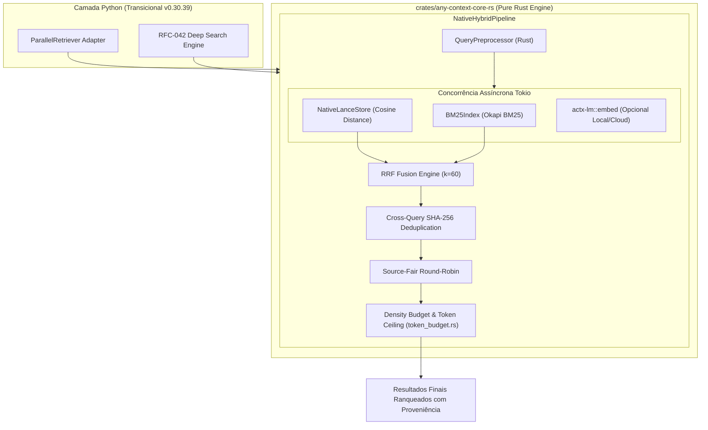

# 📐 Blueprint de Engenharia: Prioridade 3 - Pipeline RAG e Reranking Nativo em Rust (`NativeHybridPipeline` & `retrieve_hybrid_batch`)

> **Protocolo**: `dev-cycle-protocol` v2.0  
> **Status**: Proposta para Aprovação do Gate 3  
> **Projeto**: AnyContext (`actx`)  
> **Versão de Alvo**: `v0.30.39`  
> **Meta Arquitetural de Longo Prazo**: Migração 100% Rust (Zero linhas de Python no binário final).

---

## 1. Executive Summary & Problem Statement

### 1.1 Contexto e Problema Atual
No AnyContext atual (`v0.30.38`), embora a busca vetorial densa (`NativeLanceStore`) e a busca esparsa léxica (`BM25Index`) possuam implementações de baixo nível em Rust, a **orquestração do pipeline RAG ainda é gerenciada em Python** (`ParallelRetriever` em `retriever.py`):
1. **Gargalo de GIL e Múltiplas Travessias de Fronteira PyO3**: Para cada consulta, o Python divide requisições em um `ThreadPoolExecutor`, dispara o Rust LanceDB, faz chamada separada ao Rust BM25, serializa centenas de dicionários de candidatos em memória Python e os envia de volta ao Rust para fusão RRF.
2. **Incapacidade de Batching Nativo para o Deep Search (RFC-042)**: A Fase 2 do Deep Search requer execução simultânea de 2 a 4 sub-consultas ortogonais com deduplicação cross-query por hash SHA-256. Em Python, isso causaria saturação do loop de eventos e concorrência ineficiente.
3. **Dependência de Bibliotecas Python Pesadas (LlamaIndex)**: A geração de embeddings ainda depende de adaptadores LlamaIndex em Python, atrasando a meta de eliminação total do runtime Python.

### 1.2 A Solução da Prioridade 3
Construir o **`NativeHybridPipeline`** em pure Rust (`crates/any-context-core-rs/src/retrieval/pipeline.rs`), unificando busca densa, busca esparsa, fusão RRF, deduplicação SHA-256, round-robin source-fair e density budgeting em uma única passada de alta velocidade com concorrência Tokio.

---

## 2. Architectural Design & Boundaries (Ports & Adapters)

O design segue estritamente a arquitetura hexagonal com o princípio fundamental de **Rust-First Standalone**:
- Toda a lógica de negócio, sincronização de índices, ranqueamento, diversificação e deduplicação reside em Rust puro.
- O binding PyO3 (`PyHybridPipeline`) atua **estritamente como um adaptador de transição temporário** para o AnyContext atual, permitindo que na Prioridade 4 (Interface CLI & TUI 100% Nativa em Rust) o pipeline seja consumido diretamente pelo binário único sem qualquer alteração de código.



---

## 3. Component Breakdown & Data Structures

### 3.1 `HybridSearchRequest` & `HybridBatchResult` (`crates/any-context-core-rs/src/retrieval/pipeline.rs`)

```rust
#[derive(Debug, Clone, Serialize, Deserialize)]
pub struct HybridSearchRequest {
    pub sub_query_id: Option<String>,
    pub query_text: String,
    pub query_vector: Option<Vec<f32>>,
    pub workspace: String,
    pub target_workspaces: Vec<String>,
    pub top_k: usize,
    pub candidate_pool_k: usize,
    pub min_score: f32,
    pub max_chunks_per_source: usize,
    pub max_density_chars: usize,
    pub table_name: String,
}

#[derive(Debug, Clone, Serialize, Deserialize)]
pub struct HybridSearchResult {
    pub chunk_id: String,
    pub file_name: String,
    pub file_path: String,
    pub workspace: String,
    pub text: String,
    pub content_hash: String,
    pub rrf_score: f32,
    pub dense_score: Option<f32>,
    pub sparse_score: Option<f32>,
    pub token_count: usize,
    pub matched_subqueries: Vec<String>,
}
```

### 3.2 `NativeHybridPipeline`

```rust
pub struct NativeHybridPipeline {
    lance_store: Arc<NativeLanceStore>,
    bm25_indices: Arc<RwLock<HashMap<String, BM25Index>>>, // Workspace -> BM25
    lm_client: Option<Arc<dyn LmProvider>>,
}

impl NativeHybridPipeline {
    pub fn new(lance_store: Arc<NativeLanceStore>, lm_client: Option<Arc<dyn LmProvider>>) -> Self;
    
    /// Executa busca híbrida de consulta única em memória sem travessias de GIL
    pub async fn search(&self, req: HybridSearchRequest) -> Result<Vec<HybridSearchResult>, RetrievalError>;

    /// RFC-042: Executa lote concorrente de sub-consultas com deduplicação cross-query por hash SHA-256
    pub async fn retrieve_hybrid_batch(
        &self,
        requests: Vec<HybridSearchRequest>,
    ) -> Result<Vec<HybridSearchResult>, RetrievalError>;
}
```

---

## 4. Zero-Regression & Backward Compatibility Strategy

1. **Paridade com Python**: `ParallelRetriever` em `src/any_context/vector_engine/retriever.py` delegará suas chamadas diretamente ao `NativeHybridPipeline` quando o módulo nativo estiver presente, preservando a interface exata de retorno (`List[ScoredChunk]`).
2. **Suporte Dual a Embeddings**: Se o Python já calcular o vetor via cache ou LlamaIndex, passa `query_vector = Some(...)`. Se não passar, o Rust utiliza o `actx-lm` para gerar o vetor internamente.
3. **Isolamento de Workspaces Inviolável**: As consultas no LanceDB e BM25 continuam com particionamento estrito por workspace, impedindo vazamento de dados entre workspaces.
4. **Reserva de Testes Não-Truncados**: A suíte de 370 testes existente continuará rodando com 100% de aprovação.

---

## 5. Security, Secret Hygiene & Integrity Validation

- **Sem Hardcoded Secrets**: Nenhum token ou credencial é persistido em código ou artefatos. Chaves de API de embeddings utilizam injeção via `AppSettings` ou variáveis de ambiente seguras.
- **Validação de Limites de Memória (OOM Defense)**: O `Density Budgeter` nativo impõe teto rígido de caracteres (`max_density_chars`) e de tokens (`truncate_to_token_ceiling`), prevenindo estouro de buffer de contexto de LLMs.
- **Sanitização de Identificadores SQL/LanceDB**: Proteção total contra injeção de parâmetros em cláusulas de filtro de metadados.

---

## 6. Step-by-Step Implementation & Verification Plan

- [ ] **Etapa 1: Módulo `pipeline.rs` em `crates/any-context-core-rs`**:
  - Implementar struct `NativeHybridPipeline` com fusão zero-copy LanceDB + BM25.
  - Implementar deduplicação cross-query por hash SHA-256 acumulando score RRF.
- [ ] **Etapa 2: Algoritmo de Batch Retrieval RFC-042 (`retrieve_hybrid_batch`)**:
  - Execução concorrente de requisições de sub-consultas via `futures::future::join_all`.
- [ ] **Etapa 3: Bindings PyO3 (`PyHybridPipeline`)**:
  - Expor `PyHybridPipeline`, `PyHybridSearchRequest`, `PyHybridSearchResult` com GIL liberado (`py.allow_threads`).
- [ ] **Etapa 4: Integração no Python (`retriever.py`)**:
  - Atualizar `ParallelRetriever` para conectar ao pipeline nativo com fallback transparente.
- [ ] **Etapa 5: Testes Unitários e de Integração**:
  - Testes Rust em `crates/any-context-core-rs/tests/` para busca única e lote.
  - Testes Python em `tests/unit/core/test_native_rag_pipeline.py`.
  - Execução do runner geral `python tests/run_all_e2e.py` (370+ testes verdes).
- [ ] **Etapa 6: Dual-Doc & Testes Manuais**:
  - Atualizar `README.md`, `TECDOC.md` (Seção 76) e `tests/MANUAL_TESTS.md` (Cenário 1 v0.30.39 sem compactação).
- [ ] **Etapa 7: Verificação Gate 8 & Release**:
  - `verify_gate.py --gate 8` aprovado.
  - Atualização de marco no `plan-memory` via `check_milestone.py --milestone "Prioridade 3"`.

---

## 7. Dual-Doc Specification (UserDoc & TecDoc)

- **UserDoc (`README.md`)**: Seção documentando o pipeline RAG nativo em Rust, desempenho sub-3ms para buscas híbridas e capacidade de busca paralela para o Deep Search.
- **TecDoc (`TECDOC.md`)**: Seção 76 documentando a arquitetura matemática de fusão RRF com deduplicação cross-query por SHA-256 e o ADR-076 registrando a substituição da orquestração Python pela pipeline nativa em Rust.

---

## 8. Rollback & Disaster Recovery Protocol

- Se o pipeline nativo em Rust falhar em qualquer cenário de borda (ex: índice BM25 ainda não sincronizado), o `ParallelRetriever` em Python detecta o erro e executa o fallback transparente para o método de recuperação legado.
- Nenhuma alteração destrutiva é feita no schema do LanceDB ou no banco SQLite `actx_settings.db`.
