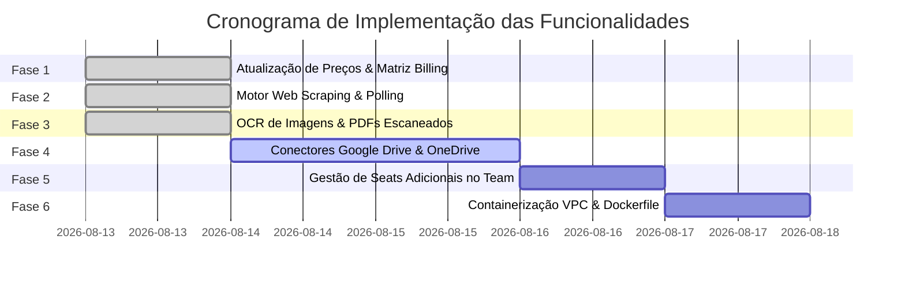

# 🚀 Plano de Implementação: Módulos e Recursos dos Planos de Assinatura

> **Objetivo**: Concretizar 100% das funcionalidades necessárias para sustentar a esteira de produtos e a nova tabela de preços acessível, focada em alta conversão e crescimento por usuário (*Expansion MRR*).

---

## 📊 1. Matriz de Preços e Recursos Alinhada

| **Plano** | **Preço Mensal** | **Preço Anual (-20%)** | **Escopo & Funcionalidades** | **Regras de Validação no `BillingManager`** |
|---|---|---|---|---|
| **Community (Gratuito)** | **$0** | **$0** | 1 Workspace Local (até 3 pastas locais). | `max_workspaces=1`, `allowed_sources=["local"]`, `supports_ocr=False`. |
| **Personal / Starter** | **$12 /mês** *(~CAD 15)* | **$9 /mês** ($108/ano) | Workspaces Locais Ilimitados + **OCR de Imagens e PDFs Escaneados**. | `max_workspaces=999`, `allowed_sources=["local"]`, `supports_ocr=True`. |
| **Pro (Multi-Context)** | **$29 /mês** *(~CAD 38)* | **$24 /mês** ($288/ano) | **Multi-Context**: Pastas Locais + Google Drive + OneDrive + Web Scraping + OCR. | `allowed_sources=["local", "drive", "web"]`, `supports_multi_context=True`. |
| **Team (Colaboração)** | **$79 /mês** *(inclui 5 seats)* + **$15/mês** por seat adicional | **$65 /mês** ($780/ano) + **$12/mês** por seat extra | Tudo do Pro + Multi-Usuário (RBAC, Convites, Workspaces Compartilhados). | `base_seats=5`, `extra_seat_price_usd=15.00`, `supports_collaboration=True`. |
| **Enterprise (VPC / On-Prem)** | **$499 /mês** ou **$4.900/ano** | Sob Consulta | Containers Docker em VPC Privada + SSO + Licença Offline + Suporte SLA. | `supports_custom_vpc=True`, `unlimited_seats=True`. |

---

## 🏗️ 2. Detalhamento Técnico das Fases de Implementação

### 📍 Fase 1: Atualização dos Schemas e Matriz de Preços
- **Status**: ✅ **CONCLUÍDA**.

---

### 🌐 Fase 2: Motor de Web Scraping & Polling Recorrente
- **Status**: ✅ **CONCLUÍDA**.
- **Arquivos**: `src/any_context/ingestion/web_ingestor.py`, `src/any_context/ingestion/web_scheduler.py`.

---

### 📷 Fase 3: Daemon de Processamento de Imagens e OCR
- **Status**: ✅ **CONCLUÍDA**.
- **Arquivos**: `src/any_context/ingestion/image_ocr_ingestor.py`.

---

### ☁️ Fase 4: Conectores Cloud Storage - Google Drive & OneDrive
- **Objetivo**: Permitir login via OAuth2 e sincronização incremental de pastas do Google Drive e Microsoft OneDrive.
- **Novos Arquivos**:
  - `src/any_context/ingestion/gdrive_ingestor.py`: Cliente de integração com Google Drive API v3.
  - `src/any_context/ingestion/onedrive_ingestor.py`: Cliente de integração com Microsoft Graph API.

---

### 👥 Fase 5: Gestão de Assentos Adicionais no Plano Team
- **Objetivo**: Controlar o número de usuários cadastrados no banco SQLite em relação à licença ativa no plano Team ($79 base + $15/seat extra).
- **Ações**:
  - Atualizar `src/any_context/billing/store.py` com o campo `extra_seats_purchased`.
  - Atualizar `POST /v1/users` na API REST para impedir a criação de usuários se o limite de seats (5 base + extras) for atingido sem contratar um seat adicional de $15/mês.

---

### 🐳 Fase 6: Pacote de Containerização Enterprise VPC
- **Objetivo**: Disponibilizar arquivos prontos para implantação em Docker/Kubernetes na VPC do cliente.
- **Novos Arquivos**:
  - `Dockerfile`: Imagem de produção otimizada com suporte a Python, FastAPI e ChromaDB.
  - `docker-compose.yml`: Configuração contendo o serviço `actx-server` e volume persistente `./data`.
  - `docs/ENTERPRISE_VPC_GUIDE.md`: Guia técnico de implantação em nuvens privadas.

---

## 🗓️ Cronograma de Execução e Status Atual

